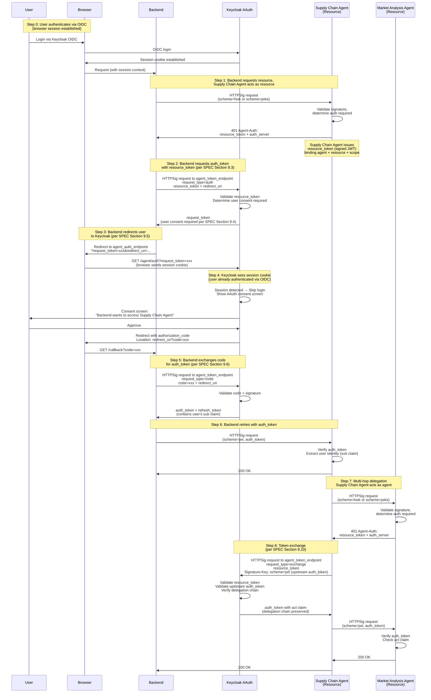

# Us

er-Delegated AAuth Flow Implementation

## Overview

Implement user-delegated AAuth authentication following **SPEC Section 3.6 (User Delegated Access)**:

- **UI/Backend**: Continue using Keycloak OIDC for user authentication

- **Backend → Supply Chain Agent**: 
  - Supply Chain Agent acts as a **resource** (SPEC Section 6) and issues `resource_token` in Agent-Auth challenge
  - Backend requests `auth_token` from Keycloak using `resource_token` (per SPEC Section 9.3)
  - Keycloak returns `request_token` (user consent required per SPEC Section 9.4)
  - Backend redirects user to Keycloak's `agent_auth_endpoint` (per SPEC Section 9.5)
  - Keycloak detects browser session cookie (from OIDC login), skips login, shows consent screen
  - User approves → Backend exchanges `authorization_code` for `auth_token` (per SPEC Section 9.6)
  - Backend uses `auth_token` in `scheme=jwt` for subsequent requests

- **Supply Chain Agent → Market Analysis Agent**: 
  - Market Analysis Agent acts as a **resource** and issues `resource_token`
  - Supply Chain Agent performs token exchange (SPEC Section 9.10) for multi-hop delegation
  - Supply Chain Agent uses exchanged `auth_token` in `scheme=jwt` for downstream requests

## Architecture Flow



## Implementation Steps

### 1. Backend: AAuth Token Service

**File**: `backend/app/services/aauth_token_service.py` (new)

- Create service to request AAuth auth tokens following SPEC Section 3.6 (User Delegated Access) and Section 9.5 (User Consent Flow)
- Fetch Keycloak AAuth metadata from `/.well-known/aauth-issuer` to get `agent_token_endpoint` and `agent_auth_endpoint`

- Implement `request_auth_token()` method (SPEC Section 9.3):
  - Takes `resource_token` (from Agent-Auth challenge) and `redirect_uri`
  - Makes signed HTTPSig request to Keycloak's `agent_token_endpoint` with:
    - `request_type=auth` (REQUIRED per SPEC Section 9.3)
    - `resource_token` (REQUIRED - from resource's Agent-Auth challenge)
    - `redirect_uri` (REQUIRED per SPEC Section 9.3)
  - Signs request with backend's signing key (scheme=jwks or scheme=hwk)
  - Returns `request_token` (per SPEC Section 9.4) - user consent required

- Implement `get_consent_url()` method:
  - Takes `request_token` and `redirect_uri`
  - Returns URL to Keycloak's `agent_auth_endpoint` with `request_token` parameter
  - Format: `{agent_auth_endpoint}?request_token={request_token}&redirect_uri={redirect_uri}`

- Implement `exchange_code_for_token()` method (SPEC Section 9.6):
  - Takes `authorization_code` and `redirect_uri`
  - Makes signed HTTPSig request to `agent_token_endpoint` with:
    - `request_type=code`
    - `code` (authorization code from redirect)
    - `redirect_uri` (must match original)
  - Returns `auth_token` and `refresh_token`

- Implement `refresh_auth_token()` method for token refresh (SPEC Section 9.7)
- Handle token caching/expiration

**Note**: Browser session acts as the bridge - Keycloak detects the OIDC session cookie when user is redirected to `agent_auth_endpoint`, skips login, and shows consent screen.

### 2. Backend: Update AAuth Interceptor

**File**: `backend/app/services/aauth_interceptor.py`

- Modify `intercept()` method to support configurable signature schemes: `hwk`, `jwks`, or `jwt`
- Read `AAUTH_SIGNATURE_SCHEME` environment variable (default: `hwk`)
- **Scheme selection logic**:
  - If `scheme=hwk`: Use existing HWK implementation (pseudonymous)
  - If `scheme=jwks`: Use existing JWKS implementation (identified agent)
  - If `scheme=jwt`: Use auth tokens (user-delegated authorization)
- **For `scheme=jwt`**:
  - Check if auth_token is available (from context or cache)
  - If not available, trigger AAuth token request (requires resource_token from challenge)
  - Use `scheme=jwt` with auth_token in Signature-Key header
  - Format: `Signature-Key: sig=(scheme=jwt jwt="<auth-token>")`
- Handle 401 responses with Agent-Auth challenges to obtain resource_token (only needed for `scheme=jwt`)

### 3. Backend: Handle Agent-Auth Challenges and User Consent Flow

**File**: `backend/app/services/a2a_service.py`

- Update `optimize_supply_chain()` to handle 401 responses with Agent-Auth challenges
- Extract `Agent-Auth` header from 401 response
- Parse structured field to extract:
  - `resource_token` (signed JWT from Supply Chain Agent)
  - `auth_server` (Keycloak AAuth issuer URL)
- Call AAuth token service `request_auth_token(resource_token, redirect_uri)`
- Receive `request_token` from Keycloak
- **For web requests**: Redirect user to consent URL (obtained from `get_consent_url()`)
- **For API requests**: Return response indicating user consent required (with consent URL)
- Handle callback from Keycloak with `authorization_code`
- Exchange code for `auth_token` using `exchange_code_for_token()`
- Retry original request with `scheme=jwt` and `auth_token` in Signature-Key header
- Cache auth_token for subsequent requests (respect expiration)

**File**: `backend/app/api/auth.py` (new callback endpoint)

- Create `/auth/aauth/callback` endpoint to handle Keycloak redirect
- Extract `code` and `state` from query parameters
- Exchange code for `auth_token` using AAuth token service
- Store `auth_token` in session or return to client
- Redirect to original request context or return success response

### 4. Supply Chain Agent: Issue Resource Tokens (Act as Resource)

**File**: `supply-chain-agent/agent_executor.py`

- Update to act as a resource per SPEC Section 3.6 and Section 6 (Resource Tokens)
- When incoming request requires authorization (based on policy):
  - Generate `resource_token` (signed JWT) with claims:
    - `iss`: Supply Chain Agent identifier (from `SUPPLY_CHAIN_AGENT_ID_URL`)
    - `aud`: Keycloak AAuth issuer URL
    - `agent`: Backend agent identifier (from request's Signature-Key header)
    - `agent_jkt`: JWK Thumbprint of backend's signing key (from request)
    - `exp`: Expiration (short-lived, e.g., 5 minutes)
    - `scope`: Required scopes for the operation
  - Sign resource_token with Supply Chain Agent's private key
  - Return 401 with Agent-Auth header:
    ```
    Agent-Auth: httpsig; auth-token; resource_token="<signed-jwt>"; auth_server="<keycloak-issuer>"
    ```


**File**: `supply-chain-agent/resource_token_service.py` (new, optional helper)

- Helper service to generate and sign resource tokens
- Implements SPEC Section 6.3 (Required Claims) and Section 6.2 (Token Format)

### 5. Supply Chain Agent: AAuth Token Exchange Service

**File**: `supply-chain-agent/aauth_token_service.py` (new)

- Create service for token exchange (multi-hop delegation)

- Implement `exchange_token()` method:
- Takes upstream auth_token and resource_token from downstream agent

- Makes signed AAuth request to Keycloak with `request_type=exchange`

- Presents upstream auth_token in Signature-Key header

- Returns new auth_token with `act` claim showing delegation chain

### 6. Supply Chain Agent: Update AAuth Interceptor

**File**: `supply-chain-agent/aauth_interceptor.py`

- Add support for `scheme=jwt` with auth tokens

- Extract auth_token from incoming request context (if available)

- Use token exchange service when calling market-analysis-agent

- Include auth_token in Signature-Key header for downstream calls

### 6. Supply Chain Agent: Handle Agent-Auth Challenges

**File**: `supply-chain-agent/agent_executor.py`

- Update to handle 401 responses from market-analysis-agent

- Extract resource_token from Agent-Auth challenge

- Call token exchange service

- Retry request with new auth_token

### 8. Market Analysis Agent: Issue Resource Tokens (Act as Resource)

**File**: `market-analysis-agent/agent_executor.py`

- Similar to Supply Chain Agent, act as a resource and issue resource tokens
- When incoming request requires authorization:
  - Generate `resource_token` with claims binding the requesting agent (Supply Chain Agent)
  - Return 401 with Agent-Auth header containing resource_token

### 9. Market Analysis Agent: Verify Auth Tokens

**File**: `market-analysis-agent/agent_executor.py`

- Update verification logic to handle all three signature schemes: `hwk`, `jwks`, and `jwt`
- **For `scheme=hwk`**: Use existing HWK verification (pseudonymous)
- **For `scheme=jwks`**: Use existing JWKS verification (identified agent)
- **For `scheme=jwt`**: Verify auth tokens (user-delegated authorization)
  - Extract auth_token from Signature-Key header
  - Verify JWT signature using Keycloak's JWKS
  - Validate claims:
    - `typ` must be `"auth+jwt"`
    - `aud` must match agent identifier
    - `agent` claim (upstream agent)
    - `sub` claim (user identity)
    - `act` claim (delegation chain, if present)
    - `exp` (not expired)
  - Extract user identity from `sub` and other claims for authorization

### 8. Configuration Updates

**Files**:

- `backend/env.example`

- `supply-chain-agent/env.example`

- `market-analysis-agent/env.example`

Add environment variables:

- `KEYCLOAK_AAUTH_ISSUER_URL`: Keycloak AAuth issuer URL (e.g., `http://localhost:8080/realms/aauth-test`)

- `KEYCLOAK_AAUTH_AGENT_TOKEN_ENDPOINT`: Full URL to agent_token_endpoint (optional, can be derived from issuer)

- `AAUTH_AUTH_TOKEN_CACHE_TTL`: Cache TTL for auth tokens (default: 3600 seconds)

### 11. Keycloak Integration Notes

**Keycloak-specific extension**: Include OIDC ID token as `subject_token` parameter in AAuth `request_type=auth` requests. This allows Keycloak to skip user interaction since the user is already authenticated via OIDC.

**Keycloak validation flow**:

1. Validate `resource_token` per SPEC Section 6.5:

   - Verify JWT signature using resource's (Supply Chain Agent's) JWKS
   - Verify `aud` matches Keycloak's issuer
   - Verify `agent` matches requesting agent (backend)
   - Verify `agent_jkt` matches backend's signing key thumbprint
   - Verify token not expired
   - Extract `scope` for authorization

2. Validate `subject_token` (OIDC ID token):

   - Verify JWT signature using Keycloak's OIDC keys
   - Verify `iss`, `aud`, `exp`, `iat`
   - Extract user identity (`sub`, `preferred_username`, etc.)

3. Issue AAuth `auth_token` with:

   - User identity claims from ID token (`sub`, `name`, `email`, etc.)
   - Scopes from `resource_token`
   - `agent` claim (backend identifier)
   - `cnf.jwk` (backend's signing key from request)
   - Direct grant (no `request_token` returned)

**Example request** (following SPEC Section 9.3 with Keycloak extension):

```http
POST /realms/aauth-test/protocol/aauth/agent/token HTTP/1.1
Host: localhost:8080
Content-Type: application/x-www-form-urlencoded
Content-Digest: sha-256=:...:
Signature-Input: sig=("@method" "@authority" "@path" "content-type" "content-digest" "signature-key");created=1730217600
Signature: sig=:...:
Signature-Key: sig=(scheme=jwks id="http://backend.localhost:8000" kid="backend-key-1")

request_type=auth&
resource_token=eyJhbGciOiJFZERTQSIsInR5cCI6InJlc291cmNlK2p3dCIsImtpZCI6InJlc291cmNlLWtleS0xIn0.eyJpc3MiOiJodHRwczovL3N1cHBseS1jaGFpbi1hZ2VudC5leGFtcGxlIiwiYXVkIjoiaHR0cHM6Ly9hdXRoLmV4YW1wbGUiLCJhZ2VudCI6Imh0dHA6Ly9iYWNrZW5kLmxvY2FsaG9zdDo4MDAwIiwiYWdlbnRfamt0IjoiLi4uIiwic2NvcGUiOiJkYXRhLnJlYWQiLCJleHAiOjE3MzAyMjEyMDB9.signature&
redirect_uri=http://backend.localhost:8000/callback&
subject_token=eyJhbGciOiJSUzI1NiIsInR5cCI6IkpXVCJ9.eyJzdWIiOiJ1c2VyLTEyMzQ1IiwibmFtZSI6IkFsaWNlIFNtaXRoIiwiZXhwIjoxNzMwMjIxMjAwfQ.signature&
subject_token_type=urn:ietf:params:oauth:token-type:id_token
```

**Note**: The `subject_token` and `subject_token_type` parameters are Keycloak-specific extensions to enable seamless integration with existing OIDC authentication. The standard AAuth flow would return a `request_token` requiring user interaction, but since the user is already authenticated via OIDC, Keycloak can issue the `auth_token` directly.

## Testing Strategy

1. **Unit Tests**: Test AAuth token service methods

2. **Integration Tests**: Test full flow from backend to agents

3. **Token Exchange Tests**: Verify multi-hop delegation with `act` claims
4. **Error Handling**: Test expired tokens, invalid signatures, etc.

## Security Considerations

- Auth tokens must be bound to agent's signing key (`cnf.jwk` claim)
- Token exchange must preserve user identity (`sub` claim) through delegation chain

- Verify `act` claim in multi-hop scenarios to prevent unauthorized delegation

- Cache auth tokens appropriately but respect expiration

- Refresh tokens should be stored securely

## Files to Create/Modify

**New Files**:

- `backend/app/services/aauth_token_service.py`

- `supply-chain-agent/aauth_token_service.py`

**Modified Files**:

- `backend/app/services/aauth_interceptor.py` - Support scheme=jwt with auth tokens
- `backend/app/services/a2a_service.py` - Handle Agent-Auth challenges, extract resource_token, initiate user consent flow
- `backend/app/api/auth.py` - Add callback endpoint for Keycloak redirect (`/auth/aauth/callback`)
- `supply-chain-agent/agent_executor.py` - Act as resource: issue resource tokens, verify auth tokens, handle challenges
- `supply-chain-agent/aauth_interceptor.py` - Support scheme=jwt for downstream calls
- `market-analysis-agent/agent_executor.py` - Act as resource: issue resource tokens, verify all schemes (hwk/jwks/jwt)
- `supply-chain-agent/agent_executor.py` - Handle Agent-Auth challenges and verify all schemes
- `market-analysis-agent/agent_executor.py` - Verify all schemes (hwk/jwks/jwt)