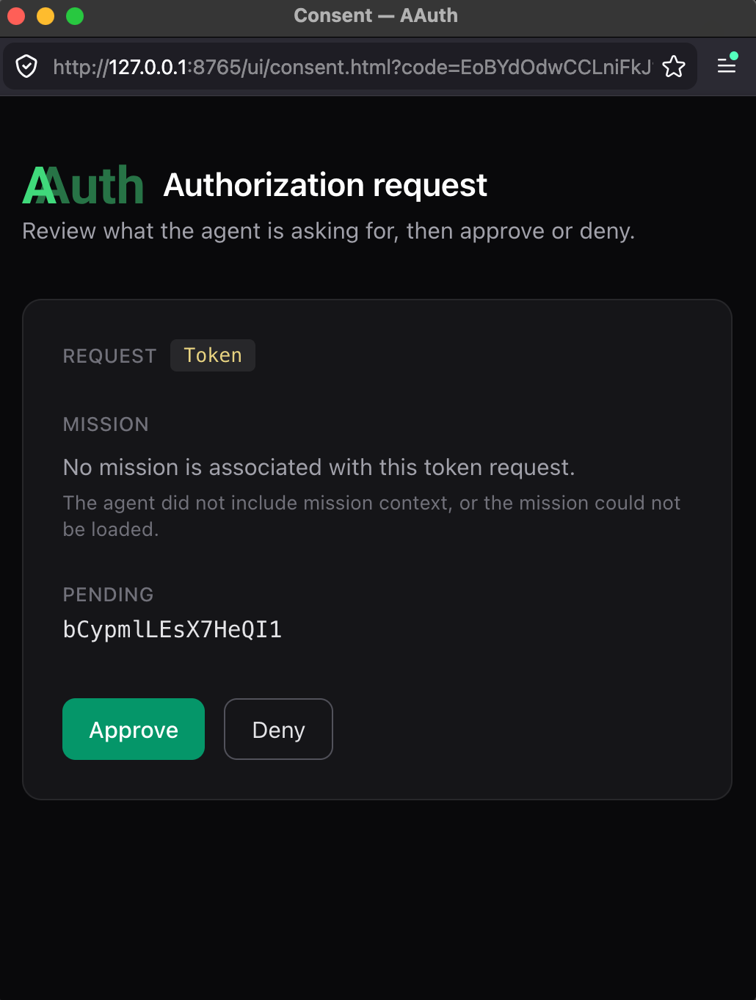

# Agent Authorization (with User Consent)

In this demo, we extend the [autonomous PS-asserted authorization flow](./agent-authorization-autonomous.md) by adding the one piece the agent cannot satisfy on its own: **explicit, on-the-fly user consent**. This is the same [PS-Asserted (Three-Party) flow](https://explorer.aauth.dev/access/ps-asserted) (AAuth spec §4.1.3) we saw in the previous demo: the resource still issues a 401 challenge with an `aa-resource+jwt`, the backend still posts it to the Person Server's token endpoint but the PS now refuses to issue the `aa-auth+jwt` until the user has approved the request through the **interaction endpoint** (spec §7.2 / §12.3.3).

When the PS decides consent is needed, it does **not** return an `auth_token` on the first signed `POST /token`. Instead it returns a **deferred response** (spec §12.4):

* **`202 Accepted`**
* **`Location`** header pointing at a **pending URL** the agent will poll
* **`AAuth-Requirement: requirement=interaction; url="…"; code="…"`** carrying the user-facing interaction endpoint and a single-use code
* `Retry-After` and `Cache-Control: no-store`

The backend surfaces the `(url, code)` pair to the UI so the user can complete consent in their browser, while the backend itself **polls** the pending URL with signed `GET` requests (per spec §12.4.3) until the PS responds with **`200 OK`** and an `auth_token`. There is no separate authorization code grant — the pending URL and polling carry that role (spec Appendix B.2.4).

[← Back to index](index.md)

## Watch the demo

<div style="position: relative; padding-bottom: 56.25%; height: 0; overflow: hidden; max-width: 100%; margin: 1em 0;">
  <iframe style="position: absolute; top: 0; left: 0; width: 100%; height: 100%;" src="https://www.youtube.com/embed/J96tIVf8dVI" title="Agent authorization (on behalf of) Demo" frameborder="0" allow="accelerometer; autoplay; clipboard-write; encrypted-media; gyroscope; picture-in-picture; web-share" allowfullscreen></iframe>
</div>

## Run the components

To run this demo, [please set up the prerequisites](./install-aauth.md).

This flow uses the **same** Mode 3 / three-party PS-asserted setup as the autonomous demo. The only differences are:

1. The aauth extauthz config tells `supply-chain-agent` to mint resource tokens that include the **`require:user`** scope. This is the signal the Person Server uses to decide it must run the consent interaction before issuing an `aa-auth+jwt`.
2. Restart the AAuth extauthz service with `aauth-config-user-consent.yaml` instead of the autonomous-flow `aauth-config-mode3.yaml`:

```bash
cd aauth-full-demo/agentgateway
AAUTH_CONFIG=aauth-config-user-consent.yaml "$HOME/bin/extauth-aauth-resource/aauth-service"
```

The agentgateway stays running the `config-policy.yaml` as in the previous step:

```bash
agentgateway -f ./agentgateway/config-policy.yaml
```

The `aauth-config-user-consent.yaml` resource section adds the consent trigger to the existing Mode 3 config:

```yaml
supported_scopes:
  - supply-chain:check
  - supply-chain:read
  - supply-chain:optimize
  - require:user
scope_descriptions:
  supply-chain:check: Check supply chain
  supply-chain:read: Read supply chain
  supply-chain:optimize: Optimize supply chain
  require:user: Require user consent
default_resource_token_scopes:
  - supply-chain:check
  - supply-chain:read
  - require:user           # <-- this is what triggers PS consent
access:
  require: auth-token
person_server:
  issuer: http://127.0.0.1:8765
  jwks_uri: http://127.0.0.1:8765/.well-known/jwks.json
allowed_signature_key_schemes:
  - jwt
allowed_jwt_types:
  - aa-agent+jwt
  - aa-auth+jwt
policy:
  name: default
```

If you don't have the other services running from the previous step, start each one:

| Component | Port | Command |
|-----------|------|---------|
| UI | 3050 | `cd supply-chain-ui && npm start` |
| Backend | 8000 | `cd backend && uv run .` |
| Supply-chain-agent | 9999 | `cd supply-chain-agent && uv run .` |
| Market-analysis-agent | 9998 | `cd market-analysis-agent && uv run .` |

## Step By Step

### 1. Initial Request Fails (401)

When the `backend` calls the `supply-chain-agent`, the resource (via the `aauth-service` extauthz at the gateway) sees that `access: require: auth-token` is configured but the request only carries an `aa-agent+jwt`. It responds with a `401` and an `AAuth-Requirement` header carrying the **resource token** — exactly the same first hop as the autonomous flow:

```bash
INFO:aauth_interceptor:🔐 AAuth: Signing with agent token (aa-agent+jwt in Signature-Key)
INFO:aauth.tokens:401 from supply-chain-agent: configure policy on agentgateway or fix signatures
INFO:aauth.tokens:401 AAuth / aauth | aauth-requirement: requirement=auth-token, resource-token="eyJ0eXAiOiJhYS1yZXNvdXJjZStqd3QiLCJhbGciOiJFZERTQSIsImtpZCI6InNwYS1yc2stMSJ9..."
```
{: .log-output}

The only difference from the autonomous resource token is the embedded scope — the resource token now contains `require:user`, which the PS will use as its consent trigger:

```json
{
  "iss": "http://supply-chain-agent.localhost:3000",
  "dwk": "aauth-resource.json",
  "aud": "http://127.0.0.1:8765",
  "agent": "aauth:b8ef15f9-725a-4e87-a0da-14a8edcf9009@agent-server.example",
  "agent_jkt": "k7PlM2ZaFNvm7p_2NPqZpW3DCmgRHqYfB3zi9WJpdbo",
  "iat": 1778720443,
  "exp": 1778720743,
  "scope": "supply-chain:check supply-chain:read require:user",
  "jti": "98a1709f-c169-4393-a93a-030e5b75d291"
}
```

### 2. Person Server returns 202 (interaction required)

The backend extracts the resource token, signs a `POST` to the PS's `token_endpoint` with its `aa-agent+jwt` in the `Signature-Key` header (and typically `Prefer: wait=N` so the PS may long-poll the request — spec §12.4.1):

```http
POST /token HTTP/1.1
Host: 127.0.0.1:8765
Content-Type: application/json
Prefer: wait=45
Signature-Input: sig=("@method" "@authority" "@path" "signature-key");created=…
Signature: sig=:…:
Signature-Key: sig=jwt;jwt="eyJhbGc…"

{"resource_token": "eyJ0eXAi…"}
```

The PS verifies the agent token and the resource token, sees `require:user` in the resource scope, and — instead of issuing an `aa-auth+jwt` — returns a **deferred response** (spec §7.1.4 / §12.3.3 / §12.4.2). At the wire level, the spec-mandated shape is just this:

```http
HTTP/1.1 202 Accepted
Location: http://127.0.0.1:8765/pending/2e44214dc421
Retry-After: 0
Cache-Control: no-store
AAuth-Requirement: requirement=interaction; url="http://127.0.0.1:8765/ui/consent.html"; code="EoBYdOdwCCLniFkJ1SSJSQ"
Content-Type: application/json

{"status": "pending"}
```

Per spec §12.4.2 the only **REQUIRED** body field is `status` (`"pending"` while waiting, `"interacting"` once the user has arrived). The headers do all the normative work: `Location` (REQUIRED — pending URL to poll), `Retry-After` (REQUIRED — polling cadence in seconds, `0` means "retry immediately"), `Cache-Control: no-store` (REQUIRED), and `AAuth-Requirement` (OPTIONAL in general, present here because the PS needs the user). The interaction `url` and `code` are normatively conveyed only in the `AAuth-Requirement` header per spec §12.3.3 / §7.2 — not in the body.

Two things are happening in this single response:

1. **For the user**: `AAuth-Requirement: requirement=interaction; url=…; code=…` says "to make progress, send a human to `{url}?code={code}`" (spec §7.2). The `code` is single-use and ties the human's browser session to this exact pending request.
2. **For the agent**: `Location` and `Retry-After` say "poll this URL with signed `GET` requests until I have a terminal answer" (spec §12.4.3).

The Person Server in this demo emits a richer body than the spec minimum — it duplicates the requirement/code data and adds a few internal IDs:

```json
{
  "status": "pending",
  "requirement": "interaction",
  "code": "EoBYdOdwCCLniFkJ1SSJSQ",
  "interaction_url": "http://127.0.0.1:8765/ui/consent.html",
  "retry_after": 0,
  "pending_id": "2e44214dc421",
  "pending_url": "http://127.0.0.1:8765/pending/2e44214dc421"
}
```

These extra fields are **non-normative** — the spec does not define them for `requirement=interaction` (the only spec-defined extra body fields are `clarification`/`timeout`/`options` for `requirement=clarification` and `required_claims` for `requirement=claims`, per §12.4.2). They're a convenience: the AAuth Python client (`aauth.agent.poller`) reads `requirement` and `code` from the body in addition to the header, so duplicating them keeps the implementation tolerant to clients that only inspect one or the other. A spec-compliant client only needs the headers.

The backend's `exchange_resource_token` helper (from the `aauth` Python library) handles both sides automatically. It hands the `(interaction_url, code)` pair to its `on_interaction` callback, which the demo backend uses to surface consent state to the UI:

```bash
INFO:app.services.a2a_service:PS requires user interaction — url=http://127.0.0.1:8765/ui/consent.html?code=EoBYdOdwCCLniFkJ1SSJSQ&callback=http://localhost:3050/auth-callback?request_id=d4ae0c8f-ff5e-41e8-95b4-c6e6f52dcac6 code=EoBYdOdwCCLniFkJ1SSJSQ
INFO:aauth.tokens:USER INTERACTION REQUIRED: visit http://127.0.0.1:8765/ui/consent.html?code=EoBYdOdwCCLniFkJ1SSJSQ&callback=http://localhost:3050/auth-callback?request_id=d4ae0c8f-ff5e-41e8-95b4-c6e6f52dcac6 (code: EoBYdOdwCCLniFkJ1SSJSQ)
```
{: .log-output}

The demo backend appends `&callback={frontend_callback}` to the interaction URL — spec §7.2 allows agents that have a browser to opt in to a server-driven redirect back to the app once consent is complete (so the popup can close itself instead of relying solely on polling).

While the user is being directed to the consent screen, `aauth.agent.poller` is calling `GET` on the pending URL on a loop. Each poll is signed with the agent's ephemeral key and carries the `aa-agent+jwt` (per spec §12.4.3 — `Prefer: wait` MAY be sent). The PS keeps replying `202` with `{"status": "pending"}` (or `"interacting"` once the user has arrived at the interaction endpoint) until the user makes a decision. A non-`202` response is terminal: `200 OK` carries the `auth_token`, `403` means denied/abandoned, `408` means the pending request timed out, `410` means the code was already consumed (spec §12.4.4 state machine).

### 3. User Consent Screen

The interaction URL the backend surfaced in step 2 is what the UI opens for the user. The user lands on the Person Server's consent page (the `interaction_endpoint` published in `/.well-known/aauth-person.json`, with the `code` from the `AAuth-Requirement` header pre-filling the session):



The user sees:

* Which agent is requesting access (the `backend` — derived from the verified `aa-agent+jwt` and resolved through the agent's PS registration)
* What scopes are being requested (`supply-chain:check supply-chain:read require:user`, from the resource token)
* The ability to approve or deny

This consent UI is the Person Server's own. There is no separate identity provider involved — in this demo the PS plays both the AAuth Agent Provider role *and* the Person Server role (spec §4.2 "Common collocations"), and the user authenticates directly to the PS portal (`http://127.0.0.1:8765/ui`). The browser leg and the agent's polling leg are decoupled: both converge through the `pending_id` the PS minted in step 2.

### 4. Auth token with user-asserted claims

Once the user approves, the next poll the backend makes returns `200 OK` with the `auth_token` payload. The backend now retries the original call to `supply-chain-agent`, this time presenting the `aa-auth+jwt` in the `Signature-Key` header (`scheme=jwt`). The supply-chain-agent's extauthz logs:

```bash
INFO:agent_executor:🔐 Auth token detected in request (scheme=jwt)
INFO:httpx:HTTP Request: GET http://127.0.0.1:8765/.well-known/jwks.json "HTTP/1.1 200 OK"
INFO:agent_executor:✅ Auth token verified successfully
INFO:agent_executor:✅ Authorization successful: auth_token verified for agent: aauth:b8ef15f9-725a-4e87-a0da-14a8edcf9009@agent-server.example
```
{: .log-output}

Decoded, the `aa-auth+jwt` (spec §9.4.1) looks like this:

```json
{
  "iss": "http://127.0.0.1:8765",
  "aud": "http://supply-chain-agent.localhost:3000",
  "dwk": "aauth-person.json",
  "jti": "b574b8a5-e2db-4586-9d96-4e9c05b15d51",
  "agent": "aauth:b8ef15f9-725a-4e87-a0da-14a8edcf9009@agent-server.example",
  "cnf": {
    "jwk": {
      "kty": "OKP",
      "crv": "Ed25519",
      "x": "9Z0ySzZ7xYhcSv8LE9DYETLPoQeLn0q3hHIqif8v4MU"
    }
  },
  "act": {
    "sub": "aauth:b8ef15f9-725a-4e87-a0da-14a8edcf9009@agent-server.example"
  },
  "iat": 1778718323,
  "exp": 1778721923,
  "sub": "user",
  "scope": "supply-chain:check supply-chain:read require:user"
}
```

The key parts (spec §9.4.1):

* **`iss`** — the **Person Server** that issued this auth token. Same entity that issued every `aa-agent+jwt` in this demo (PS + AP collocation, spec §4.2).
* **`dwk: aauth-person.json`** — tells the resource which well-known document to fetch to discover the issuer's JWKS (spec §9.4.3 step 2). PS-asserted auth tokens use `aauth-person.json`; AS-issued tokens use `aauth-access.json`.
* **`aud`** — scoped to the `supply-chain-agent`. Useless anywhere else.
* **`agent`** — the verified caller identity (`aauth:local@domain` form, spec §5.1). Matches the `agent` claim from the resource token.
* **`cnf.jwk`** — bound to the backend's **current ephemeral public key** (proof-of-possession, spec §14.1). Only the backend can use this token because only it holds the matching private key.
* **`act.sub`** — the actor; the entity that requested the auth token (spec §9.4.1, [RFC 8693] §4.1). In direct authorization this is the agent itself; in call chaining `act` would nest the upstream agent's identity (spec §10.1).
* **`sub`** — the user identity asserted by the PS. In this demo the PS issues `"user"` as a single-tenant placeholder; in a multi-user PS the spec recommends a **pairwise pseudonymous identifier** per `aud` so different resources see different `sub` values for the same person (spec §9.4.1 / §15.1).
* **`scope`** — the scopes the PS confirmed the user consented to (carried over from the resource token, with `require:user` propagated through).

What materially changed compared to the autonomous flow is **how** this token came into existence: the user explicitly clicked "Approve" through the Person Server's interaction endpoint before the PS would mint it. The token's wire format is the same; the PS's evaluation in front of issuance is what differs.

## Compare to Autonomous Scheme

Both flows produce a PS-issued `aa-auth+jwt` with the same claim shape (spec §9.4.1). The difference is what the PS does **before** signing:

| Aspect | Autonomous (`aauth-config-mode3.yaml`) | User Consent (`aauth-config-user-consent.yaml`) |
|--------|-----------------------------------------|--------------------------------------------------|
| Resource scope contains `require:user` | ❌ No | ✅ Yes |
| PS reaction to `POST /token` | `200` immediately, returns `auth_token` | `202`, returns pending URL + interaction URL/code |
| User involvement | None — PS auto-issues based on prior agent registration | Explicit click-to-approve on the PS interaction page |
| Polling required by agent | ❌ No | ✅ Yes — signed `GET` on the pending URL until terminal status |
| `auth_token` claim shape | `iss`, `aud`, `agent`, `cnf`, `act`, `sub`, `scope`, `dwk: aauth-person.json` | Identical |
| `sub` semantics | PS-asserted user (always-on owner of the agent registration) | PS-asserted user **and** explicit per-request consent |
| Spec section | §4.1.3, §7.1.4 (Direct grant) | §4.1.3, §7.1.4 (Deferred), §7.2, §12.3.3, §12.4 |

This is what the spec calls out in §4.3: "Person Server decides whether to issue an auth token for a given resource and scope — based on user consent and, when the agent is operating under a mission, the mission's intent and prior log entries against the PS's governance policy." Same decision point — different signal (`require:user`) flips it from quiet approval to interactive approval.

## How This Relates to OIDC

If you're coming from OAuth 2.0 / OIDC, the moving parts map cleanly:

* **OIDC authorization code flow with `prompt=consent`** ↔ AAuth's PS deferred response with `requirement=interaction` (spec §12.3.3). Both park the request server-side, send the user to a consent page, then resume.
* **OIDC `code` parameter on the redirect URI** ↔ AAuth's `code` parameter on `{url}?code={code}` (spec §7.2). Same idea: a single-use, opaque value that ties the browser back to the pending server-side request. The big difference is that AAuth's `code` is **not** redeemed for a token — there's no `/token` round trip with `grant_type=authorization_code`. The polling on the pending URL plays that role (spec Appendix B.2.4 "Why No Authorization Code").
* **OIDC ID token `sub`** ↔ `aa-auth+jwt` `sub`. Both identify the human who consented. The spec recommends pairwise pseudonymous identifiers per audience (spec §9.4.1, §15.1) — analogous to OIDC pairwise subject identifiers ([OpenID.Core] §8.1).
* **OAuth `scope`** ↔ AAuth `scope` (spec §12.2 reuses OpenID Connect scope vocabulary).
* **DPoP / mTLS-bound tokens** ↔ AAuth `cnf.jwk` proof-of-possession (spec §14.1) — every token in AAuth is sender-constrained to the agent's signing key by construction.

The key innovation AAuth adds on top of OIDC is **dual identity**: the same token carries both **who the user is** (`sub`) and **which agent is acting on their behalf** (`agent` + `cnf.jwk` + `act`). Traditional OAuth tokens represent either the user *or* the application. AAuth tokens represent the user *and* the specific agent instance simultaneously, with a verifiable actor chain. That makes audit statements like "the agent identified by `aauth:b8ef15f9-…@agent-server.example`, holding key `9Z0ySzZ…`, was authorized by user `00b519e8-…` via the Person Server `http://127.0.0.1:8765` to call `supply-chain-agent` with scope `supply-chain:optimize`" express both the identity and the consent in a single, signed credential.

## Summary

Use **autonomous** mode when the agent acts on its own standing authority — background jobs, system-to-system coordination, or anywhere the user has effectively pre-approved the agent's class of work at registration time. The PS issues immediately.

Use **user consent** mode when the user must be in the loop for *this specific request* — accessing user data, taking actions with user accountability, or satisfying a regulatory consent requirement. The resource signals this need by including `require:user` in the resource token scope; the PS responds with a deferred response that pauses issuance behind explicit user approval.


### What the Tokens Prove

After consent is approved, the backend's pending-URL poll returns `200` with an `auth_token` whose `sub` claim asserts the user identity the PS is configured to issue (`"user"` in this demo's default configuration; a real deployment would use a pairwise pseudonymous subject per spec §9.4.1 / §15.1). The presence of `sub` together with `agent` + `cnf.jwk` + `act.sub` is what distinguishes a PS-asserted, user-consented token from anything that could have been issued by an unauthenticated client — the resource can prove *who* approved (the user, via their PS), *which agent* is using it (the `agent` URI, bound by `cnf.jwk`), and *what* was approved (`scope`).

---

In the next post, we'll explore how Agentgateway uses these claims to enforce policy: [Apply policy with Agentgateway →](./apply-policy-agentgateway.md).

[← Back to index](index.md)
