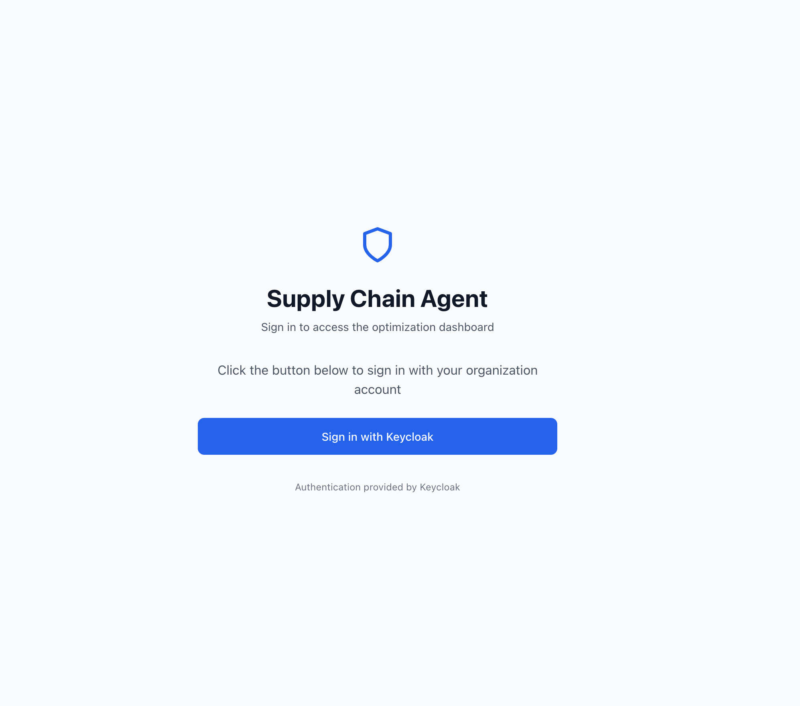
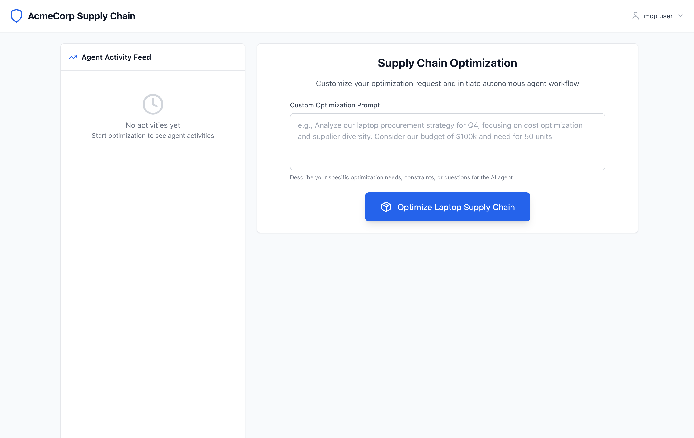
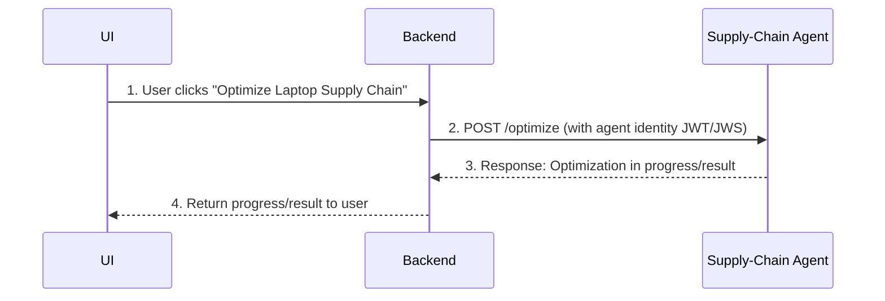
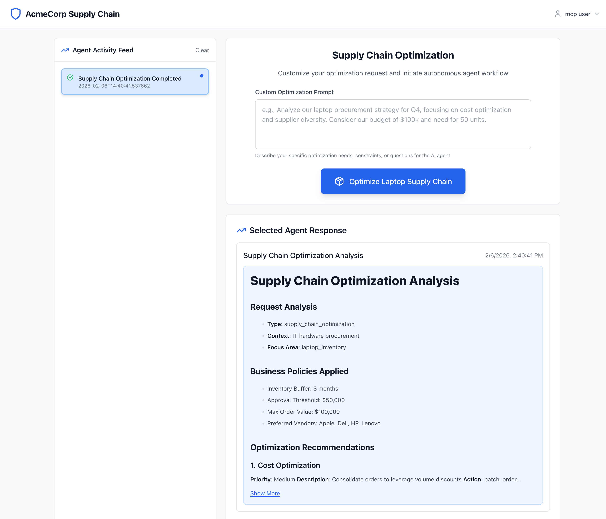
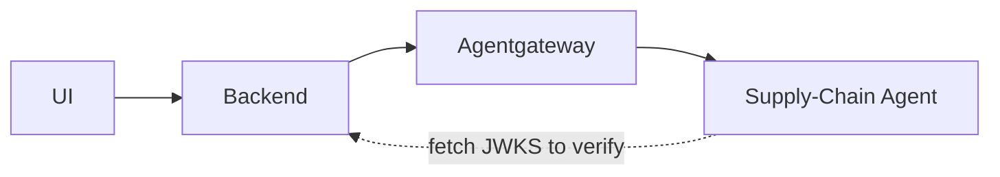

# Agent Identity with JWKS

In this demo, we'll establish Agent Identity with HTTP message signing using JWKS [as described in detail in this flow](./flow-02-jwks.md). For the draft of [AAuth please visit the GitHub repo](https://github.com/dickhardt/agent-auth). 

[← Back to index](index.md)

## Watch the demo

<div style="position: relative; padding-bottom: 56.25%; height: 0; overflow: hidden; max-width: 100%; margin: 1em 0;">
  <iframe style="position: absolute; top: 0; left: 0; width: 100%; height: 100%;" src="https://www.youtube.com/embed/N5q8LVM0p9k" title="Agent Identity with JWKS Demo" frameborder="0" allow="accelerometer; autoplay; clipboard-write; encrypted-media; gyroscope; picture-in-picture; web-share" allowfullscreen></iframe>
</div>

## Run the components

To run this demo, [please set up the prerequisites](./install-aauth-keycloak.md) (Keycloak, Agentgateway, Jaeger). 

We will run the Supply-Chain UI with the following:

```bash
> cd supply-chain-ui
> cp env.example .env
> npm start
```
{: .callout}

The supply-chain-ui is secured with OIDC and Keycloak. AAuth CAN replace OIDC in our demo, but I wanted to be more realistic in an enterprise setting. That is, most applications will be secured with SSO/OIDC but within our agent calls, we can use AAuth. 

Make sure you have [Keycloak running](./install-aauth-keycloak.md), naviate your browser to `http://localhost:3050` and your browser should direct you to Keycloak to login with OIDC:



You can login with "mcp-user / user123". Then you should see the UI:



### Run the Backend Agents and Components

Now you have access to the UI, but the backend components need to be started. Run each component in its own terminal:

<div class="run-tabs">
  <input type="radio" name="run-tabs" id="tab-backend" checked>
  <input type="radio" name="run-tabs" id="tab-agentgateway">
  <input type="radio" name="run-tabs" id="tab-supply-chain">
  <input type="radio" name="run-tabs" id="tab-market-analysis">
  <div class="tab-labels">
    <label for="tab-backend">Backend</label>
    <label for="tab-agentgateway">Agentgateway</label>
    <label for="tab-supply-chain">Supply-chain-agent</label>
    <label for="tab-market-analysis">Market-analysis</label>
  </div>
  <div class="tab-content" id="content-backend">
    <p>From the <code>backend</code> directory:</p>
    <pre><code>
      > cd backend
      > cp env.jwks .env # just need to do this one time
      > uv run . --signature-scheme jwks
    </code></pre>
  </div>
  <div class="tab-content" id="content-agentgateway">
    <p>From the <code>agentgateway</code> directory:</p>
    <pre><code>
      > ./agw -f agentgateway/config.yaml
    </code></pre>
  </div>
  <div class="tab-content" id="content-supply-chain">
    <p>From the <code>supply-chain-agent</code> directory:</p>
    <pre><code>
      > cd supply-chain-agent
      > cp env.jwks .env # just need to do this one time
      > uv run . --signature-scheme jwks --authorization-scheme signature-only
    </code></pre>
  </div>
  <div class="tab-content" id="content-market-analysis">
    <p>From the <code>market-analysis-agent</code> directory:</p>
    <pre><code>
      > cd market-analysis-agent
      > cp env.jwks .env # just need to do this one time
      > uv run . --signature-scheme jwks --authorization-scheme signature-only
    </code></pre>
  </div>
</div>

You'll end up with the following:

| Component              | Port  | Description                                                                                                                    |
|------------------------|-------|--------------------------------------------------------------------------------------------------------------------------------|
| Keycloak               | 8080  | Identity Provider (IdP); issues OIDC tokens, implements the AAuth protocol for agent/user auth tokens                          |
| Agentgateway           | 3000  | Implements AAuth message signing/verification; used for policy enforcement, observability, rate limiting, etc.                 |
| UI                     | 3050  | Main UI for user interaction with the system                                                                                   |
| Backend                | 8000  | Handles OIDC auth flows with Keycloak; backend API that calls the supply-chain-agent                                           |
| Supply-Chain Agent     | 9999  | Performs supply chain calculations; can call out to market-analysis-agent                                                      |
| Market Analysis Agent  | 9998  | Can call out to MCP servers to perform additional analysis                                                                     |

## Walking through the Demo Flow

From the main UI page, if you click the `"Optimize Laptop Supply Chain"` button, it should kick off the flow for the backend components:



This diagram illustrates the core sequence:
- The UI sends a request to the Backend when the user initiates the optimization.
- The Backend creates an AAuth request with appropriate HTTP signatures/signature-key using JWKS
- The Supply-Chain Agent uses AAuth to verify message signatures and agent identity, return a response
- The Backend returns the result (or progress) to the UI.




## Review Flow in Detail

Let's take a look at what the `backend` logs look like:

```bash
INFO:     127.0.0.1:54969 - "GET /.well-known/aauth-agent HTTP/1.1" 200 OK
INFO:     127.0.0.1:54970 - "GET /jwks.json HTTP/1.1" 200 OK
INFO:     127.0.0.1:54965 - "POST /optimization/start HTTP/1.1" 200 OK
INFO:     127.0.0.1:54965 - "OPTIONS /optimization/progress/7c595657-a4b4-45b6-a8c4-f49696328963 HTTP/1.1" 200 OK
INFO:     127.0.0.1:54965 - "GET /optimization/progress/7c595657-a4b4-45b6-a8c4-f49696328963 HTTP/1.1" 200 OK
```
{: .log-output}

What we can see from these access logs is that something called the `/.well-known/aauth-agent` and `jwks.json` files to verify its public keys. So what happens is `backend` calls `supply-chain-agent` with the correct AAuth headers (which we'll see shortly) and `supply-chain-agent` uses the JWKS scheme to identify the `backend` by verifying its signing keys. 

If we look at the logs for the `supply-chain-agent`, it should look similar to:

```bash
INFO:http_headers_middleware:🔐 AAuth headers received: ['signature', 'signature-key', 'signature-input']
INFO:agent_executor:🔐 AAuth signature headers detected: ['signature', 'signature-key', 'signature-input']
INFO:agent_executor:🔐 AAuth scheme: JWKS - identified agent
INFO:agent_executor:🔐 Verifying AAuth signature (scheme: jwks)
INFO:agent_executor:🔐 VERIFYING with: method=POST, target_uri='http://supply-chain-agent.localhost:3000/'
INFO:aauth.signing:🔐 VERIFIER: verify_signature() called
INFO:aauth.signing:🔐 VERIFIER: method=POST, target_uri=http://supply-chain-agent.localhost:3000/
INFO:aauth.signing:🔐 VERIFIER: signature_input_header=sig1=("@method" "@authority" "@path" "signature-key");created=1770414041
INFO:httpx:HTTP Request: GET http://backend.localhost:8000/.well-known/aauth-agent "HTTP/1.1 200 OK"
INFO:httpx:HTTP Request: GET http://backend.localhost:8000/jwks.json "HTTP/1.1 200 OK"
INFO:agent_executor:✅ AAuth signature verification successful
INFO:agent_executor:🔐 Accepting request with valid signature (signature-only mode, scheme=jwks)
INFO:agent_executor:✅ Authorization successful: auth_token verified for agent: None
INFO:agent_executor:🔐 Using AAuth JWKS signing for downstream agent calls
INFO:     127.0.0.1:54968 - "POST / HTTP/1.1" 200 OK
```
{: .log-output}

In these logs, we can see the request to `supply-chain-agent` come in, that it verifies the message was signed with the expectd keys to verify `backend`'s identity and then a successful response. 

Lastly, if we look at the logs for Agentgateway:

```bash
2026-02-06T21:19:22.418895Z     info    state_manager   loaded config from File("./agentgateway/config.yaml")
2026-02-06T21:19:22.419230Z     info    app     serving UI at http://localhost:15000/ui
2026-02-06T21:19:22.419244Z     info    agent_core::readiness   Task 'agentgateway' complete (7.722275ms), still awaiting 1 tasks
2026-02-06T21:19:22.419255Z     info    management::hyper_helpers       listener established    address=127.0.0.1:15000 component="admin"
2026-02-06T21:19:22.419344Z     info    management::hyper_helpers       listener established    address=[::]:15020 component="stats"
2026-02-06T21:19:22.419386Z     info    proxy::gateway  started bind    bind="bind/3000"
2026-02-06T21:19:22.419395Z     info    agent_core::readiness   Task 'state manager' complete (7.872532ms), marking server ready
2026-02-06T21:40:41.536353Z     info    request gateway=default/default listener=listener0 route=default/route0 endpoint=localhost:9999 src.addr=127.0.0.1:54966 http.method=POST http.host=supply-chain-agent.localhost http.path=/ http.version=HTTP/1.1 http.status=200 trace.id=3aef7d77d62861bad0066c70fc24a1db span.id=a4085bd01952f77f aauth.scheme=Jwks aauth.agent=http://backend.localhost:8000 protocol=a2a a2a.method=message/send duration=117ms aauth_scheme="Jwks" aauth_agent_identity="http://backend.localhost:8000" sig_key="sig1=(scheme=jwks id=\"http://backend.localhost:8000\" kid=\"backend-ephemeral-1\")"
```
{: .log-output}

We can see that agentgateway also verified the agent's identity and added some of this metadata to the access logging. The fields `aauth_scheme`, `aauth_agent_identity`, `sig_key` are all added to the log output (see the last line). These fields can also be used for authorization policy in the gateway. We'll see that in the last post of this series. 

This flow from the UI (just clicking the button) doesn't trigger the `market-analysis-agent` but if we type "perform market analysis" in the UI prompt text box it will. And since all of the components are configured for AAuth JWKS agent identity, you should see the `supply-chain-agent` call the `market-analysis-agent` in that flow. Check the logs to verify. 


## Summary: End-to-End Flow Diagram

The following diagram summarizes the complete Agent Identity with JWKS flow described above:



**Key:** Backend signs with JWKS → Agentgateway verifies → Supply-Chain Agent fetches Backend's JWKS to verify identity.


[In the next post](./agent-authorization-autonomous.md), we'll look at how the [AAuth authorization flow works](./flow-03-authz.md) in this demo!

[← Back to index](index.md)