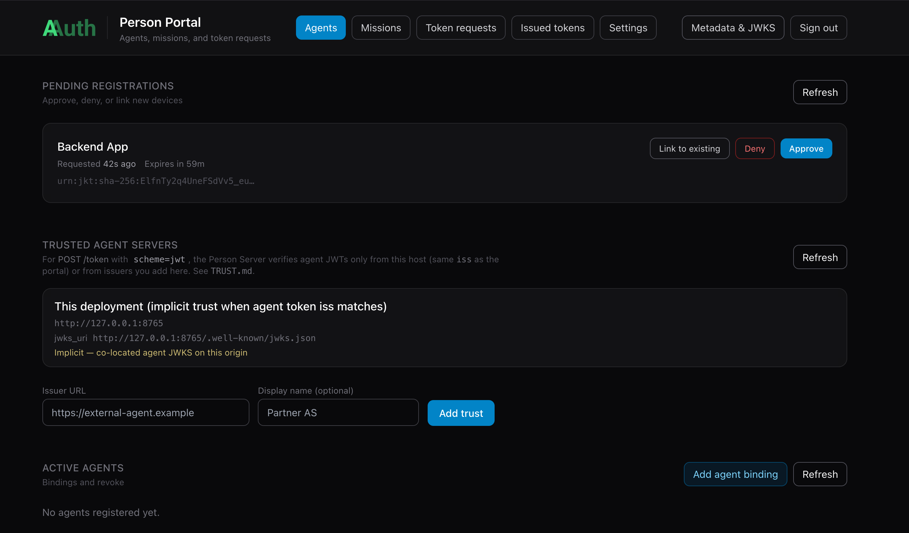
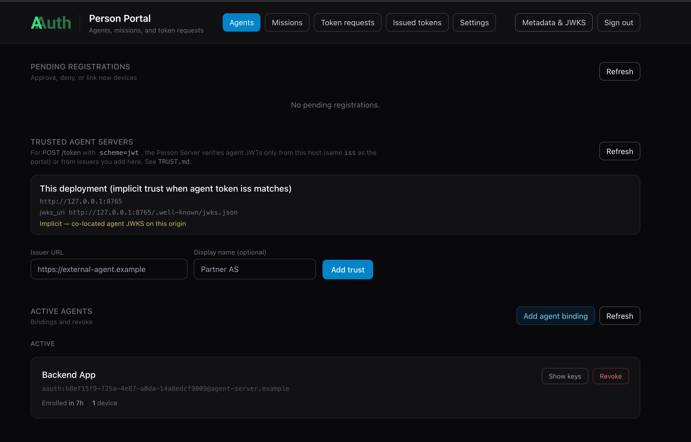
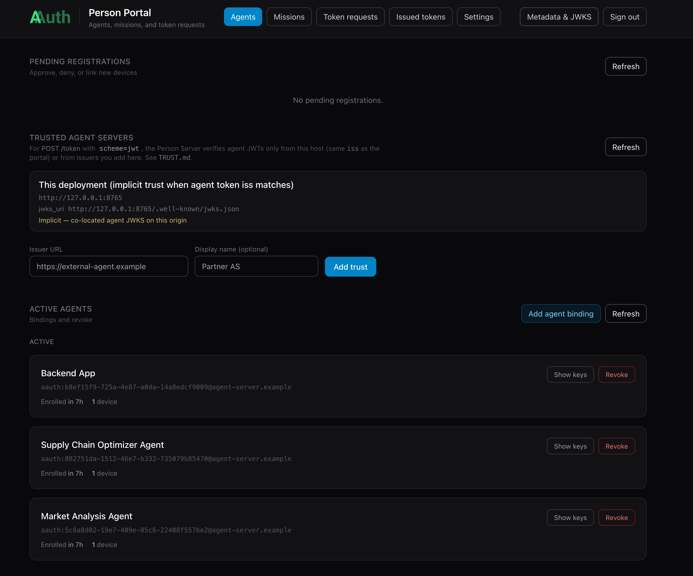
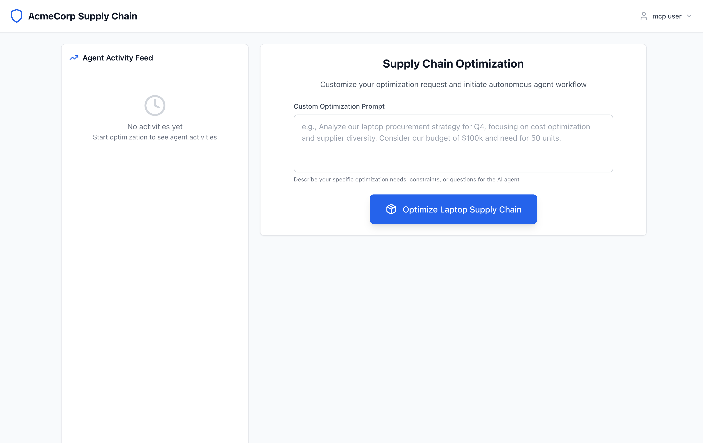
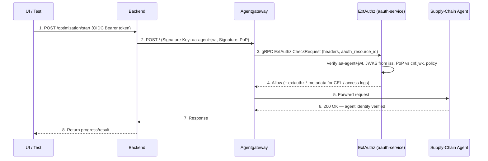
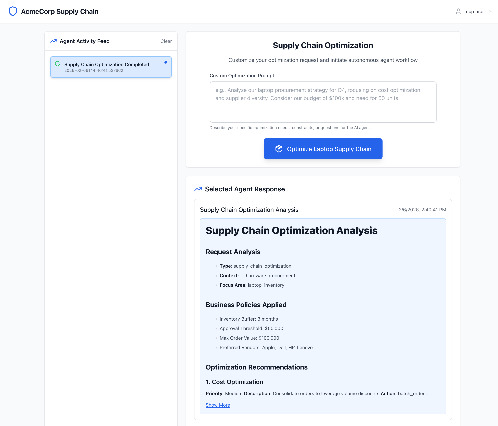

# Agent Identity

In this demo, we establish Agent Identity using **`aa-agent+jwt`** tokens: a short-lived JWT issued by an AAuth Agent Provider that cryptographically binds the agent's signing key to its identity. This replaces pseudonymous or static JWKS-based identity with a two-layer key model that includes key rotation, proof-of-possession, and a verifiable issuer chain. See the [AAuth spec §5.2](https://github.com/dickhardt/AAuth) for the normative definition.

[← Back to index](index.md)

## Watch the demo

<div style="position: relative; padding-bottom: 56.25%; height: 0; overflow: hidden; max-width: 100%; margin: 1em 0;">
  <iframe style="position: absolute; top: 0; left: 0; width: 100%; height: 100%;" src="https://www.youtube.com/embed/N5q8LVM0p9k" title="Agent Identity with aa-agent+jwt Demo" frameborder="0" allow="accelerometer; autoplay; clipboard-write; encrypted-media; gyroscope; picture-in-picture; web-share" allowfullscreen></iframe>
</div>

---

## Bootstrap: How Agents Acquire an Agent Token

Before any AAuth protocol flow begins, each agent must obtain an **`aa-agent+jwt`** token from its AAuth Agent Provider. In this demo the Person Server (`http://127.0.0.1:8765`) acts as the AAuth Agent Provider. This happens automatically on startup.

### The Two-Key Model

Each agent maintains two key layers:

| Key | Lifetime | Purpose |
|-----|----------|---------|
| **Stable key** (`supply-chain-stable.key`) | Permanent — persisted to disk | Long-term identity anchor. Signs delegation JWTs for token refresh. Never leaves the agent. Used this way for demo. In a real environment, this key would be stored in a secure enclave. |
| **Ephemeral key** | Rotated on each token refresh | Active signing key for HTTP Message Signatures. Its public half is embedded in the agent token via `cnf.jwk`. |

The ephemeral key is what signs individual HTTP requests. The stable key establishes continuity of identity across token renewals without requiring the user to re-approve.

### Bootstrap Sequence

On startup of an agent (`backend`, `supply-chain-agent`, or `market-analysis-agent`) you'll see:

```
INFO:     Started server process [28461]
INFO:     Waiting for application startup.
INFO:app.services.stable_identity:Loaded stable identity from /Users/ceposta/python/aauth-full-demo/backend (JKT sha-256: ElfnTy2q4UneFSdVv5_euKRZMl73YLjby7LJs5eMbzo)
INFO:app.services.stable_identity:Stable public JWK (stable_pub wire shape): {"kty":"OKP","crv":"Ed25519","x":"YwkGsYY8OGe4mPllE8T6p7ncadMCr3Iel4rWAx6VJgs"}
INFO:app.services.agent_token_service:Ephemeral signing key (startup): {"kty":"OKP","crv":"Ed25519","x":"yPE-tGxq1IZHTmqGSSb01i6d0mC2tJBiOabqpVk_aa4"}
INFO:     Application startup complete.
INFO:     Uvicorn running on http://0.0.0.0:8000 (Press CTRL+C to quit)
INFO:app.services.agent_token_service:Agent Server discovery OK: issuer=http://127.0.0.1:8765 register=http://127.0.0.1:8765/register refresh=http://127.0.0.1:8765/refresh
```

The agent is trying to register with the person server (PS). We need to go to the person server and approve the agent:



If you approve the agent (the Backend in this case), it will show up as an Active Agent:





And once the Backend is approved, it should be able to acquire its `aa-agent+jwt` token which represents its identity and is bound through message signing to its ephemeral key. 

```
INFO:app.services.agent_token_service:Agent token updated, exp in 86399s
aa-agent+jwt claims (startup):
{
  "cnf": {
    "jwk": {
      "crv": "Ed25519",
      "kty": "OKP",
      "x": "yPE-tGxq1IZHTmqGSSb01i6d0mC2tJBiOabqpVk_aa4"
    }
  },
  "dwk": "aauth-agent.json",
  "exp": 1778799170,
  "iat": 1778712770,
  "iss": "http://127.0.0.1:8765",
  "jti": "ac016e2e-df75-47c2-b62e-5731f4cd8868",
  "sub": "aauth:b8ef15f9-725a-4e87-a0da-14a8edcf9009@agent-server.example"
}
INFO:app.services.agent_token_service:Agent Server registration complete; agent token acquired

```
{: .log-output}

### The `aa-agent+jwt` Token Structure

The spec defines the required structure (AAuth §5.2.2):

```json
{
  "iss": "http://127.0.0.1:8765",
  "sub": "urn:jkt:sha-256:<stable-key-JWK-thumbprint>",
  "iat": 1770412670,
  "exp": 1770416270,
  "cnf": {
    "jwk": {
      "kty": "OKP",
      "crv": "Ed25519",
      "x": "<ephemeral-public-key>"
    }
  }
}
```

Key claims:
- **`iss`** — the AAuth Agent Provider that issued this token (the Person Server in this demo)
- **`sub`** — a stable agent identity. In this demo, it's derived from the stable public key JWK thumbprint; the main point about `sub` is that it's stable across token refreshes
- **`cnf.jwk`** — the active ephemeral public key; **must match** the key used to sign each HTTP request (proof-of-possession)
- **`exp`** — short-lived (typically 1 hour); the stable key enables silent renewal

### Token Refresh (without re-approval)

When the agent token is near expiry the agent renews it silently: the stable key signs a short-lived delegation JWT (`typ: jkt-s256+jwt`) whose `cnf.jwk` points to a **new** ephemeral key. This delegation JWT is sent to `POST /refresh`. The AAuth Agent Provider verifies the stable-key signature and issues a fresh `aa-agent+jwt` for the new ephemeral key — no user interaction needed.

---

## Run the Components

To run this demo, [please set up the prerequisites](./install-aauth.md) (Agentgateway, Person Server).

Start individual services manually if you want to explore each one:

| Component | Port | Command |
|-----------|------|---------|
| UI | 3050 | `cd supply-chain-ui && npm start` |
| Backend | 8000 | `cd backend && uv run .` |
| Supply-chain-agent | 9999 | `cd supply-chain-agent && uv run .` |
| Market-analysis-agent | 9998 | `cd market-analysis-agent && uv run .` |

Each Python service calls `AgentTokenService.startup()` during its lifespan and registers with the Person Server automatically. Check `AGENT_SERVER_BASE` in each service's `.env` (defaults to `http://127.0.0.1:8765`). You will have to go approve each of the agents in the person server. Once approved, you should see all three agents/components "Active":



---

## Walking through the Demo Flow

Go to `http://localhost:3050` to see the demo UI:



You can click on the "Optimize Supply Chain" button to initiate the flow.

When the backend calls the supply-chain-agent, it signs the HTTP request with its ephemeral key and presents its `aa-agent+jwt` in the `Signature-Key` header:

```
INFO:app.services.aauth_interceptor:🔐 Signing request to: http://supply-chain-agent.localhost:3000/
INFO:app.services.aauth_interceptor:🔐 AAuth: Signing with agent token (aa-agent+jwt in Signature-Key)
INFO:app.services.aauth_interceptor:🔐 SIGNING with: method=POST, target_uri='http://supply-chain-agent.localhost:3000/'
```

The UI will call the `backend` service to invoke the `supply-chain-agent`. Communication between `backend` and any agents happens over the A2A protocol. Before from `backend` reaches `supply-chain-agent`, it goes through Agentgateway where AAuth gets evaluated. In this first part of the demo, the signature will be checked, Identity confirmed (checking the signing chain), and only allowed through if AAuth identity is satisfied. This "identity only" flow is what we call "mode 1" in this demo documentation.

Agentgateway does not implement AAuth verification itself. Its **extAuthz** policy sends each matching request to the **aauth-service** (from [extauth-aauth-resource](https://github.com/christian-posta/extauth-aauth-resource)) over **gRPC** on `localhost:7070`; that service validates the agent token and proof-of-possession, applies policy, and returns allow/deny before the gateway proxies to the agent.


```mermaid
sequenceDiagram
  participant UI as UI / Test
  participant BE as Backend
  participant AGW as Agentgateway
  participant EA as ExtAuthz (aauth-service)
  participant SCA as Supply-Chain Agent

  UI->>BE: 1. POST /optimization/start (OIDC Bearer token)
  BE->>AGW: 2. POST / (Signature-Key: aa-agent+jwt, Signature: PoP)
  AGW->>EA: 3. gRPC ExtAuthz CheckRequest (headers, aauth_resource_id)
  EA->>EA: Verify aa-agent+jwt, JWKS from iss, PoP vs cnf.jwk, policy
  EA-->>AGW: 4. Allow (+ extauthz.* metadata for CEL / access logs)
  AGW->>SCA: 5. Forward request
  SCA-->>AGW: 6. 200 OK — agent identity verified
  AGW-->>BE: 7. Response
  BE-->>UI: 8. Return progress/result
```

In Mode 1 (identity-based access, AAuth spec §4.1.1) the `aauth-service` extauthz service accepts the `aa-agent+jwt` directly — no 401 resource-token challenge, no Person Server exchange. The extauth config (`aauth-config.yaml`) makes this explicit:

```yaml
resources:
  - id: supply-chain-agent
    authority_override: "supply-chain-agent.localhost:3000"
    signing_key:
      kid: spa-rsk-1
      alg: EdDSA
      private_key_file: spa-resource-key.pem
    signature_window: 60s
    allow_pseudonymous: false
    allowed_signature_key_schemes:
      - jwt
    allowed_jwt_types:
      - aa-agent+jwt        # only agent identity token; aa-auth+jwt never needed
    # No access: section  → resource never issues a 401 resource-token challenge
    # No person_server:   → no PS exchange; identity-only policy applies
    policy:
      name: default
```

Key config:
- **`signing_key`** — The private key used to sign any resource tokens; we don't sign in this demo, but here's how you configure
- **`allowed_signature_key_schemes`** — specifies the allowed signing types; `hwk`, `jwks_uri` are other options, but not specified therefore not allowed in this configuration; only agent tokens are allowed
- **`allowed_jwt_types`** — make it explicit: agent tokens are required/allowed; we don't need auth tokens in this demo


### Backend Logs

When `backend` makes a call, the signing interceptor logs:

```bash
INFO:aauth_interceptor:🔐 AAuth: Signing with agent token (aa-agent+jwt in Signature-Key)
INFO:aauth_interceptor:🔐 SIGNING with: method=POST, target_uri='http://supply-chain-agent.localhost:3000/'
```
{: .log-output}

### Supply-chain-agent Logs

The resource side (via aauth-service) verifies the `aa-agent+jwt`:

```bash
INFO:     127.0.0.1:54969 - "GET /.well-known/aauth-agent.json HTTP/1.1" 200 OK
INFO:     127.0.0.1:54965 - "POST /optimization/start HTTP/1.1" 200 OK
```
{: .log-output}

The aauth-service:
1. Decodes the `aa-agent+jwt` from `Signature-Key`
2. Fetches the AAuth Agent Provider's JWKS at `{iss}/.well-known/aauth-agent.json` to verify the JWT signature
3. Confirms `typ: aa-agent+jwt`
4. Verifies that the key used to sign the HTTP request matches `cnf.jwk` in the token (proof-of-possession)
5. Applies the configured policy — in Mode 1, `default` policy accepts any identified agent

### Agentgateway Access Logs

Agentgateway enriches the access log with AAuth metadata:

```bash
info request gateway=default/default listener=listener0 route=default/route0
     endpoint=localhost:9999 src.addr=127.0.0.1:54966
     http.method=POST http.host=supply-chain-agent.localhost http.path=/
     http.status=200 duration=117ms
     aauth.scheme=Jwt
     aauth.agent=http://backend.localhost:8000
     sig_key="sig1=(scheme=jwt typ=\"aa-agent+jwt\" sub=\"urn:jkt:sha-256:...\")"
```
{: .log-output}

The `aauth.scheme=jwt` field (type `aa-agent+jwt`) and `aauth.agent` (the verified agent identity URL) are available for use in authorization CEL rules.

On a successful call, you should see: 


The `market-analysis-agent` can be invoked by typing `"perform market analysis"` into the UI's text box. This flow triggers the supply-chain-agent → market-analysis-agent call. Both hops use `aa-agent+jwt` signing. Check `logs/supply-chain-agent.log` and `logs/market-analysis-agent.log` to see the same bootstrap and verification pattern on the downstream hop.

---

**Key:** Each agent bootstraps an `aa-agent+jwt` from the Person Server → presents it in `Signature-Key` → Agentgateway verifies the JWT and proof-of-possession → forwards to the resource.

---

[Next: Agent Authorization (Autonomous)](./agent-authorization-autonomous.md) — where agents need more than identity and must obtain an `aa-auth+jwt` via the 401-challenge / resource-token exchange.

[← Back to index](index.md)
