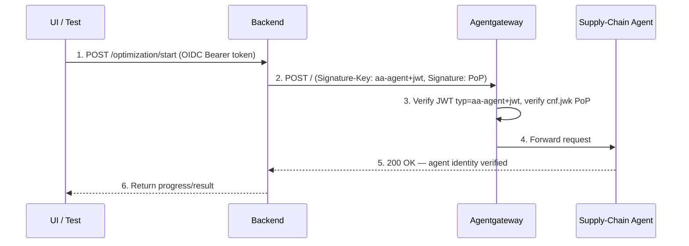
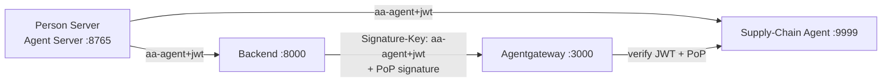

# Agent Identity with aa-agent+jwt

In this demo, we establish Agent Identity using **`aa-agent+jwt`** tokens: a short-lived JWT issued by an Agent Server that cryptographically binds the agent's signing key to its identity. This replaces pseudonymous or static JWKS-based identity with a two-layer key model that includes key rotation, proof-of-possession, and a verifiable issuer chain. See the [AAuth spec §5.2](https://github.com/dickhardt/AAuth) for the normative definition.

[← Back to index](index.md)

## Watch the demo

<div style="position: relative; padding-bottom: 56.25%; height: 0; overflow: hidden; max-width: 100%; margin: 1em 0;">
  <iframe style="position: absolute; top: 0; left: 0; width: 100%; height: 100%;" src="https://www.youtube.com/embed/N5q8LVM0p9k" title="Agent Identity with aa-agent+jwt Demo" frameborder="0" allow="accelerometer; autoplay; clipboard-write; encrypted-media; gyroscope; picture-in-picture; web-share" allowfullscreen></iframe>
</div>

---

## Bootstrap: How Agents Acquire an Agent Token

Before any AAuth protocol flow begins, each agent must obtain an **`aa-agent+jwt`** token from its Agent Server. In this demo the Person Server (`http://127.0.0.1:8765`) acts as the Agent Server. This happens automatically on startup.

### The Two-Key Model

Each agent maintains two key layers:

| Key | Lifetime | Purpose |
|-----|----------|---------|
| **Stable key** (`supply-chain-stable.key`) | Permanent — persisted to disk | Long-term identity anchor. Signs delegation JWTs for token refresh. Never leaves the agent. |
| **Ephemeral key** | Rotated on each token refresh | Active signing key for HTTP Message Signatures. Its public half is embedded in the agent token via `cnf.jwk`. |

The ephemeral key is what signs individual HTTP requests. The stable key establishes continuity of identity across token renewals without requiring the user to re-approve.

### Bootstrap Sequence

```
Agent startup
     │
     ├─ 1. load_or_create_stable_identity()
     │      ↳ loads supply-chain-stable.key/pub  (or generates new pair on first run)
     │
     ├─ 2. generate_ed25519_keypair()  → ephemeral keypair
     │
     ├─ 3. GET http://127.0.0.1:8765/.well-known/aauth-agent.json
     │      ↳ discovers registration_endpoint, refresh_endpoint, issuer
     │
     ├─ 4. POST /register   (signed with ephemeral HWK)
     │      body: { stable_pub: <JWK>, agent_name: "Supply Chain Optimizer Agent" }
     │
     │      if 200 → receive aa-agent+jwt immediately
     │      if 202 → poll Location URL until approved, then receive aa-agent+jwt
     │
     └─ 5. Verify cnf.jwk in token matches ephemeral public key
```

On startup you'll see:

```
Ephemeral signing key (startup): {"crv":"Ed25519","kty":"OKP","x":"<base64>"}
Agent Server discovery OK: issuer=http://127.0.0.1:8765 register=http://127.0.0.1:8765/register refresh=http://127.0.0.1:8765/refresh
Agent Server registration complete; agent token acquired
aa-agent+jwt claims (startup):
{
  "cnf": {
    "jwk": {
      "crv": "Ed25519",
      "kty": "OKP",
      "x": "<ephemeral-public-key-base64>"
    }
  },
  "exp": 1770416270,
  "iat": 1770412670,
  "iss": "http://127.0.0.1:8765",
  "sub": "urn:jkt:sha-256:<stable-key-thumbprint>"
}
```
{: .log-output}

### The `aa-agent+jwt` Token Structure

The spec defines the required structure (AAuth §5.2.2):

```json
{
  "iss": "http://127.0.0.1:8765",
  "sub": "urn:jkt:sha-256:<stable-key-JWK-thumbprint>",
  "iat": 1770412670,
  "exp": 1770416270,
  "cnf": {
    "jwk": {
      "kty": "OKP",
      "crv": "Ed25519",
      "x": "<ephemeral-public-key>"
    }
  }
}
```

Key claims:
- **`iss`** — the Agent Server that issued this token (the Person Server in this demo)
- **`sub`** — a stable `urn:jkt:sha-256:…` identifier derived from the stable public key JWK thumbprint; stable across token refreshes
- **`cnf.jwk`** — the active ephemeral public key; **must match** the key used to sign each HTTP request (proof-of-possession)
- **`exp`** — short-lived (typically 1 hour); the stable key enables silent renewal

### Token Refresh (without re-approval)

When the token is near expiry the agent renews it silently: the stable key signs a short-lived delegation JWT (`typ: jkt-s256+jwt`) whose `cnf.jwk` points to a **new** ephemeral key. This delegation JWT is sent to `POST /refresh`. The Agent Server verifies the stable-key signature and issues a fresh `aa-agent+jwt` for the new ephemeral key — no user interaction needed.

---

## Run the Components

To run this demo, [please set up the prerequisites](./install-aauth-keycloak.md) (Keycloak, Agentgateway, Person Server).

Start all services with the identity-only config (Mode 1):

```bash
./scripts/start-infra.sh mode1
```

Or start individual services manually if you want to explore each one:

| Component | Port | Command |
|-----------|------|---------|
| Keycloak | 8080 | `./bin/kc.sh start-dev --bootstrap-admin-username=admin --bootstrap-admin-password=admin` |
| Person Server (Agent Server) | 8765 | `cd ~/python/aauth-person-server && ./run-server.sh` |
| Agentgateway | 3000 | `agentgateway -f agentgateway/config.yaml` |
| aauth-service | 7070/8081 | `./agentgateway/run-aauth-extauth.sh` |
| Backend | 8000 | `cd backend && .venv/bin/python run_server.py` |
| Supply-chain-agent | 9999 | `cd supply-chain-agent && .venv/bin/python __main__.py` |
| Market-analysis-agent | 9998 | `cd market-analysis-agent && .venv/bin/python __main__.py` |

Each Python service calls `AgentTokenService.startup()` during its lifespan and registers with the Person Server automatically. Check `AGENT_SERVER_BASE` in each service's `.env` (defaults to `http://127.0.0.1:8765`).

---

## Walking through the Demo Flow

Once bootstrapped, when the backend calls the supply-chain-agent, it signs the HTTP request with its ephemeral key and presents its `aa-agent+jwt` in the `Signature-Key` header:

```
Signature-Key: sig=jwt; jwt="eyJhbGciOiJFZERTQSIsInR5cCI6ImFhLWFnZW50K2p3dCJ9..."
Signature-Input: sig=("@method" "@authority" "@path" "signature-key" "content-digest");created=1770415970
Signature: sig=:...EdDSA-signature-over-the-above...:
```

The flow:


```mermaid
sequenceDiagram
  participant UI as UI / Test
  participant BE as Backend
  participant AGW as Agentgateway
  participant SCA as Supply-Chain Agent

  UI->>BE: 1. POST /optimization/start (OIDC Bearer token)
  BE->>AGW: 2. POST / (Signature-Key: aa-agent+jwt, Signature: PoP)
  AGW->>AGW: 3. Verify JWT typ=aa-agent+jwt, verify cnf.jwk PoP
  AGW->>SCA: 4. Forward request
  SCA-->>BE: 5. 200 OK — agent identity verified
  BE-->>UI: 6. Return progress/result
```

In Mode 1 (identity-based access, AAuth spec §4.1.1) the aauth-service accepts the `aa-agent+jwt` directly — no 401 resource-token challenge, no Person Server exchange. The agentgateway config (`aauth-config.yaml`) makes this explicit:

```yaml
allowed_signature_key_schemes:
  - jwt
allowed_jwt_types:
  - aa-agent+jwt   # only agent identity token; aa-auth+jwt never needed
# No access: section → resource never issues a 401 resource-token challenge
```

### Backend Logs

When `backend` makes a call, the signing interceptor logs:

```bash
INFO:aauth_interceptor:🔐 AAuth: Signing with agent token (aa-agent+jwt in Signature-Key)
INFO:aauth_interceptor:🔐 SIGNING with: method=POST, target_uri='http://supply-chain-agent.localhost:3000/'
```
{: .log-output}

### Supply-chain-agent Logs

The resource side (via aauth-service) verifies the `aa-agent+jwt`:

```bash
INFO:     127.0.0.1:54969 - "GET /.well-known/aauth-agent.json HTTP/1.1" 200 OK
INFO:     127.0.0.1:54965 - "POST /optimization/start HTTP/1.1" 200 OK
```
{: .log-output}

The aauth-service:
1. Decodes the `aa-agent+jwt` from `Signature-Key`
2. Fetches the Agent Server's JWKS at `{iss}/.well-known/aauth-agent.json` to verify the JWT signature
3. Confirms `typ: aa-agent+jwt`
4. Verifies that the key used to sign the HTTP request matches `cnf.jwk` in the token (proof-of-possession)
5. Applies the configured policy — in Mode 1, `default` policy accepts any identified agent

### Agentgateway Access Logs

Agentgateway enriches the access log with AAuth metadata:

```bash
info request gateway=default/default listener=listener0 route=default/route0
     endpoint=localhost:9999 src.addr=127.0.0.1:54966
     http.method=POST http.host=supply-chain-agent.localhost http.path=/
     http.status=200 duration=117ms
     aauth.scheme=Jwt
     aauth.agent=http://backend.localhost:8000
     sig_key="sig1=(scheme=jwt typ=\"aa-agent+jwt\" sub=\"urn:jkt:sha-256:...\")"
```
{: .log-output}

The `aauth.scheme=Jwt` field (type `aa-agent+jwt`) and `aauth.agent` (the verified agent identity URL) are available for use in authorization CEL rules.

Market analysis requests that include `"perform market analysis"` also trigger the supply-chain-agent → market-analysis-agent call. Both hops use `aa-agent+jwt` signing. Check `logs/supply-chain-agent.log` and `logs/market-analysis-agent.log` to see the same bootstrap and verification pattern on the downstream hop.

---

## Summary: End-to-End Flow Diagram


```mermaid
flowchart LR
    PS[Person Server\nAgent Server :8765] -->|aa-agent+jwt| BE[Backend :8000]
    PS -->|aa-agent+jwt| SCA[Supply-Chain Agent :9999]
    BE -->|Signature-Key: aa-agent+jwt\n+ PoP signature| AGW[Agentgateway :3000]
    AGW -->|verify JWT + PoP| SCA
```

**Key:** Each agent bootstraps an `aa-agent+jwt` from the Person Server → presents it in `Signature-Key` → Agentgateway verifies the JWT and proof-of-possession → forwards to the resource.

---

## Automated Testing (Mode 1)

The identity-only flow is exercised by the **mode1** test suite:

```bash
./scripts/start-infra.sh mode1
./scripts/run-tests.sh mode1
./scripts/stop-infra.sh
```

### What the Tests Verify

`tests/integration/test_mode1_flow.py` (5 tests):

| Test | What it checks |
|------|---------------|
| `test_supply_chain_optimization_flow` | Start → poll → results completes with `status=completed` |
| `test_market_analysis_request` | `"perform market analysis"` prompt triggers market-analysis-agent call |
| `test_empty_request_prompt` | Empty prompt is accepted and returns a `request_id` |
| `test_multiple_concurrent_requests` | Three simultaneous optimization requests all complete |
| `test_mode1_no_user_interaction` | Confirms `interaction_required` is **never** set (identity-only mode needs no consent) |

`tests/integration/test_health.py` (9 tests) runs first and confirms all services — including the Person Server that issued the `aa-agent+jwt` tokens — are reachable before the flow tests run.

[In the next post](./agent-authorization-autonomous.md), we'll look at how the [AAuth authorization flow works](./flow-03-authz.md) — where agents need more than identity and must obtain an auth token.

[← Back to index](index.md)
