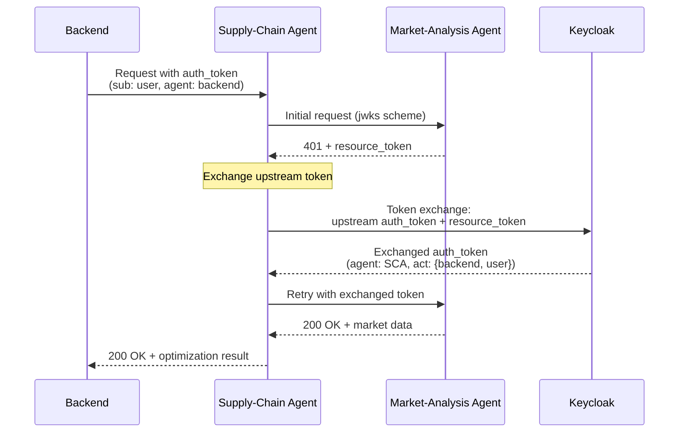

# Agent Token Exchange

In this demo, we'll explore how Agent Identity orks when user consent is required and _needs to propagate across agents/resources_. This builds on the [authorization wiht user consent flow](./agent-authorization-on-behalf-of.md) but adds one more piece: agent acting on behalf of. When an agent needs to act on behalf of a user, even across service hops, the authorization server (Keycloak) enables token exchange.

[← Back to index](index.md)

## Watch the demo

<div style="position: relative; padding-bottom: 56.25%; height: 0; overflow: hidden; max-width: 100%; margin: 1em 0;">
  <iframe style="position: absolute; top: 0; left: 0; width: 100%; height: 100%;" src="https://www.youtube.com/embed/5CNeJZyeL_A" title="Agent Token Exchange Demo" frameborder="0" allow="accelerometer; autoplay; clipboard-write; encrypted-media; gyroscope; picture-in-picture; web-share" allowfullscreen></iframe>
</div>

## Token Exchange: Supply Chain Agent Calls Market Analysis Agent

When the `supply-chain-agent` (SCA) receives the request from `backend`, it needs to call the `market-analysis-agent` (MAA) to get market data. But SCA is now acting as both a **resource** (receiving the backend's request) and an **agent** (making its own request to MAA). To do this, it must be authorized to act on behalf of the user so it will need to request a token exchange:

Here's the complete flow:


### Step 1: MAA Issues Challenge

When SCA first calls MAA, it receives a 401 with a resource token:
```bash
INFO:agent_executor:🔐 Authorization required: scheme=jwt needed but received jwks
INFO:resource_token_service:✅ Resource token generated successfully
INFO:agent_executor:🔐 Issuing resource_token for agent: http://supply-chain-agent.localhost:3000
```

The resource token identifies SCA as the requesting agent:
```json
{
  "iss": "http://market-analysis-agent.localhost:3000",
  "aud": "http://localhost:8080/realms/aauth-test",
  "agent": "http://supply-chain-agent.localhost:3000",
  "agent_jkt": "9aOuAvaRr0YVHxiZqIpJvDf9hjg2uvKw1FVVMzDiOwg",
  "exp": 1770659003,
  "scope": "market-analysis:analyze"
}
```

### Step 2: Token Exchange Request

SCA now performs a token exchange. It presents to Keycloak:
1. **Upstream auth_token**: The token it received from `backend` (proving user authorization)
2. **Resource token**: The token from MAA (proving what SCA needs access to)

From the logs in SCA:

```bash
INFO:agent_executor:🔐 Exchanging upstream auth_token for MAA token
INFO:aauth.tokens:🔐 Token exchange request: 
  upstream_auth_token=eyJhbGci...
  resource_token=eyJhbGci...
```

The token exchange request is provided with the JWT scheme and SCA signs the request using using its key. The Auth server reviews the JWT from the `Signature-Key` header and sees that the token was issued with an `aud` of `supply-chain-agent`. The Auth server, knowing this is a token exchange request, will use the `aud` claim to retrieve the JWKS of the `supply-chain-agent`. 


```bash
INFO:aauth_token_service:🔐 Signing with JWT scheme for token exchange
INFO:aauth.signing:🔐   Line 3: '"signature-key": sig1=(scheme=jwt jwt="eyJhbGci...")'
```

### Step 3: Keycloak Issues Exchanged Token

Keycloak validates:
1. The upstream auth_token signature (from Keycloak's own JWKS)
2. The resource token signature (from MAA's JWKS)
3. The request signature matches the key in `aud`/JWKS of the upstream token
4. The delegation chain is authorized

Keycloak issues a new auth_token:
```json
{
  "iss": "http://localhost:8080/realms/aauth-test",
  "aud": "http://market-analysis-agent.localhost:3000",
  "sub": "00b519e8-f409-4201-8911-1cb408e8a082",
  "agent": "http://supply-chain-agent.localhost:3000",
  "cnf": {
    "jwk": {
      "kty": "OKP",
      "crv": "Ed25519",
      "x": "jqjPR5broSbHfpXZaGpTrBcem4DX6gbWEQsDWEyZMG0",
      "kid": "-DN2FPpkqklNWGbl9yYVuH4ONyIgBp36hU4nJJKUARY"
    }
  },
  "scope": "market-analysis:analyze",
  "act": {
    "sub": "00b519e8-f409-4201-8911-1cb408e8a082",
    "agent": "http://backend.localhost:8000"
  }
}
```

### The `act` Claim: Tracking Delegation

The critical new element is the **`act` (actor) claim**:

| Claim | Value | Meaning |
|-------|-------|---------|
| **`agent`** | `supply-chain-agent.localhost:3000` | **Direct caller** - SCA is making this request |
| **`act.agent`** | `backend.localhost:8000` | **Acting on behalf of** - Backend authorized the original request |
| **`act.sub`** | `00b519e8-f409-4201-8911-1cb408e8a082` | **User identity** - The user who granted consent |
| **`cnf.jwk`** | SCA's signing key | **Cryptographic binding** - Only SCA can use this token |

MAA can now make authorization decisions with full causal context:
- **Who's calling?** supply-chain-agent
- **On whose behalf?** backend agent
- **For which user?** User `00b519e8...`
- **With what authorization?** scope: `market-analysis:analyze`

### Step 4: Supply Chain Agent Accesses Market Analysis Agent

SCA retries the request with the exchanged token:
```bash
INFO:agent_executor:✅ Token exchange successful, retrying MAA request with exchanged token
INFO:aauth_interceptor:🔐 AAuth: Signing request with JWT scheme (auth_token present)
```

MAA validates the exchanged token and grants access:

```bash
INFO:agent_executor:🔐 JWT scheme detected: verifying auth_token
INFO:agent_executor:✅ Auth token verified successfully
```

## Causal Chain Preserved

Compare the tokens at each hop:

| Hop | Token Audience | Agent Claim | Actor Claim | Meaning |
|-----|---------------|-------------|-------------|---------|
| **Backend → SCA** | `supply-chain-agent` | `backend.localhost:8000` | ❌ None | Backend directly authorized |
| **SCA → MAA** | `market-analysis-agent` | `supply-chain-agent` | ✅ `{agent: backend, sub: user}` | SCA acting on-behalf-of backend+user |

The `act` claim creates an **audit trail**: 
- User `00b519e8...` authorized backend
- Backend called SCA
- SCA called MAA
- All actions trace back to the original user consent

This is the foundation for **multi-hop authorization** - each service in the chain proves both its own identity and the authority under which it's acting.

## Summary

When an agent needs to call another agent/MCP server after receiving user consent, the token will need to be exchanged. AAuth explicitly calls out Token Exchange for this purpose. This part of the spec also accounts for cross-identity token exchange (not shown in this demo) where agents live in different trust domains governed by separate authorization servers. 

Use user-delegated mode when: Agents must act on behalf of a specific user (accessing user data, making decisions with user accountability, compliance requirements).

In the next and final post, we'll dig into using Agentgateway for policy control .

[← Back to index](index.md)