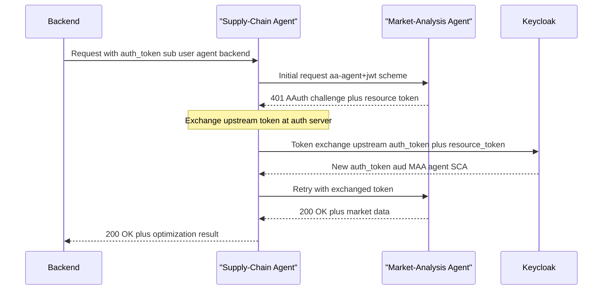

# Agent Token Exchange

In this demo, we'll explore how agent identity works when user consent is required and _needs to propagate across agents/resources_. This builds on the [authorization with user consent flow](./agent-authorization-on-behalf-of.md) but adds one more piece: an agent acting on behalf of another. When an agent needs to act on behalf of a user, even across service hops, the authorization server (Keycloak) enables token exchange.

[← Back to index](index.md)

## Watch the demo

<div style="position: relative; padding-bottom: 56.25%; height: 0; overflow: hidden; max-width: 100%; margin: 1em 0;">
  <iframe style="position: absolute; top: 0; left: 0; width: 100%; height: 100%;" src="https://www.youtube.com/embed/5CNeJZyeL_A" title="Agent Token Exchange Demo" frameborder="0" allow="accelerometer; autoplay; clipboard-write; encrypted-media; gyroscope; picture-in-picture; web-share" allowfullscreen></iframe>
</div>

## Token Exchange: Supply Chain Agent Calls Market Analysis Agent

When the `supply-chain-agent` (SCA) receives the request from `backend`, it needs to call the `market-analysis-agent` (MAA) to get market data. But SCA is now acting as both a **resource** (receiving the backend's request) and an **agent** (making its own request to MAA). To do this, it must be authorized to act on behalf of the user so it will need to request a token exchange:

Here's the complete flow:

```mermaid
sequenceDiagram
    participant BE as Backend
    participant SCA as "Supply-Chain Agent"
    participant MAA as "Market-Analysis Agent"
    participant KC as Keycloak

    BE->>SCA: Request with auth_token sub user agent backend
    SCA->>MAA: Initial request aa-agent+jwt scheme
    MAA-->>SCA: 401 AAuth challenge plus resource token
    
    Note over SCA: Exchange upstream token at auth server
    SCA->>KC: Token exchange upstream auth_token plus resource_token
    KC-->>SCA: New auth_token aud MAA agent SCA
    
    SCA->>MAA: Retry with exchanged token
    MAA-->>SCA: 200 OK plus market data
    SCA-->>BE: 200 OK plus optimization result
```

### Step 1: MAA issues challenge

When SCA first calls MAA, it receives **401** with an **`AAuth: require=auth-token; resource-token="..."; auth-server="..."`** response (same challenge shape as in the [autonomous authorization](./agent-authorization-autonomous.md) and [resource authorization](./flow-03-authz.md) flows). The body indicates that the `aa-agent+jwt` identity token is not sufficient — an `aa-auth+jwt` auth token is required.

```bash
INFO:aauth_interceptor:🔐 AAuth: Signing with agent token (aa-agent+jwt in Signature-Key)
INFO:resource_token_service:✅ Resource token generated successfully
INFO:agent_executor:🔐 Issuing resource_token for agent: http://supply-chain-agent.localhost:3000
```

The resource token identifies SCA as the requesting agent:
```json
{
  "iss": "http://market-analysis-agent.localhost:3000",
  "aud": "http://localhost:8080/realms/aauth-test",
  "agent": "http://supply-chain-agent.localhost:3000",
  "agent_jkt": "9aOuAvaRr0YVHxiZqIpJvDf9hjg2uvKw1FVVMzDiOwg",
  "exp": 1770659003,
  "scope": "market-analysis:analyze"
}
```

### Step 2: Token exchange request

SCA now performs a token exchange. On the signed `POST` to the token endpoint it sends (see [Token exchange](./flow-05-token-ex.md)):

1. **`upstream_token`**: The auth token SCA received from `backend` (proves upstream authorization and user context the auth server already issued)
2. **`resource_token`**: The token from MAA (proves Resource 2 challenged SCA for access)

From the logs in SCA:

```bash
INFO:agent_executor:🔐 Exchanging upstream auth_token for MAA token
INFO:aauth.tokens:🔐 Token exchange: upstream_auth_token=eyJhbGci..., resource_token=eyJhbGci...
```

The token exchange request uses the JWT scheme in `Signature-Key`, and SCA signs the HTTP request with its own key. The Auth server reviews the JWT from the `Signature-Key` header and sees that the token was issued with an `aud` of `supply-chain-agent`. The Auth server, knowing this is a token exchange request, will use the `aud` claim to retrieve the JWKS of the `supply-chain-agent`. 


```bash
INFO:aauth_token_service:🔐 Signing with JWT scheme for token exchange
INFO:aauth.signing:🔐   Line 3: '"signature-key": sig1=(scheme=jwt jwt="eyJhbGci...")'
```

### Step 3: Keycloak issues exchanged token

Keycloak validates, in line with call-chaining token exchange:

1. The HTTP message signature on the exchange request
2. The **`upstream_token`** (auth token for the upstream audience, issued by this auth server)
3. The **`resource_token`** from MAA (including `agent` / `agent_jkt` binding to SCA)
4. Policy: whether SCA is allowed to receive an auth token for MAA with the requested scopes

It then issues a **new** auth token for the downstream hop. That token’s claims describe the **immediate** caller and the resource audience—not a nested “actor” object. As in [flow-05-token-ex](./flow-05-token-ex.md), the exchanged JWT does **not** carry a legacy **`act`** claim; provenance of the chain is established when the auth server validates **`upstream_token`** and **`resource_token`** together.

The Person Server issues a new `aa-auth+jwt` shaped like this (illustrative):

```json
{
  "iss": "http://127.0.0.1:8765",
  "aud": "http://market-analysis-agent.localhost:3000",
  "jti": "abdceb92-5458-4fbc-9403-7c0d8255526d",
  "sub": "00b519e8-f409-4201-8911-1cb408e8a082",
  "agent": "http://supply-chain-agent.localhost:3000",
  "cnf": {
    "jwk": {
      "kty": "OKP",
      "crv": "Ed25519",
      "x": "jqjPR5broSbHfpXZaGpTrBcem4DX6gbWEQsDWEyZMG0",
      "kid": "-DN2FPpkqklNWGbl9yYVuH4ONyIgBp36hU4nJJKUARY"
    }
  },
  "iat": 1770659000,
  "exp": 1770662600,
  "scope": "market-analysis:analyze"
}
```

### What MAA can rely on in the exchanged token

| Claim | Role |
|-------|------|
| **`agent`** | Verifiable immediate caller — SCA (matches who must sign requests with this token) |
| **`aud`** | Intended resource — MAA |
| **`sub`** | User identity when the upstream grant was user-delegated (same meaning as elsewhere in auth tokens) |
| **`cnf.jwk`** | Proof-of-possession — only SCA’s key can be used with this token |
| **`scope`** | What MAA authorized for this hop |

The **backend** does not appear as a nested field in this JWT. The auth server already used the **`upstream_token`** (audience backend → SCA, user in `sub`, etc.) when deciding to mint this token. Audit and policy at MAA focus on **who is calling now** (`agent`), **for which user** (`sub` when present), and **what is allowed** (`scope`, `aud`).

### Step 4: Supply-chain agent calls market-analysis agent again

SCA retries the request with the exchanged token:
```bash
INFO:agent_executor:✅ Token exchange successful, retrying MAA request with exchanged token
INFO:aauth_interceptor:🔐 AAuth: Signing request with JWT scheme (auth_token present)
```

MAA validates the exchanged token and grants access:

```bash
INFO:agent_executor:🔐 JWT scheme detected: verifying auth_token
INFO:agent_executor:✅ Auth token verified successfully
```


## Summary

When an agent needs to call another agent or MCP server after receiving user consent, it typically obtains a new auth token for that audience via **token exchange** at the auth server: signed `POST` with **`resource_token`** and **`upstream_token`**. The new token names the **immediate** `agent` and resource `aud`; it does not embed a nested **`act`** claim. The same pattern extends to cross-domain cases (not shown here) where different authorization servers participate in the chain.

Use user-delegated mode when: Agents must act on behalf of a specific user (accessing user data, making decisions with user accountability, compliance requirements).

In the next and final post, we'll dig into using Agentgateway for policy control.

[← Back to index](index.md)