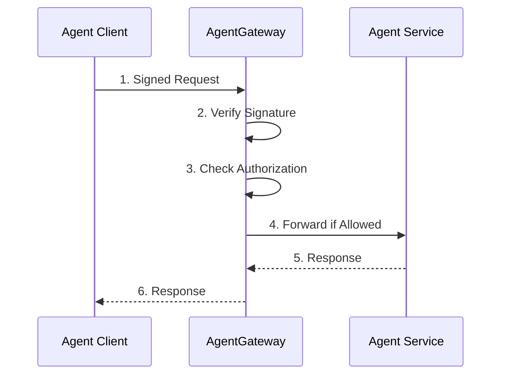

# Apply Policy with Agentgateway


In this final post, we'll explore how to use [**Agentgateway** as a policy enforcement point](https://github.com/Agentgateway/Agentgateway) for AAuth enabled agent communication. Throughout this demo series, we've seen how AAuth provides identity and authorization for agents. Now we'll see how Agentgateway enables centralized policy enforcement, observability, and traffic management for agent-to-agent communication.

[← Back to index](index.md)

## Watch the demo

<div style="position: relative; padding-bottom: 56.25%; height: 0; overflow: hidden; max-width: 100%; margin: 1em 0;">
  <iframe style="position: absolute; top: 0; left: 0; width: 100%; height: 100%;" src="https://www.youtube.com/embed/wCOzJh73TWU" title="Apply policy with Agentgateway Demo" frameborder="0" allow="accelerometer; autoplay; clipboard-write; encrypted-media; gyroscope; picture-in-picture; web-share" allowfullscreen></iframe>
</div>

## Why Agentgateway for AAuth?

Agentgateway sits between agent calls and provides several critical capabilities:

1. **AAuth Protocol Enforcement** - Verify message signatures and agent identity before reaching your services
2. **Authorization Policy** - Apply fine-grained access control using CEL expressions on AAuth claims (could call out to an external policy engine like OPA or OpenFGA)
3. **Observability** - Add structured logging and distributed tracing with AAuth metadata
4. **Rate Limiting** - Protect resources from abuse while maintaining agent identity context, and honoring/requiring progressive auth
5. **Centralized Configuration** - Manage policies across all agent communication in one place



## Running with Policy Enforcement

If you've [followed the pre-requisites](./install-aauth-keycloak.md) for this demo, you can change the `Agentgateway` command to the following:

```bash
> cd Agentgateway
> ./agw -f config-policy.yaml
```

Watch the Agentgateway logs to see policy enforcement:

```bash
info request aauth.scheme=Jwt aauth.agent=http://supply-chain-agent.localhost:3000
     jwt_act={agent:http://backend.localhost:8000,sub:00b519e8-f409...}
     authenticated=true user_id=mcp-user http.status=200
```
{: .log-output}

Let's take a look at the configuration:

## AAuth Policy Configuration

Let's examine the key sections of the Agentgateway configuration for AAuth policy enforcement. You can see the [full configuration](https://github.com/christian-posta/aauth-full-demo/blob/main/agentgateway/config-policy.yaml) in the source code of this documentation. 


### 1. Observability: Logging and Tracing

The first step in policy enforcement is visibility. Agentgateway can extract AAuth claims and add them to logs and traces:

```yaml
config:
  tracing:
    otlpEndpoint: http://localhost:4317
    randomSampling: true
    fields:
      add:
        authenticated: 'jwt.sub != null'
        jwt_act: 'jwt.act'
        user_id: 'jwt.name'
        token_issuer: 'jwt.iss'
        token_audience: 'jwt.aud'
        aauth_scheme: 'aauth.scheme'
        aauth_agent_identity: 'aauth.agent'
        aauth_jwt_claims: 'aauth.jwt_claims'
        
  logging:
    fields:
      add:
        authenticated: 'jwt.sub != null'
        jwt_act: "jwt.act"
        user_id: 'jwt.name'
        aauth_scheme: 'aauth.scheme'
        aauth_agent_identity: 'aauth.agent'
```

**Key Fields:**
- `aauth.scheme` - Which AAuth scheme was used (JWKS, JWT, HWK)
- `aauth.agent` - The verified identity of the calling agent
- `jwt.act` - The actor claim for delegation chains (on-behalf-of)
- `jwt.sub` - The user identity when using user-delegated authorization
- `aauth.jwt_claims` - Full JWT claims for advanced policy decisions

When you run the demo with this configuration, you'll see rich logs like:

```bash
info request aauth.scheme=Jwks aauth.agent=http://backend.localhost:8000 
     http.method=POST http.status=200 trace.id=3aef7d77d62861bad0066c70fc24a1db 
     duration=117ms authenticated=false
```
{: .log-output}


### 2. AAuth Protocol Enforcement

The `aauth` policy controls how Agentgateway validates incoming requests:

```yaml
listeners:
  - hostname: "supply-chain-agent.localhost"
    routes:
    - policies:
        aauth:
          mode: optional
          requiredScheme: jwks
          timestampTolerance: 60
```

**Configuration Options:**
- `mode: optional` - Allow requests without AAuth (for testing), use `strict` in production
- `requiredScheme: jwks` - Enforce that agents use JWKS for identity (not HWK pseudonymous)
- `timestampTolerance: 60` - Allow 60 seconds clock skew for signature verification

This ensures that:
1. Messages are signed with the correct HTTP signatures
2. Agent identity can be verified via JWKS discovery
3. Signatures are recent (replay attack protection)

### 3. Authorization Policies with CEL

The `authorization` policy uses [Common Expression Language (CEL)](https://github.com/google/cel-spec) to evaluate access control rules based on AAuth claims:

```yaml
authorization:
  rules:
    # Rule 1: Verify agent identity and JWT claims
    - "aauth.agent == 'http://backend.localhost:8000' && 
       (!has(aauth.jwt_claims) || 
        (has(aauth.jwt_claims.aud) && 
         aauth.jwt_claims.aud == 'http://supply-chain-agent.localhost:3000' && 
         aauth.jwt_claims.scope.contains('supply-chain:optimize')))"
    
    # Rule 2: Allow well-known endpoints
    - "request.path.startsWith('/.well-known/')"
    
    # Rule 3: Allow JWKS discovery
    - "request.path.startsWith('/jwks.json')"
```

**Rule 1 Breakdown:**
- `aauth.agent == 'http://backend.localhost:8000'` - Only allow the backend agent
- `!has(aauth.jwt_claims)` - Allow signature-only mode (no auth token)
- `aauth.jwt_claims.aud == 'http://supply-chain-agent.localhost:3000'` - Verify token audience
- `aauth.jwt_claims.scope.contains('supply-chain:optimize')` - Verify required scope

This policy allows requests if ANY rule evaluates to `true`. You can make policies more restrictive by requiring multiple conditions.

### 4. Checking the `act` Claim for Delegation

When agents call other agents on-behalf-of users (token exchange), the `act` claim contains the delegation chain. You can write policies to validate this:

```yaml
authorization:
  rules:
    # Verify delegation chain
    - "has(aauth.jwt_claims.act) && 
       aauth.jwt_claims.act.agent == 'http://backend.localhost:8000' &&
       aauth.jwt_claims.act.sub != null"
```

This rule ensures:
- The token was obtained via token exchange (`act` claim present)
- The original caller was the backend agent
- A user identity is present (user-delegated authorization)

From the [token exchange post](./agent-token-exchange.md), recall that the `act` claim looks like:

```json
{
  "agent": "http://supply-chain-agent.localhost:3000",
  "act": {
    "agent": "http://backend.localhost:8000",
    "sub": "00b519e8-f409-4201-8911-1cb408e8a082"
  }
}
```

You can validate the entire delegation chain:

```yaml
# Only allow supply-chain-agent when acting on behalf of backend + user
- "aauth.agent == 'http://supply-chain-agent.localhost:3000' &&
   has(aauth.jwt_claims.act) &&
   aauth.jwt_claims.act.agent == 'http://backend.localhost:8000' &&
   has(aauth.jwt_claims.act.sub)"
```

### 5. Rate Limiting (Optional)

While not shown in the demo configuration, Agentgateway supports rate limiting per agent:

```yaml
rateLimit:
  requestsPerMinute: 100
  burstSize: 20
  keyExtractor: 'aauth.agent'  # Rate limit by agent identity
```

This allows you to:
- Prevent agent abuse while maintaining identity context
- Apply different limits to different agents
- Track which agent is consuming resources

## Complete Policy Configuration Example

Here's a production-ready configuration from `config-policy.yaml`:

```yaml
binds:
- port: 3000
  listeners:
  - hostname: "supply-chain-agent.localhost"
    routes:
    - policies:
        # AAuth verification
        aauth:
          mode: optional  # Use 'required' in production
          requiredScheme: jwks
          timestampTolerance: 60
        
        # Authorization rules
        authorization:
          rules:
          - "aauth.agent == 'http://backend.localhost:8000' && 
             (!has(aauth.jwt_claims) || 
              (has(aauth.jwt_claims.aud) && 
               aauth.jwt_claims.aud == 'http://supply-chain-agent.localhost:3000' && 
               aauth.jwt_claims.scope.contains('supply-chain:optimize')))"
          - "request.path.startsWith('/.well-known/')"
          - "request.path.startsWith('/jwks.json')"
        
        # Mark as agent-to-agent traffic
        a2a: {}
        
        # Pass auth headers to backend
        backendAuth:
          passthrough: {}
        
        # CORS for browser-based agents
        cors:
          allowOrigins: ["*"]
          allowHeaders: ["*"]
      
      backends:
      - host: localhost:9999
```


## Testing Policy Violations

Try these to see policy enforcement in action:

**1. Wrong agent identity:**
Change the backend's agent identifier and watch the authorization rule fail:
```bash
ERROR: Authorization denied: aauth.agent 'http://wrong-agent' not in allowed list
```

**2. Missing required scope:**
Modify the resource token to request a different scope and see the authorization fail:
```bash
ERROR: Authorization denied: required scope 'supply-chain:optimize' not found
```

**3. Invalid audience:**
Send a token meant for a different service:
```bash
ERROR: Authorization denied: aud claim mismatch
```


## Summary

Agentgateway provides a centralized policy enforcement point for AAuth-enabled agent communication:

| Capability | Benefit |
|------------|---------|
| **Signature Verification** | Verify agent identity before reaching your services |
| **Authorization Policy** | Fine-grained access control using CEL on AAuth claims |
| **Delegation Validation** | Track and validate on-behalf-of chains with `act` claim |
| **Observability** | Structured logging and tracing with agent identity context |
| **Rate Limiting** | Protect resources while maintaining identity context |
| **Centralized Config** | Manage all agent policies in one place |

**Key Policy Patterns:**
- Verify agent identity: `aauth.agent == 'expected-agent'`
- Check authorization scopes: `aauth.jwt_claims.scope.contains('required-scope')`
- Validate delegation: `has(aauth.jwt_claims.act) && aauth.jwt_claims.act.agent == 'trusted-agent'`
- Require user consent: `has(aauth.jwt_claims.sub)`

This completes our deep dive into AAuth! You now understand:
1. Agent identity establishment with JWKS
2. Autonomous and user-delegated authorization flows
3. Token exchange for delegation chains
4. Policy enforcement with Agentgateway

For more advanced scenarios, explore the [AAuth specification](https://github.com/dickhardt/agent-auth) and consider integrating with OPA or FGA for complex authorization logic.

[← Back to index](index.md)
