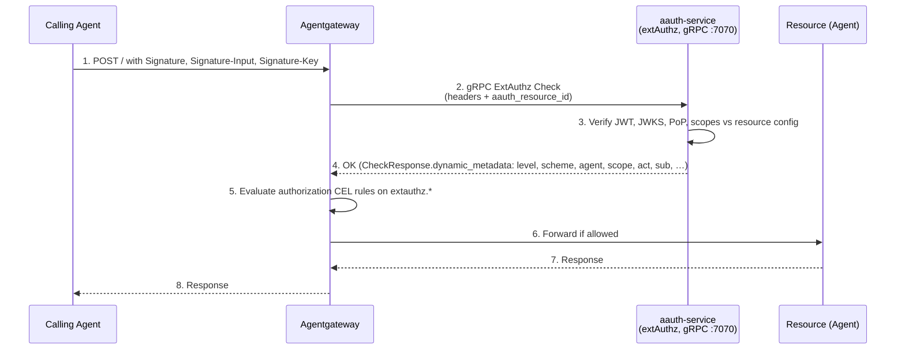

# Apply Policy with Agentgateway

In this final post, we'll explore how to use [**Agentgateway**](https://agentgateway.dev) as a policy enforcement point for AAuth-enabled agent communication. Throughout this series we've seen how AAuth provides identity and authorization for agents (`aa-agent+jwt` for identity, `aa-auth+jwt` for authorization). Now we'll see how Agentgateway combines an out-of-process AAuth verifier (the `aauth-service` from [extauth-aauth-resource](https://github.com/christian-posta/extauth-aauth-resource)) with **CEL rules on the dynamic metadata** that verifier returns, so the gateway can make centralized identity- and scope-aware policy decisions before the request ever reaches the resource.

[← Back to index](index.md)

<!--
## Watch the demo

<div style="position: relative; padding-bottom: 56.25%; height: 0; overflow: hidden; max-width: 100%; margin: 1em 0;">
  <iframe style="position: absolute; top: 0; left: 0; width: 100%; height: 100%;" src="https://www.youtube.com/embed/wCOzJh73TWU" title="Apply policy with Agentgateway Demo" frameborder="0" allow="accelerometer; autoplay; clipboard-write; encrypted-media; gyroscope; picture-in-picture; web-share" allowfullscreen></iframe>
</div>
-->

---

## How the pieces fit together

Two configs do all the work in this demo:

| File | Loaded by | Role |
|------|-----------|------|
| `agentgateway/config-policy.yaml` | `agentgateway -f …` | Per-route policy stack on the gateway: which paths go through ExtAuthz, which CEL rules to apply on the response, where the `.well-known/` documents come from, etc. |
| `agentgateway/aauth-config-mode3.yaml` (or `aauth-config-user-consent.yaml`) | `aauth-service` | Per-resource AAuth policy on the verifier side: required schemes, signature window, whether a 401 challenge is issued, scopes, Person Server discovery. Covered in detail in the [Autonomous](./agent-authorization-autonomous.md) and [User Consent](./agent-authorization-on-behalf-of.md) posts. |

Agentgateway itself does **not** implement AAuth. Its `extAuthz` policy sends each request to the `aauth-service` over gRPC (`localhost:7070`); that service verifies the `aa-agent+jwt` or `aa-auth+jwt`, checks the HTTP Message Signature (RFC 9421) against `cnf.jwk`, and either returns a 401 challenge or **allows the request and emits `dynamic_metadata`** (an Envoy-compatible `google.protobuf.Struct`) that the gateway exposes to CEL as the `extauthz.*` variable. The `authorization` policy then runs its CEL rules against that metadata.


```mermaid
sequenceDiagram
  participant Caller as Calling Agent
  participant AGW as Agentgateway
  participant AAuth as aauth-service<br/>(extAuthz, gRPC :7070)
  participant Resource as Resource (Agent)

  Caller->>AGW: 1. POST / with Signature, Signature-Input, Signature-Key
  AGW->>AAuth: 2. gRPC ExtAuthz Check<br/>(headers + aauth_resource_id)
  AAuth->>AAuth: 3. Verify JWT, JWKS, PoP, scopes vs resource config
  AAuth-->>AGW: 4. OK (CheckResponse.dynamic_metadata: level, scheme, agent, scope, act, sub, …)
  AGW->>AGW: 5. Evaluate authorization CEL rules on extauthz.*
  AGW->>Resource: 6. Forward if allowed
  Resource-->>AGW: 7. Response
  AGW-->>Caller: 8. Response
```

The split matters: the verifier decides _"is this token / signature valid right now for this resource?"_ The gateway decides _"is this allowed agent / scope / actor for this route?"_ Both must agree before the resource is called.

## Running with policy enforcement

If you've [followed the install guide](./install-aauth.md), the easiest way to run the policy stack is the test harness in the repo root:

```bash
./scripts/start-infra.sh mode3        # autonomous PS-asserted auth-token flow
# or
./scripts/start-infra.sh user-consent # same gateway config, PS requires explicit consent

# tear it all down
./scripts/stop-infra.sh
```

Looking at `scripts/start-infra.sh`, both `mode3` and `user-consent` load **the same** `config-policy.yaml` on Agentgateway; only the `AAUTH_CONFIG` passed to `aauth-service` changes (`aauth-config-mode3.yaml` vs `aauth-config-user-consent.yaml`). In other words, the gateway-side policy in this post is the same enforcement surface for both authorization flows we walked through earlier.

If you'd rather start the gateway by hand:

```bash
cd agentgateway
agentgateway -f config-policy.yaml
```

…and in a separate terminal:

```bash
cd agentgateway
AAUTH_CONFIG=aauth-config-mode3.yaml "$HOME/bin/extauth-aauth-resource/aauth-service"
```

A successful, allowed request shows up in the Agentgateway access log enriched with AAuth fields (see [observability](#observability-aauth-fields-on-logs--traces) below):

```
info request gateway=default/default listener=listener0 route=default/route0
     endpoint=localhost:9999 src.addr=127.0.0.1:54966
     http.method=POST http.host=supply-chain-agent.localhost http.path=/
     http.status=200 duration=117ms
     aauth.scheme=Jwt aauth.agent=http://backend.localhost:8000
     sig_key="sig1=(scheme=jwt typ=\"aa-agent+jwt\" sub=\"urn:jkt:sha-256:...\")"
```
{: .log-output}

Let's walk through what's in `config-policy.yaml` to make that happen.

## The route stack per agent

`config-policy.yaml` defines two AAuth-protected listeners on port 3000 — `supply-chain-agent.localhost` and `market-analysis-agent.localhost` — each with three named routes:

| Route | Match | Policies | Where it goes | Why |
|-------|-------|----------|---------------|-----|
| `a2a-authed` | `POST /` and `GET /agent/authenticatedExtendedCard` | `authorization` (CEL), `extAuthz` (to aauth-service), `a2a`, `backendAuth: passthrough`, `cors` | the agent process (`localhost:9999` / `:9998`) | the actual A2A entry points; this is where AAuth verification + scope policy run |
| `aauth-dwk` | `pathPrefix: /.well-known/` | `urlRewrite.authority` only | `localhost:8081` (the aauth-service HTTP listener) | serves `aauth-resource.json`, `aauth-agent.json`, and `jwks.json` from the verifier (no extAuthz on these — clients need to be able to discover keys before they can sign) |
| `a2a-default` | everything else under the hostname | `a2a`, `backendAuth: passthrough`, `cors` | the agent process | catch-all for non-A2A paths (e.g. `GET /agent-card.json`); intentionally unauthenticated so unauthenticated clients can still read the public card |

A third listener with no hostname exposes a `general-mcp` MCP route (time / everything / sequential-thinking) that is independent of AAuth and is included so the same gateway instance can also serve unauthenticated MCP traffic.

The interesting policy work happens entirely on `a2a-authed`.

## The `extAuthz` policy

```yaml
extAuthz:
  host: "localhost:7070"
  protocol:
    grpc:
      context:
        aauth_resource_id: "supply-chain-agent"
```

Two things to call out:

* **`host: "localhost:7070"`** — the gRPC ext_authz endpoint exposed by `aauth-service`. Agentgateway is API-compatible with the [Envoy External Authorization gRPC service](https://www.envoyproxy.io/docs/envoy/latest/api-v3/extensions/filters/http/ext_authz/v3/ext_authz.proto), so it sends a `CheckRequest` with the incoming headers and waits for an `OK` / `Denied` decision plus optional `dynamic_metadata`.
* **`context.aauth_resource_id: "supply-chain-agent"`** — a context extension that tells `aauth-service` _which_ resource section of its own config (`aauth-config-mode3.yaml`) to apply. Without it, the service falls back to Host-header lookup (the `hosts:` list in the resource config). This way one `aauth-service` deployment can multi-tenant many different resources, and each agentgateway route binds itself to a specific tenant.

When `aauth-service` allows the request, the `CheckResponse.dynamic_metadata` it returns shows up in agentgateway as the `extauthz` variable for CEL to use.

## `authorization` policy and `extauthz.*` metadata

On the `supply-chain-agent` route the policy stack also defines an `authorization` rule:

```yaml
authorization:
  rules:
    - 'extauthz.act.sub == extauthz.agent &&
       extauthz.agent.endsWith("agent-server.example") &&
       extauthz.scope.contains("supply-chain:read")'
```

The fields here come straight from the dynamic metadata `aauth-service` set on the `CheckResponse`. Per the [extauth-aauth-resource](https://github.com/christian-posta/extauth-aauth-resource#extauthz-dynamic-metadata-and-cel-agentgateway) README, the level-aware metadata struct is:

| Key | Type | Meaning |
|-----|------|---------|
| `level` | string | Identity level: `pseudonymous`, `identified`, or `authorized` |
| `scheme` | string | `Signature-Key` scheme: `hwk`, `jwks_uri`, or `jwt` |
| `token_type` | string | JWT `typ` for `jwt` scheme requests, such as `aa-agent+jwt` or `aa-auth+jwt` |
| `issuer` | string | JWT `iss`, or `jwks_uri` discovery `id` |
| `key_id` | string | `kid` from `Signature-Key` or JWT header when known |
| `jkt` | string | RFC 7638 SHA-256 thumbprint of the signing or bound key |
| `agent_server` | string | Agent server issuer for `identified` requests (`aa-agent+jwt` or `jwks_uri`) |
| `agent` | string | Agent identifier from the `aa-auth+jwt` `agent` claim |
| `scope` | string | OAuth-style scope string from the `aa-auth+jwt` `scope` claim |
| `txn` | string | Transaction ID from the `aa-auth+jwt` `txn` claim |
| `act` | object | RFC 8693 actor from `aa-auth+jwt`; use `act.sub` in CEL |
| `sub` | string | JWT subject when present (`aa-agent+jwt` or `aa-auth+jwt`) |

So the rule above reads:

* `extauthz.act.sub == extauthz.agent` — the actor in `act` is the same identity as the `agent` claim. In direct authorization (no chained delegation) these match; if the upstream caller had delegated through another agent, `act` would carry the nested actor (per AAuth §10.1 / RFC 8693 §4.1). This is a defense-in-depth check that the request is a direct call and not a relayed one.
* `extauthz.agent.endsWith("agent-server.example")` — restricts to agents minted by an Agent Provider whose URN suffix is `@agent-server.example`. In this demo every agent identity from the Person Server matches that pattern (e.g. `aauth:b8ef15f9-…@agent-server.example`).
* `extauthz.scope.contains("supply-chain:read")` — the granted scope string from the `aa-auth+jwt` includes `supply-chain:read`. Note that `scope` is a single space-separated string per OAuth convention, so `contains` here is a substring check; in production you may want to tokenize.

Agentgateway's `authorization` policy treats rules as **OR** — a request is allowed if any rule evaluates to true (see the [authorization rules reference](https://agentgateway.dev/docs/configuration/security/authorization/)). To require multiple conditions, AND them inside a single rule like the example above does.

Because `aauth-service` only emits the auth-token fields (`agent`, `scope`, `act`, …) when the request reached `authorized` level, this CEL rule effectively also requires Mode 3: an `aa-agent+jwt`-only request will be allowed by `aauth-service` (Mode 1) but the dynamic metadata won't contain `agent`/`scope`, the rule evaluates false, and authorization denies. The resource config's `access: require: auth-token` in `aauth-config-mode3.yaml` is what guarantees Mode 3 happens upstream of this check.

> **Note on the `market-analysis-agent` route in this same file:** it has `extAuthz` but **no** `authorization` block, so any request that `aauth-service` allows passes through to the agent without further CEL filtering. That's intentional in the demo — only `supply-chain-agent` is the example of layered enforcement. You can copy the same `authorization` block onto MAA's route and adjust the scope name (e.g. `market-analysis:analyze`) to enforce there too.

## Observability: AAuth fields on logs / traces

The very top of `config-policy.yaml` configures the access log and OTLP trace fields:

```yaml
config:
  tracing:
    otlpEndpoint: http://localhost:4317
    randomSampling: true
    fields:
      add:
        authenticated: 'jwt.sub != null'
        user_id: 'jwt.name'
        token_issuer: 'jwt.iss'
        token_audience: 'jwt.aud'
        aauth_scheme: 'aauth.scheme'
        aauth_agent_identity: 'aauth.agent'
        aauth_jwt_claims: 'aauth.jwt_claims'
        response_headers: 'response.headers'
        request_headers: 'request.headers'

  logging:
    fields:
      add:
        authenticated: 'jwt.sub != null'
        user_id: 'jwt.name'
        token_issuer: 'jwt.iss'
        token_audience: 'jwt.aud'
        aauth_scheme: 'aauth.scheme'
        aauth_agent_identity: 'aauth.agent'
        sig_key: 'request.headers["signature-key"]'
```

These add the verified AAuth identity to every span and structured log line:

* `aauth.scheme` — the verified `Signature-Key` scheme (`Jwt` for `aa-agent+jwt`, `JwtAuth` for `aa-auth+jwt`, `Hwk` for pseudonymous, `JwksUri` for the discovery scheme).
* `aauth.agent` — the verified agent identity URL or URN once `aauth-service` has resolved it.
* `request.headers["signature-key"]` — the raw `Signature-Key` header value, useful for debugging which key actually signed the wire request.
* The standard `jwt.*` fields fall back to any agentgateway-side JWT policy; in this demo they're informational because the AAuth verification happens in `aauth-service`, not in the gateway's own JWT policy.

> **A note on `aauth_jwt_claims`:** that tracing field exists because earlier revisions of agentgateway/aauth surfaced full JWT claims as an in-gateway primitive. In the current `config-policy.yaml`, claim-level decisions are made on `extauthz.*` (set by `aauth-service`) rather than on `aauth.jwt_claims`. The field is kept on tracing for visibility and back-compat; the live CEL rule uses `extauthz.*`.

If you want to follow a request end-to-end in Jaeger after `./scripts/start-infra.sh mode3`, the trace will show the gateway hop, the ext_authz hop into `aauth-service`, and the upstream call to the agent, all carrying the same `aauth.agent` field.

## Full `a2a-authed` policy block (supply-chain)

Putting all the pieces from `config-policy.yaml` together for the `supply-chain-agent` listener:

```yaml
binds:
- port: 3000
  listeners:
  - hostname: "supply-chain-agent.localhost"
    routes:
    - name: a2a-authed
      matches:
      - path:
          exact: /
        method: "POST"
      - path:
          exact: /agent/authenticatedExtendedCard
      policies:
        authorization:
          rules:
          - 'extauthz.act.sub == extauthz.agent &&
             extauthz.agent.endsWith("agent-server.example") &&
             extauthz.scope.contains("supply-chain:read")'
        extAuthz:
          host: "localhost:7070"
          protocol:
            grpc:
              context:
                aauth_resource_id: "supply-chain-agent"
        a2a: {}
        backendAuth:
          passthrough: {}
        cors:
          allowOrigins: ["*"]
          allowHeaders: ["*"]
      backends:
      - host: localhost:9999
```

The `a2a: {}` policy marks this route as A2A traffic so agentgateway applies its A2A-aware framing; `backendAuth: passthrough: {}` keeps the original `Authorization` / `Signature*` headers intact when proxying to the agent so downstream Python code can re-verify if it wants to; `cors` is permissive for the demo.

## Testing the policy

Mode 3 tests live in [`tests/integration/test_mode3_flow.py`](https://github.com/christian-posta/aauth-full-demo/blob/main/tests/integration/test_mode3_flow.py) and run automatically as part of the harness:

```bash
./scripts/run-tests.sh mode3
# or all flows
./scripts/run-tests.sh all
```

`scripts/run-tests.sh` brings up the same `config-policy.yaml` + `aauth-config-mode3.yaml` infra, runs the pytest marker `mode3`, and tears it down. The mode3 tests are:

* `test_mode3_optimization_flow` — full optimization through the policy-enforced route, validating that an authorized request actually succeeds (status `completed`). If auth fails at the gateway it's surfaced as a `failed`/`interaction_required` status and the test reports it.
* `test_mode3_market_analysis` — same path for the MAA flow.
* `test_mode3_agent_health` — fetches `http://supply-chain-agent.localhost:3000/.well-known/agent-card.json` and asserts the response code is one of `[200, 403, 404]` — i.e. the route exists at the gateway. The well-known prefix is rewritten to `aauth-service` HTTP (`localhost:8081`), which doesn't host `agent-card.json`, so `404` is the expected happy case; the test is mainly a smoke check that the gateway is up and the listener is reachable.
* `test_mode3_extended_flow` — end-to-end SCA → MAA agent-to-agent path under the policy config. Exercises both `a2a-authed` routes and confirms the token exchange (SCA requesting a new auth-token for MAA) clears every CEL/ExtAuthz check on the way through.

If you want to see denial behavior in action, the simplest experiment is to edit the CEL rule on the `supply-chain-agent` route. For example, change `supply-chain:read` to a scope that the resource never issues (`supply-chain:delete`) and re-run the mode3 tests — agentgateway will refuse the request after `aauth-service` allows it, and you'll see the `authorization` policy reject it in the access log.

## Summary

Agentgateway provides a centralized enforcement point for AAuth-enabled agent communication by combining two layers:

| Layer | Where it lives | What it decides |
|-------|----------------|-----------------|
| **AAuth verification** | `aauth-service` (gRPC ExtAuthz) via `extauth-aauth-resource` | Is the `Signature` valid for this `Signature-Key`? Is the `aa-agent+jwt` / `aa-auth+jwt` real and bound to the signer? Does the resource require an auth-token, and if so was one presented? |
| **Policy / CEL** | `authorization` block on the agentgateway route | Now that the request is authenticated, is _this_ `agent`, `scope`, `act.sub` combination allowed on _this_ route? |

Plus universal capabilities Agentgateway brings as a gateway:

| Capability | Provided by |
|------------|-------------|
| Centralized config per route / hostname | `binds.listeners.routes` |
| Structured access logs + OTLP traces with AAuth fields | `config.logging.fields` / `config.tracing.fields` |
| Discovery surfaces (`/.well-known/*`) without re-auth | `aauth-dwk` route → `aauth-service` HTTP listener |
| Same gateway can serve MCP and unauthenticated routes alongside AAuth | extra listener at the bottom of `config-policy.yaml` |

**Key policy patterns** (all on `extauthz.*` from `aauth-service` dynamic metadata):

* Require a known issuer of agent identities: `extauthz.agent.endsWith("agent-server.example")`
* Require an auth-token (forces Mode 3): test for any `aa-auth+jwt`-only field, e.g. `extauthz.scope != ""` or `extauthz.act.sub != ""`
* Require a scope: `extauthz.scope.contains("supply-chain:read")`
* Pin to a specific agent: `extauthz.agent == "aauth:b8ef15f9-…@agent-server.example"`
* Defend against relayed delegation chains: `extauthz.act.sub == extauthz.agent`
* Require user-asserted authorization (a PS-issued auth token has `sub` = user): `extauthz.sub != ""` combined with `extauthz.level == "authorized"`

This completes the AAuth demo series. You now have a working implementation of:

1. Agent identity establishment with `aa-agent+jwt` ([Agent Identity](./agent-identity-jwks.md))
2. Autonomous PS-asserted authorization for resource access ([Autonomous](./agent-authorization-autonomous.md))
3. User consent on top of the same flow ([User Consent](./agent-authorization-on-behalf-of.md))
4. Centralized policy enforcement and observability at the gateway (this post)

For the protocol specification and advanced scenarios, see the [AAuth IETF draft](https://datatracker.ietf.org/doc/draft-hardt-oauth-aauth-protocol/) and the [AAuth Protocol Explorer](https://explorer.aauth.dev).

[← Back to index](index.md)
