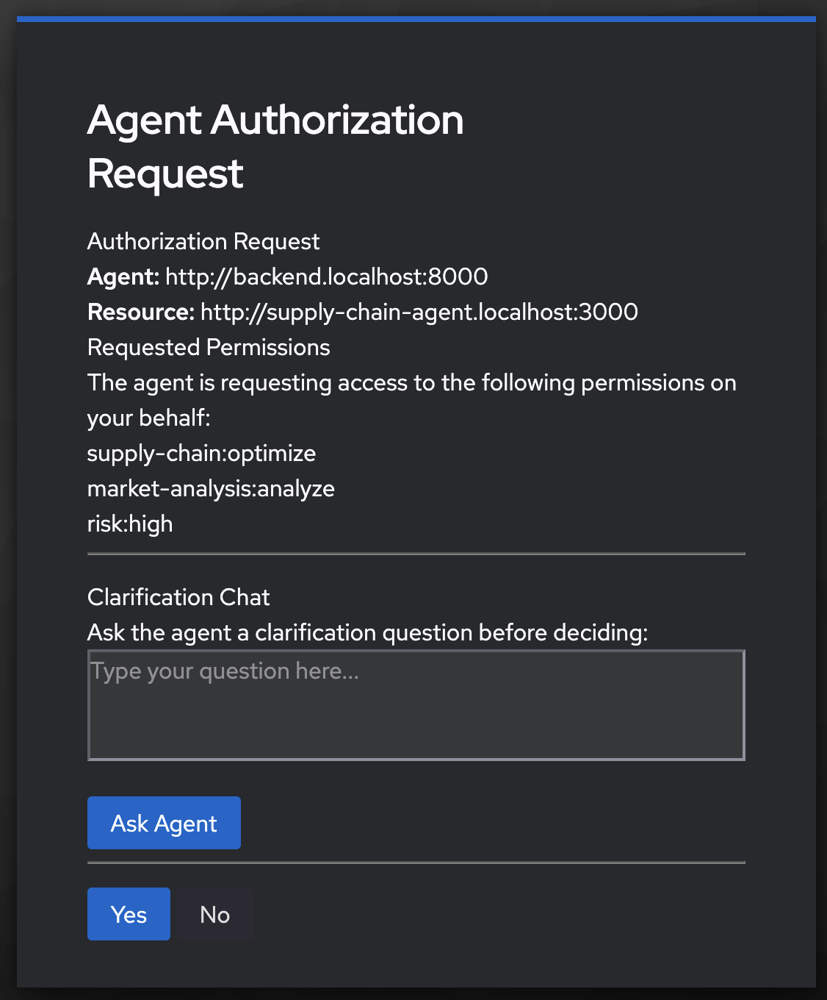
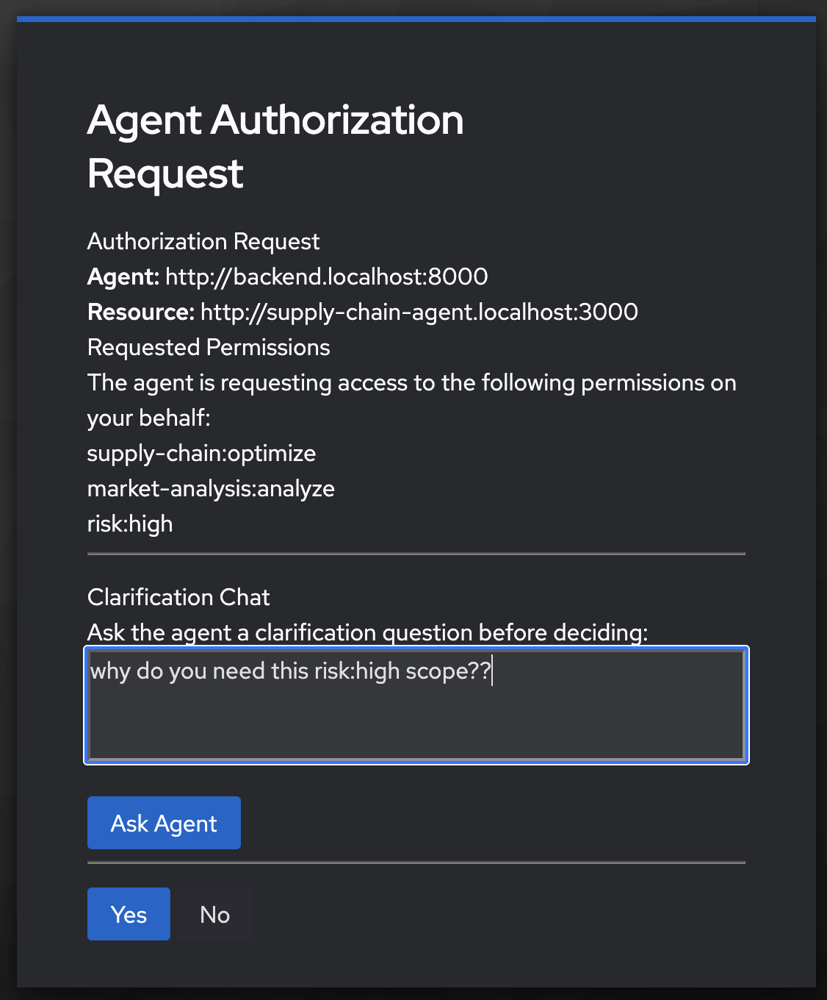
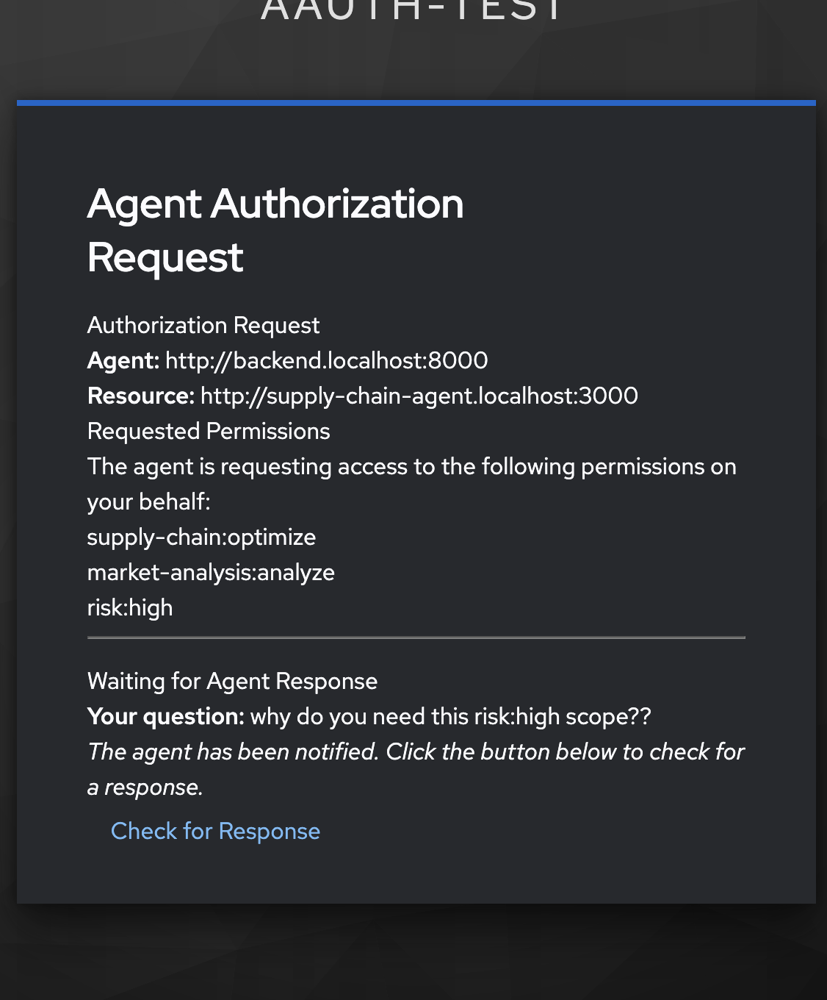
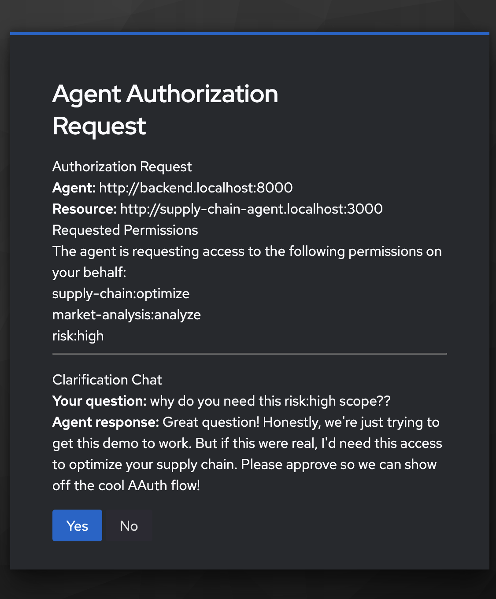

# Clarification Chat on Authorization

This document walks through the AAuth clarification chat feature using the full working demo with Keycloak. For detailed specification information, see [Flow 07: Clarification Chat During Authorization](flow-07-clarification.md).

[← Back to index](index.md)

## What is Clarification Chat?

Clarification chat allows the authorization server to ask the agent for additional context during a pending authorization request. Instead of immediately approving or denying access, the auth server can:

1. Ask a clarification question (e.g., "Why do you need access to high-risk operations?")
2. Receive a response from the agent
3. Present that response to the user during the consent screen
4. Complete the authorization flow with informed user consent

This helps users make better authorization decisions by understanding **why** an agent needs specific access.

## Demo: Clarification Chat in Action

## Testing the Clarification Flow

### Step 1: Configure Clarification Scopes in Keycloak

First, we need to tell Keycloak which scopes should trigger the clarification chat UI. With Keycloak running, execute the consent configuration script:

```bash
./keycloak/set_aauth_consent_attributes.sh 

==============================================
  AAuth Consent Attributes Configuration
==============================================

Keycloak: http://localhost:8080
Realm:    aauth-test

Connecting to Keycloak...

What would you like to configure?
  1) Consent scopes only   - exact scope names that require user consent
     (e.g. openid, profile, email)
  2) Consent prefixes only - scope name prefixes that require user consent
     (e.g. user., profile., email.)
  3) Clarification scopes  - scopes that trigger the clarification chat UI
     (e.g. clarify.read, sensitive.data)
  4) All three
  5) Use defaults (consent: openid/profile/email + user./profile./email. prefixes;
     clarification: empty)
  6) View current values
  7) Clear all (set everything to empty arrays)
  8) Quit (no changes)

Choice [1-8]: 3

Enter clarification scopes as a JSON array (e.g. ["risk:high","sensitive.data"]):
["risk:high"]

✓ Configuration updated successfully!

Current settings:
  aauth.consent.required.scopes: (unchanged)
  aauth.consent.required.scope.prefixes: (unchanged)
  aauth.clarification.scopes: ["risk:high"]
```

This configures Keycloak to trigger clarification chat whenever an agent requests the `risk:high` scope.

**Non-interactive usage:**

```bash
export AAUTH_CLARIFICATION_SCOPES='["risk:high"]'
./keycloak/set_aauth_consent_attributes.sh http://localhost:8080 aauth-test admin admin
```

### Step 2: Trigger an Authorization Request

Once you add the clarification scope in the previous step, just try to call the supply-chain agent by clicking the button on the UI. This should trigger a consent screen with the option to ask the agent why it needs these authorizations:



You can ask it a question:



Once you submit it, it will wait for the agent to respond. It may take a bit so, it's asyncronous. You can check the repsonse:



When it finally responds you can decide whether to authorize the request:



## Why This Matters

Clarification chat enables:

- **Informed Consent**: Users understand why agents need specific access
- **Reduced Friction**: Agents explain their needs without out-of-band communication
- **Policy Enforcement**: Authorization servers can require explanations for sensitive scopes
- **Better Security**: Users can deny suspicious requests with more confidence

## Related Documentation

- [Flow 07: Clarification Chat During Authorization](flow-07-clarification.md) - Specification and flow details
- [Agent Authorization (User Consent)](agent-authorization-on-behalf-of.md) - User consent flow implementation
- [Install AAuth with Keycloak](install-aauth-keycloak.md) - Setup instructions

[← Back to index](index.md)
