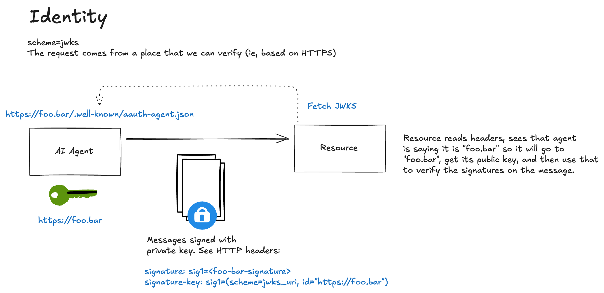

[AAuth](https://github.com/dickhardt/agent-auth) supports **progressive authentication** levels: pseudonymous, identified, and authorized. This document covers the **identified** level where agents prove a stable, verifiable identity backed by cryptographic, discoverable keys.

[← Back to index](index.md)

## What is Identified Access?

With identified scheme, an agent proves it controls keys published at a well-known URL. The resource can verify that:
- The request was signed by the holder of a private key
- That private key corresponds to a public key published at the agent's declared identity URL
- The agent's identity is stable and verifiable across requests

Unlike pseudonymous (HWK) access, the agent **does** prove who they are. Their identity is bound to a domain they control (HTTPS). This enables policy decisions based on known agent identities and audit trails tied to specific agents.

This approach forms the foundation for Agent Identity. 


The **JSON Web Key Set (JWKS)** scheme requires agents to publish their public keys at a discoverable URL. Instead of embedding the key inline, the agent tells the resource where to fetch it.



**Key ownership:**
- The **agent** generates and holds the private key locally
- The agent publishes the **public key** at a JWKS endpoint (e.g., `https://agent.supply-chain.com/jwks.json`)
- The agent hosts metadata at a well-known endpoint declaring their JWKS location
- The resource fetches (and potentially caches) these keys for verification

**What the resource can verify:**
1. The request was signed by someone holding the corresponding private key
2. That key is published by the declared agent identity
3. The covered components haven't been tampered with
4. The signature was created recently (via the `created` timestamp)

**What the resource can also establish:**
- *Who* the signer is (the agent identity URL)
- The agent controls the domain where keys are published
- Organizational trust based on domain reputation

In our sample flow, we see that when the agent makes a request to a resource, it sends:

```bash
================================================================================
>>> AGENT REQUEST to https://important.resource.com/data-jwks
================================================================================
GET https://important.resource.com/data-jwks HTTP/1.1
Signature: sig1=:0O48KtRbtfpgIZdCVdPZkHQNzBCZmOnPjTDYW0JN4qET18p4toSEE7ZIZo1v5Hf7CZKPugAhiSkrWuNmekUvAQ:
Signature-Input: sig1=("@method" "@authority" "@path" "signature-key");created=1768785796
Signature-Key: sig1=(scheme=jwks id="https://agent.supply-chain.com" kid="key-1" well-known="aauth-agent")
================================================================================
```

## Understanding the Request Headers

Resource sees:

```bash
================================================================================
>>> RESOURCE REQUEST received
================================================================================
GET /data-jwks HTTP/1.1
Host: 127.0.0.1:8002
accept: */*
accept-encoding: gzip, deflate
connection: keep-alive
host: 127.0.0.1:8002
signature: sig1=:0O48KtRbtfpgIZdCVdPZkHQNzBCZmOnPjTDYW0JN4qET18p4toSEE7ZIZo1v5Hf7CZKPugAhiSkrWuNmekUvAQ:
signature-input: sig1=("@method" "@authority" "@path" "signature-key");created=1768785796
signature-key: sig1=(scheme=jwks id="https://agent.supply-chain.com" kid="key-1" well-known="aauth-agent")
user-agent: python-httpx/0.28.1
================================================================================
```

### `Signature-Input`
```
Signature-Input: sig1=("@method" "@authority" "@path" "signature-key");created=1768785796
```

This header declares *what was signed* and *how*:

| Component | Meaning |
|-----------|---------|
| `sig1=` | The signature label, must match across all three headers |
| `"@method"` | The HTTP method (`GET`) is covered by the signature |
| `"@authority"` | The host (`important.resource.com`) is covered |
| `"@path"` | The path (`/data-jwks`) is covered |
| `"signature-key"` | **Critical:** The Signature-Key header itself is covered, preventing identity substitution attacks |
| `created=1768785796` | Unix timestamp when the signature was created (resources typically reject signatures older than 60 seconds) |

### `Signature`
```
Signature: sig1=:0O48KtRbtfpgIZdCVdPZkHQNzBCZmOnPjTDYW0JN4qET18p4toSEE7ZIZo1v5Hf7CZKPugAhiSkrWuNmekUvAQ:
```

The actual cryptographic signature, base64-encoded between colons (RFC 9421 format).

### `Signature-Key`
```
Signature-Key: sig1=(scheme=jwks id="https://agent.supply-chain.com" kid="key-1" well-known="aauth-agent")
```

| Parameter | Meaning |
|-----------|---------|
| `sig1=` | Must match the label in `Signature-Input` and `Signature` |
| `scheme=jwks` | JWKS scheme—identified, discoverable public keys |
| `id="https://agent.supply-chain.com"` | The agent's identity URL (base for key discovery) |
| `kid="key-1"` | Key ID to look up in the JWKS |
| `well-known="aauth-agent"` | Which well-known path to use for metadata discovery |

**Note:** The `id` parameter establishes the agent's identity claim. The resource will verify this claim by fetching keys from that domain.

## Key Discovery Process

Before verifying the signature, the resource must fetch the agent's public key. This involves two HTTP requests:

### Step 1: Fetch Agent Metadata

The resource constructs the well-known URL from the `id` and `well-known` parameters:
```
https://agent.supply-chain.com/.well-known/aauth-agent
```

```bash
INFO:     127.0.0.1:58634 - "GET /.well-known/aauth-agent HTTP/1.1" 200 OK
```

Response:
```json
{
  "agent": "https://agent.supply-chain.com",
  "jwks_uri": "https://agent.supply-chain.com/jwks.json"
}
```

The metadata document:
- Confirms the agent identity (`agent` field matches the `id` parameter)
- Points to the JWKS endpoint (`jwks_uri`)

### Step 2: Fetch JWKS

The resource fetches the JWKS from the declared `jwks_uri`:

```bash
INFO:     127.0.0.1:58635 - "GET /jwks.json HTTP/1.1" 200 OK
```

Response:
```json
{
  "keys": [
    {
      "kty": "OKP",
      "crv": "Ed25519",
      "x": "b-8CW2TppDJhevm4Db2QaKelJ1NLKQtZg1mwazqD9iY",
      "kid": "key-1"
    }
  ]
}
```

The resource looks up the key matching `kid="key-1"` from the request's `Signature-Key` header.

**Caching:** Resources should cache JWKS responses (respecting HTTP cache headers) to avoid fetching on every request. Key rotation is handled by publishing new keys with different `kid` values.


## Resource Verification Process

When the resource receives this request, it performs these steps:

### 1. Signature-Key Coverage Check
The resource confirms that `"signature-key"` is listed in the covered components. This prevents **identity substitution attacks** where an attacker could:
- Intercept a legitimately-signed request
- Replace the `Signature-Key` header with their own identity
- Claim the request was made by their agent


### 2. Signature Base Reconstruction
The resource reconstructs the exact bytes that were signed:
```
"@method": GET
"@authority": important.resource.com
"@path": /data-jwks
"signature-key": sig1=(scheme=jwks id="https://agent.supply-chain.com" kid="key-1" well-known="aauth-agent")
"@signature-params": ("@method" "@authority" "@path" "signature-key");created=1768785796
```

### 3. Signature Verification
Using the discovered public key, verify the signature over the reconstructed signature base.

### 4. Apply Policy
With a verified identity, the resource can make richer access decisions:
- Check if this agent is on an allowlist
- Grant access tiers based on agent reputation
- Log requests with verified attribution

In our example, if the resource determines this is a valid request and agent identity, it can proceed with the request and return an HTTP 200. 

```bash
================================================================================
<<< RESOURCE RESPONSE
================================================================================
HTTP/1.1 200
content-length: 126
content-type: application/json

[Body (126 bytes)]
{"message":"Access granted","data":"This is protected data","scheme":"jwks","method":"GET","agent_id":"https://agent.supply-chain.com"}
================================================================================
```

Notice the response now includes `agent_id`. The resource knows exactly which agent made the request.

Agent gets response

```bash
================================================================================
<<< AGENT RESPONSE from https://important.resource.com/data-jwks
================================================================================
HTTP/1.1 200 OK
content-length: 126
content-type: application/json
date: Mon, 19 Jan 2026 01:23:16 GMT
server: uvicorn

[Body (126 bytes)]
{"message":"Access granted","data":"This is protected data","scheme":"jwks","method":"GET","agent_id":"https://agent.supply-chain.com"}
================================================================================
```


## HWK vs JWKS: When to Use Each

| Aspect | HWK (Pseudonymous) | JWKS (Identified) |
|--------|-------------------|-------------------|
| **Identity** | None—just a public key | Domain-bound identity URL |
| **Key discovery** | Inline in request | Fetched from agent's domain |
| **Infrastructure** | None required | Must host well-known + JWKS endpoints |
| **Trust model** | Track by key fingerprint | Trust by domain reputation |
| **Use cases** | Crawlers, testing, privacy | Production agents, enterprise, APIs |
| **Auth Upgrade path** | Can upgrade to JWKS later | Can upgrade to authorized access |


## Where to Next

In this flow, we reviewed the identified access pattern with AAuth's JWKS scheme. Agents can now prove their identity cryptographically but they're still accessing resources without explicit authorization.

For scenarios requiring explicit permission grants (OAuth-style token flows), we explore the **authorized** tier in the next section: [flow-03-tokens.md](./flow-03-authz.md).

[← Back to index](index.md)