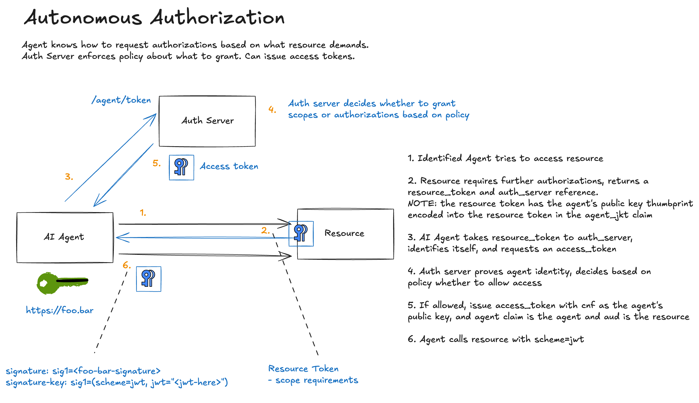

In the previous posts, we covered [pseudonymous access](./flow-01-hwk.md) and [identified access](./flow-02-jwks.md). An agent can now prove *who it is*, but that doesn't mean it's *authorized* to access protected resources. This post covers how AAuth handles authorization and how it helps with some of the previous assumptions around OAuth that no longer hold.

[← Back to index](index.md)

## The OAuth Authorization Model

OAuth 2.0 was designed with a specific mental model: **authorization happens before execution**.

Here's how it works in practice:

1. **Scopes are defined at design time.** An API team creates `calendar.read`, `calendar.write`, and documents exactly what each means.

2. **The client is written for those scopes.** A developer reads the API docs, knows exactly which endpoints they'll call, and requests exactly the scopes they need.

3. **The user consents ahead of time.** The consent screen says "This app wants to read your calendar" and the user approves.

4. **The resource server enforces mechanically.** When a request arrives, the check is simple: *does this token have the required scope?*

This works because everyone agrees on what the scope means. The client developer, the auth server, the resource server, and the user all share a mental model of what `calendar.write` allows. Authorization can be fully decided before any API call happens because the client's future behavior is predictable.

| OAuth Assumption | Why It Works |
|------------------|--------------|
| Client is known | Pre-registered, vetted, stable identity |
| Client is registered | Redirect URIs locked, trust established |
| Client intent is static | Hardcoded endpoints, predictable flows |
| Scopes map to APIs | Clear semantic meaning, bounded blast radius |
| Authorization is pre-declared | Consent happens once, before API access |

**Scopes are pre-commitments.** The client is essentially saying: "I promise I will only do the kinds of things implied by this label." That promise is meaningful because the client is bounded and predictable.

## Why This Breaks with AI Agents

AI agents don't operate like traditional OAuth clients. They don't pre-commit, they explore.

Consider a typical OAuth client:
- Built for a specific API
- Pre-registered with known redirect URIs
- Coded to call specific endpoints/responses
- Requests scopes the developer chose at build time

Now consider an AI agent:
- General-purpose, not built for any specific API
- Discovers tools dynamically at runtime
- Chains operations based on goal driven, emergent intent
- Cannot honestly say "I know exactly which endpoints I will call"

When an AI agent encounters an MCP server with 50 tools, it doesn't know ahead of time which ones it will use. It reads descriptions, infers intent, and adapts. The sequence of API calls depends on previous responses. Behavior emerges at runtime.

| OAuth Assumption | Why Agents Break It |
|------------------|---------------------|
| Client is known | Agents are generic |
| Client is registered | Agents appear dynamically |
| Client intent is static | Agent intent is emergent |
| Scopes map to APIs | Tools are composable and open-ended |
| Authorization is pre-declared | Authorization must be evaluated at runtime |


The question shifts from:
> "Is this client allowed to do X?"

To:
> "Is this action acceptable, at this specific moment, given what's already happened, which derives from some authority?"

That's fundamentally a **runtime question**.


## AAuth's Approach: The Resource Auth Challenge

AAuth moves authorization decisions to where they can be meaningfully evaluated: at the moment of access. Instead of pre-declaring what an agent might do, the resource challenges the agent for authorization when it actually attempts access.

Here's the flow:




Continuing our example flows, here we see where a resource server requires authorization for a particular acceess for a particular agent identity. 


### Step 1: Agent Requests Protected Resource

The agent makes an identified request (using JWKS identity from the previous post):

```bash
================================================================================
>>> AGENT REQUEST to https://important-resource.com/data-auth
================================================================================
GET https://important-resource.com/data-auth HTTP/1.1
Signature: sig1=:ZMGGi5N61KL-AWkTbLZDPWRA3AUefyhCtOmQ-Wp7CF6IeIch6RpzAfatdOj3VoSGL-BAouXpMCViML8gvFH1Aw:
Signature-Input: sig1=("@method" "@authority" "@path" "signature-key");created=1768785919
Signature-Key: sig1=(scheme=jwks id="https://agent.supply-chain.com" kid="key-1" well-known="aauth-agent")
================================================================================
```

The agent proves *who* it is, but hasn't proven it's *authorized* to access this resource.

### Step 2: Resource Issues Challenge with Resource Token

The resource determines this endpoint requires authorization and responds with a **401 and an Agent-Auth challenge**:

```bash
================================================================================
<<< RESOURCE RESPONSE
================================================================================
HTTP/1.1 401
agent-auth: httpsig; auth-token; resource_token="eyJhbGciOiJFZERTQSIsImtpZCI6InJlc291cmNlLWtleS0xIiwidHlwIjoi...
content-length: 22

[Body (22 bytes)]
Authorization required
================================================================================
```
This is where AAuth diverges from OAuth. The resource doesn't just say "you need authorization." It issues a **resource token** which is a signed JWT that binds this specific access request to:

- **The resource's identity** (who is asking for authorization)
- **The requesting agent** (who wants access)  
- **The agent's current signing key** (cryptographic binding)
- **The required scopes** (what access is being requested)
- **Any context, constraings, time restrictions**

Let's decode that resource token:

```json
{
  "typ": "resource+jwt",
  "alg": "EdDSA",
  "kid": "resource-key-1"
}
```

```json
{
  "iss": "https://important-resource.com",
  "aud": "https://auth-server.com",
  "agent": "https://agent.supply-chain.com",
  "agent_jkt": "zAkRaFpmIxi7kHESqzoRr3ihmKPJHBejcHrzOUqTeGo",
  "scope": "data.read data.write",
  "exp": 1768786519
}
```

The resource token provides cryptographic proof that:

1. This specific resource (`https://important-resource.com`) is requesting authorization
2. For this specific agent (`https://agent.supply-chain.com`)
3. Bound to this specific signing key (`agent_jkt`)
4. For these specific scopes (`data.read data.write`)


### Confused Deputy Prevention

Without resource tokens, an attacker could potentially:
1. Observe an agent requesting authorization for Resource A
2. Substitute Resource B's identifier in the authorization flow
3. Get the auth server to issue a token for the wrong resource

The `agent` claim in the resource token binds each access request to a specific agent. The auth server can verify: "Yes, this authorization request came from a legitimate resource asking about this specific agent."

### The "Lying Agent" Problem

Without resource tokens, a malicious agent could falsely claim that a resource challenged it for authorization. The agent could tell the auth server: "Resource X asked me for `admin.delete` scope" when Resource X never made such a request.

With resource tokens, the resource cryptographically signs exactly what scopes it requires. The auth server doesn't have to trust the agent's claim, it verifies the resource's signature.


## Step 3: Agent Requests Authorization

The agent takes the resource token to the auth server:

```bash
================================================================================
>>> AGENT REQUEST to https://auth-server.com/agent/token
================================================================================
POST https://auth-server.com/agent/token HTTP/1.1
Content-Digest: sha-256=:X4BI4dl2iOkMAnOAiyP0GgBX01OkmEmauc6Nm6DTbwE=:
Content-Type: application/x-www-form-urlencoded
Signature: sig1=:MYpXTXsAIXRUw8oUy70waxmtkbdKljMolYS6v_R7yeNUaly3mtE9NC01uF3KBCD4CfBoTBcuf3FoXAXF84bLCQ:
Signature-Input: sig1=("@method" "@authority" "@path" "content-type" "content-digest" "signature-key");created=176...
Signature-Key: sig1=(scheme=jwks id="https://agent.supply-chain.com" kid="key-1" well-known="aauth-agent")

[Body (510 bytes)]
request_type=auth&resource_token=eyJhbGciOiJFZERTQSIsImtpZCI6InJlc291cmNlLWtleS0xIiwidHlwIjoicmVzb3VyY2Urand0In0...
================================================================================
```

Notice several things:
- The request is **signed** (the agent continues to prove its identity)
- The body includes `content-digest` in the signature (integrity protection)
- The resource token is passed as a parameter


The auth server:
1. Verifies the agent's signature (fetches agent JWKS)
2. Verifies the resource token signature (fetches resource JWKS)
3. Confirms the `agent` claim in the resource token matches the requesting agent
4. Confirms the `agent_jkt` matches the agent's current signing key
5. Evaluates policy for this agent, resource, and scope combination

## Step 4: Auth Server Issues Auth Token

If policy permits, the auth server issues an **auth token**:

```json
{
  "auth_token": "eyJhbGciOiJFZERTQSIsImtpZCI6ImF1dGgta2V5LTEiLCJ0eXAiOiJhdXRoK2p3dCJ9...",
  "expires_in": 3600,
  "token_type": "Bearer"
}
```

Decoded:

```json
{
  "typ": "auth+jwt",
  "alg": "EdDSA", 
  "kid": "auth-key-1"
}
```

```json
{
  "iss": "https://auth-server.com",
  "aud": "https://important-resource.com",
  "cnf": {
    "jwk": {
      "kty": "OKP",
      "crv": "Ed25519",
      "x": "v4w1nfeU2IV9Mi7N_pLDbBvNMerWhlMwagF1Dw_7wXQ",
      "kid": "key-1"
    }
  },
  "scope": "data.read data.write",
  "exp": 1768789519,
  "agent": "https://agent.supply-chain.com"
}
```

The auth token is a **proof-of-possession token**. Notice the `cnf` (confirmation) claim. It embeds the agent's public key. This means the token can only be used by someone who can prove they hold the corresponding private key.

## Step 5: Agent Accesses Resource with Auth Token

Now the agent can make the authorized request:

```bash
================================================================================
>>> AGENT REQUEST to https://important-resource.com/data-auth
================================================================================
GET https://important-resource.com/data-auth HTTP/1.1
Signature: sig1=:7iiclCyzY7xfitBNgWZBAJOM4JmmmNtyoE7JaYwOXSej-OZg7Mx9FMHtLTau5tGs-NEtvJKQWmJndCfPbhNuDw:
Signature-Input: sig1=("@method" "@authority" "@path" "signature-key");created=1768785919
Signature-Key: sig1=(scheme=jwt jwt="eyJhbGciOiJFZERTQSIsImtpZCI6ImF1dGgta2V5LTEiLCJ0eXAiOiJhdXRoK2p3dCJ9.eyJpc3...
================================================================================
```

Note the change: `scheme=jwt` now, carrying the auth token instead of JWKS discovery parameters.

The resource validates:
1. The auth token signature (fetches auth server JWKS)
2. The `aud` claim matches this resource
3. The `scope` covers the requested operation
4. The request signature was created with the key in `cnf.jwk`

```bash
================================================================================
<<< RESOURCE RESPONSE
================================================================================
HTTP/1.1 200
content-length: 212
content-type: application/json

[Body (212 bytes)]
{"message":"Access granted","data":"This is protected data (authorized)","scheme":"jwt","token_type":"auth+jwt","method":"GET","agent":"https://agent.supply-chain.com","agent_delegate":null,"scope":"data.read data.write"}
================================================================================
```

Access granted.

## Progressive Authorization in Practice

AAuth supports **progressive authentication levels**: pseudonymous, identified, and authorized. Resources dynamically challenge for the appropriate level:

| Level | Agent-Auth Header | Use Case |
|-------|-------------------|----------|
| Pseudonymous | `Agent-Auth: httpsig` | Rate limiting, abuse prevention |
| Identified | `Agent-Auth: httpsig; identity=?1` | Allowlisting, reputation |
| Authorized | `Agent-Auth: httpsig; auth-token; resource_token="..."` | Protected data access |

A single resource can expose different endpoints at different protection levels. A public status endpoint might accept pseudonymous requests, while a data mutation endpoint requires full authorization.

## What Changes for Agent Developers

If you're building AI agents, the runtime authorization model means:

1. **Don't pre-request all possible scopes.** Let resources tell you what they need when you access them.

2. **Handle 401 challenges gracefully.** A 401 with `Agent-Auth` isn't an error—it's the protocol telling you to get authorization.

3. **Cache auth tokens appropriately.** They're valid for the resource and scope combination. Reuse them until expiry.

4. **Expect different resources to require different auth servers.** The resource token tells you where to go.

## Where to Next

We've now covered the three authentication levels in AAuth:
- [Pseudonymous (HWK)](./flow-01-hwk.md): Cryptographic proof without identity
- [Identified (JWKS)](./flow-02-jwks.md): Domain-bound agent identity  
- **Authorized (this post)**: Runtime authorization with resource binding

[In the next post](./flow-04-user.md), we'll look at **user consent flows** where, based on policy, the authorization server can require the user to consent to scopes that enable sensitive workflows or resource access. 

[← Back to index](index.md)
