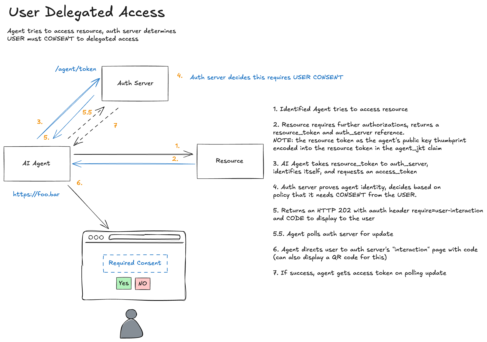

In the [previous post](./flow-03-authz.md), we saw how an agent can obtain authorization when policy permits direct token issuance. But what happens when the auth server determines that **user consent is required**? This post covers how [AAuth](https://github.com/dickhardt/agent-auth) handles interactive consent flows while maintaining cryptographic binding throughout.

[← Back to index](index.md)

## When Direct Authorization Isn't Enough

In the previous section which focused on [identified agent authorization](./flow-03-authz.md), the auth server evaluated policy and immediately issued an auth token. This works for scenarios like:

- Machine-to-machine authorization (no user in the loop)
- Pre-approved agent-resource pairs
- Low-sensitivity operations

But many scenarios require explicit user consent:

- Accessing personal data (email, calendar, files)
- Acting on behalf of a user
- First-time authorization for a new agent
- High-sensitivity operations

The auth server makes this determination, not the agent or resource. The agent simply presents the resource token; the auth server decides whether to issue a token directly or require consent.

## The Consent Flow

Here's how it differs from the direct flow:



### Steps 1-2: Same as Before

The agent requests the protected resource and receives a 401 with a resource token:
```bash
================================================================================
>>> AGENT REQUEST to https://important.resource.com/data-auth
================================================================================
GET https://important.resource.com/data-auth HTTP/1.1
Signature: sig1=:yNg83RIDMM7dnCJXGig_LrBskrbHtlTFDzCpMBQgtn1oELS1c4QNhH30rboOuGpDLgjaFx6Ut14n2gzWyV26DA:
Signature-Input: sig1=("@method" "@authority" "@path" "signature-key");created=1768786017
Signature-Key: sig1=(scheme=jwks id="https://agent.supply-chain.com" kid="key-1" well-known="aauth-agent")
================================================================================
```
```bash
================================================================================
<<< RESOURCE RESPONSE
================================================================================
HTTP/1.1 401
agent-auth: httpsig; auth-token; resource_token="eyJhbGciOiJFZERTQSIsImtpZCI6InJlc291cmNlLWtleS0xIiwidHlwIjoi...
content-length: 22

[Body (22 bytes)]
Authorization required
================================================================================
```

### Step 3: Agent Requests Authorization (Same Request, Different Response)

The agent presents the resource token to the auth server, exactly as in [identified agent authorization](./flow-03-authz.md):

```bash
================================================================================
>>> AGENT REQUEST to https://auth-server.com/agent/token
================================================================================
POST https://auth-server.com/agent/token HTTP/1.1
Content-Digest: sha-256=:rMyTWCblP3KXnWkI2KGnDVqj91ETqvcEUuzSrXChi+c=:
Content-Type: application/x-www-form-urlencoded
Signature: sig1=:ICv_zjE12EOoEOSKofQR9R3-IoRL7TM0DEc2Q8cJubwoRnbWvFNUDQQFiVizugLFeTAmBQ4JqRGv2qLpQO8GBw:
Signature-Input: sig1=("@method" "@authority" "@path" "content-type" "content-digest" "signature-key");created=176...
Signature-Key: sig1=(scheme=jwks id="https://agent.supply-chain.com" kid="key-1" well-known="aauth-agent")

[Body]
request_type=auth&resource_token=eyJhbGciOiJFZERTQSIsImtpZCI6InJlc291cmNlLWtleS0xIiwidHlwIjoicmVzb3VyY2Urand0In0...&redirect_uri=https://agent.supply-chain.com/callback
================================================================================
```

But this time, the auth server evaluates policy and determines that user consent is required. Instead of an auth token, it returns a **request token**:
```bash
================================================================================
<<< AUTH SERVER RESPONSE
================================================================================
HTTP/1.1 200 OK
Content-Type: application/json

[Body]
{
  "request_token": "kgJ04U2x_0tIBAddXd5I_LTnUMow6dWnMTjkEPuY1Y4",
  "expires_in": 600
}
================================================================================
```

## Request Tokens: OAuth PAR for Agents

If you've worked with OAuth 2.0 Pushed Authorization Requests (PAR, RFC 9126), this pattern will look familiar. PAR lets clients push authorization parameters to the auth server and receive an opaque reference in return.

AAuth's request token serves a similar purpose:

| OAuth PAR | AAuth Request Token |
|-----------|---------------------|
| Stores authorization request server-side | Stores authorization context server-side |
| Returns `request_uri` | Returns `request_token` |
| Used in authorization URL | Used in consent URL |
| Short-lived (typically 60s) | Short-lived (600s in this example) |

But there's a key difference: the AAuth request token already contains cryptographically verified context from the resource token. The auth server has already validated:

- The resource's identity and signature
- The agent's identity and signature  
- The cryptographic binding between them (`agent_jkt`)
- The requested scopes / constraints

This context is stored server-side, associated with the request token. The user will consent to a request that has already been cryptographically validated.

## Step 4: User Consent

The agent directs the user to the consent endpoint:
```
https://auth-server.com/agent/auth?request_token=kgJ04U2x_0tIBAddXd5I_LTnUMow6dWnMTjkEPuY1Y4&redirect_uri=https://agent.supply-chain.com/callback
```

The auth server displays a consent screen to the user. Because the request token references validated context, the consent screen can show verified information:

- ✓ Agent identity: `https://agent.supply-chain.com` (verified via JWKS)
- ✓ Resource requesting access: `https://important.resource.com` (verified via signature)
- ✓ Requested scopes: `data.read data.write`

The user isn't consenting to claims made by the agent. They're consenting to cryptographically verified facts.

### After User Approval

Once the user consents, the auth server redirects back to the agent with an authorization code:
```
https://agent.supply-chain.com/callback?code=3oyoQOpk9Mn1caCjVoJ-ibMfIpyRzBKwV2A5XPCuFGk
```

## Step 5: Code Exchange

The agent exchanges the code for an auth token. Note that this request is also signed: the agent continues to prove its identity:
```bash
================================================================================
>>> AGENT REQUEST to https://auth-server.com/agent/token
================================================================================
POST https://auth-server.com/agent/token HTTP/1.1
Content-Digest: sha-256=:iW1aTTCfubZKzu+4a8LoxYXIVEX0av0ii09u0ybxS1A=:
Content-Type: application/x-www-form-urlencoded
Signature: sig1=:qrlfQIgWSZtk5ret60dsdW-nIIjbM9S_nOO4dq8Mxs1hfnv0UZf-EZVOYB8E7QBD1J0QmQbwt-6CyJyzN8BoAg:
Signature-Input: sig1=("@method" "@authority" "@path" "content-type" "content-digest" "signature-key");created=176...
Signature-Key: sig1=(scheme=jwks id="https://agent.supply-chain.com" kid="key-1" well-known="aauth-agent")

[Body]
request_type=code&code=3oyoQOpk9Mn1caCjVoJ-ibMfIpyRzBKwV2A5XPCuFGk&redirect_uri=https://agent.supply-chain.com/callback
================================================================================
```

The auth server validates:
1. The agent's signature matches the agent bound to the original request
2. The authorization code is valid and unused
3. The redirect URI matches the original request

Then issues the auth token:
```bash
================================================================================
<<< AUTH SERVER RESPONSE
================================================================================
HTTP/1.1 200 OK
Content-Type: application/json

[Body]
{
  "auth_token": "eyJhbGciOiJFZERTQSIsImtpZCI6ImF1dGgta2V5LTEiLCJ0eXAiOiJhdXRoK2p3dCJ9...",
  "expires_in": 3600,
  "token_type": "Bearer"
}
================================================================================
```

The auth token now includes a `sub` claim identifying the user who consented:
```json
{
  "iss": "https://auth-server.com",
  "aud": "https://important.resource.com",
  "cnf": {
    "jwk": {
      "kty": "OKP",
      "crv": "Ed25519",
      "x": "UsRd_e0Lq8WU5uYEklowyqe_DSaFfB9fjnn__DwWF6E",
      "kid": "key-1"
    }
  },
  "scope": "data.read data.write",
  "exp": 1768789645,
  "agent": "https://agent.supply-chain.com",
  "sub": "testuser"
}
```

## Step 6: Access the Resource

From here, it's identical to [identified agent authorization](./flow-03-authz.md). The agent uses the auth token to access the resource:

```bash
================================================================================
>>> AGENT REQUEST to https://important.resource.com/data-auth
================================================================================
GET https://important.resource.com/data-auth HTTP/1.1
Signature: sig1=:yMTf_qgsX8ouHj7D5N-NGXVpq8UAPaz12MhkQoRJwAsPBwsHc1NcTRXuo2KkicCLG03fzv-HWJd0Zo0bci4aCg:
Signature-Input: sig1=("@method" "@authority" "@path" "signature-key");created=1768786045
Signature-Key: sig1=(scheme=jwt jwt="eyJhbGciOiJFZERTQSIsImtpZCI6ImF1dGgta2V5LTEiLCJ0eXAiOiJhdXRoK2p3dCJ9.eyJpc3...
================================================================================
```
```bash
================================================================================
<<< RESOURCE RESPONSE
================================================================================
HTTP/1.1 200
content-length: 212
content-type: application/json

[Body]
{"message":"Access granted","data":"This is protected data (authorized)","scheme":"jwt","token_type":"auth+jwt","method":"GET","agent":"https://agent.supply-chain.com","agent_delegate":null,"scope":"data.read data.write"}
================================================================================
```

## Policy Decides, Not the Agent

A crucial aspect of this design: **the agent doesn't know in advance whether consent will be required**. It makes the same request to `/agent/token` regardless. The auth server's response tells the agent what happens next:

| Response | Meaning |
|----------|---------|
| `auth_token` in response | Authorization granted directly |
| `request_token` in response | User consent required |
| 4xx error | Authorization denied |

This keeps policy decisions centralized in the auth server. The auth server can consider:

- Is this agent pre-approved for this resource?
- Has the user previously consented to these scopes?
- Does organizational policy allow direct issuance?
- Are there risk signals that require user confirmation?


## Comparison with OAuth

| Aspect | OAuth Authorization Code | AAuth User Consent |
|--------|--------------------------|-------------------|
| Client authentication | Client secret or PKCE | HTTP message signatures |
| Authorization request | Client constructs URL with scopes | Resource provides scope requirements |
| Request binding | PKCE code verifier | Request token + agent signatures |
| Token binding | Optional (DPoP) | Mandatory (cnf claim) |
| Scope source | Client decides | Resource declares |

The most significant philosophical difference: in OAuth, the client requests scopes it wants. In AAuth, the resource declares scopes it requires. The agent is responding to challenges, not making pre-commitments.


## Where to Next

We've now covered:
- [Pseudonymous (HWK)](./flow-01-hwk.md): Cryptographic proof without identity
- [Identified (JWKS)](./flow-02-jwks.md): Domain-bound agent identity
- [Authorized (Direct)](./flow-03-authz.md): Runtime authorization without user interaction
- **User Consent (this post)**: Interactive authorization with user approval

[In the next post](./flow-05-token-ex.md), we'll explore **Token Exchange**, and what happens when one agent needs to act on behalf of another, creating chains of authorization.

[← Back to index](index.md)