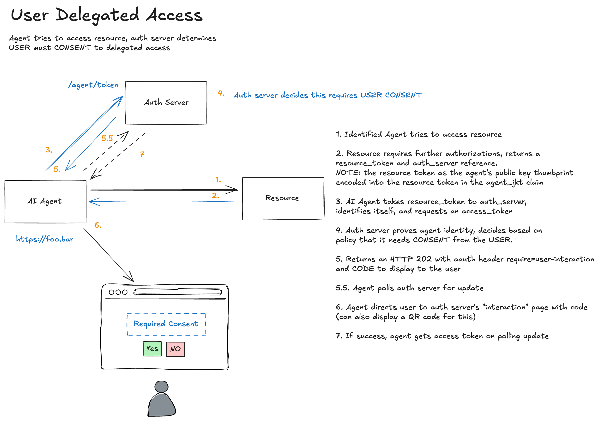

In the [previous post](./flow-03-authz.md), we saw how an agent can obtain authorization when policy permits direct token issuance. But what happens when the auth server determines that **user consent is required**? This post covers how [Agent Auth](https://github.com/dickhardt/AAuth) handles interactive consent flows while maintaining cryptographic binding throughout.

[← Back to index](index.md)

## When Direct Authorization Isn't Enough

In the previous section which focused on [identified agent authorization](./flow-03-authz.md), the auth server evaluated policy and immediately issued an auth token. This works for scenarios like:

- Machine-to-machine authorization (no user in the loop)
- Pre-approved, admin consented agent-resource pairs
- Low-sensitivity operations

But many scenarios require explicit user consent:

- Accessing personal data (email, calendar, files)
- Acting on behalf of a user
- First-time authorization for a new agent
- High-sensitivity operations

The auth server makes this determination, not the agent or resource. The agent simply presents the resource token; the auth server decides whether to issue a token directly or require consent or user involvement.

## The Consent Flow

Here's how it differs from the direct flow:



### Steps 1-2: Same as Before

The agent requests the protected resource and receives a 401 with a resource token:
```bash
================================================================================
>>> AGENT REQUEST to https://important.resource.com/data-auth
================================================================================
GET https://important.resource.com/data-auth HTTP/1.1
Signature: sig=:2_i12baYGJq8rTnIQrRltTs8NQKufOF6G98SXwHtaoG1Ygq-cOd1c5vsp70u1bfJ1MEZZWd68zee4AOVTxJbCA:
Signature-Input: sig=("@method" "@authority" "@path" "signature-key");created=1774923811
Signature-Key: sig=(scheme=jwks_uri id="https://agent.supply-chain.com" kid="key-1")
================================================================================
```
```bash
================================================================================
<<< RESOURCE RESPONSE
================================================================================
HTTP/1.1 401
aauth: require=auth-token; resource-token="eyJhbGciOiJFZERTQSIsImtpZCI6InJlc291cmNlLWtleS0xIiwidHlwIjoic...
content-length: 22

[Body (22 bytes)]
Authorization required
================================================================================
```

### Step 3: Agent Requests Authorization

The agent presents the resource token to the auth server, exactly as in [identified agent authorization](./flow-03-authz.md):

```bash
================================================================================
>>> AGENT TOKEN REQUEST to https://auth-server.com/token
================================================================================
POST https://auth-server.com/token HTTP/1.1
Content-Type: application/json
Signature: sig=:fUdXRsCaWAzclDeC3nHIFIz_QV_GDY7wvIj4mlCH9EzjGdmiRnklUUulJZephPqeDoydsyJD5KsOfqX37MYXDA:
Signature-Input: sig=("@method" "@authority" "@path" "signature-key");created=1774923811
Signature-Key: sig=(scheme=jwks_uri id="https://agent.supply-chain.com" kid="key-1")

[Body (537 bytes)]
{"resource_token": "eyJhbGciOiJFZERTQSIsImtpZCI6InJlc291cmNlLWtleS0xIiwidHlwIjoicmVzb3VyY2Urand0In0..."}
================================================================================
```

But this time, the auth server evaluates policy and determines that user consent is required. Instead of issuing an auth token immediately, it returns a deferred response:

```bash
================================================================================
<<< AUTH SERVER RESPONSE
================================================================================
HTTP/1.1 202 Accepted
Location: https://auth-server.com/pending/2e44214dc421
AAuth: require=interaction; code="7R6XKPRP"
Content-Type: application/json

[Body]
{
  "status": "pending",
  "location": "https://auth-server.com/pending/2e44214dc421",
  "require": "interaction",
  "code": "7R6XKPRP"
}
================================================================================
```

The response tells the agent:

- The authorization request is pending
- Poll `location` to learn when the auth token is ready
- The user must complete an interaction step
- The interaction code is `7R6XKPRP`

## Deferred Authorization Instead of Authorization Codes

This flow no longer relies on a request token plus authorization code exchange. Instead, the auth server uses a standard deferred pattern:

- The initial token request returns `202 Accepted`
- The response includes a pending URL
- The response tells the agent that interaction is required
- The response includes a short interaction code the user can enter or scan

Before sending this `202`, the auth server has already validated:

- The resource's identity and signature
- The agent's identity and signature  
- The cryptographic binding between them (`agent_jkt`)
- The requested scopes and constraints

That validated context is stored server-side behind the pending URL. The user is consenting to a request that has already been cryptographically verified.

## Step 4: User Consent

The user completes interaction at the auth server using the interaction code:

```bash
INFO:     127.0.0.1:49425 - "GET /interact?code=7R6XKPRP HTTP/1.1" 200 OK
INFO:     127.0.0.1:49425 - "POST /interact HTTP/1.1" 303 See Other
INFO:     127.0.0.1:49425 - "GET /interact?code=7R6XKPRP HTTP/1.1" 200 OK
INFO:     127.0.0.1:49425 - "POST /interact HTTP/1.1" 200 OK
```

The agent would show the user the interaction URL and interaction code and the user would authenticate and grant consent in a browser. If you're familiar with OAuth device code flow, this should feel similar. However, in AAuth, this deferred flow is the default first-class flow not an optional bolt-on after-the-fact. 

The auth server displays a consent screen to the user. Because the pending authorization request already references validated context, the consent screen can show verified information:

- ✓ Agent identity: `https://agent.supply-chain.com` (verified via JWKS)
- ✓ Resource requesting access: `https://important.resource.com` (verified via signature)
- ✓ Requested scopes: `data.read data.write`

The user isn't consenting to claims made by the agent. They're consenting to cryptographically verified facts.

### After User Approval

Once the user completes consent, the pending URL becomes ready to return the auth token.

## Step 5: Agent Polls the Pending URL

The agent polls the pending URL until the auth server is ready to return the auth token:

```bash
INFO:     127.0.0.1:49426 - "GET /pending/2e44214dc421 HTTP/1.1" 200 OK
```

There is no OAuth-style authorization code in this flow. The auth token is delivered from the auth server to the agent through the pending URL the agent already knows about and polls with its own authenticated requests. The browser is no longer a trusted (also unsafe) actor in this flow. It's an inconsequential actor from a security perspective. No need to mess around with authorization codes or PKCE. 

When the pending request is complete, the auth server returns the auth token:
```bash
================================================================================
<<< AUTH SERVER RESPONSE
================================================================================
HTTP/1.1 200 OK
Content-Type: application/json

[Body]
{
  "auth_token": "eyJhbGciOiJFZERTQSIsImtpZCI6ImF1dGgta2V5LTEiLCJ0eXAiOiJhdXRoK2p3dCJ9...",
  "expires_in": 3600
}
================================================================================
```

The auth token now includes a `sub` claim identifying the user who consented:
```json
{
  "iss": "https://auth-server.com",
  "aud": "https://important.resource.com",
  "jti": "ed2b1398-3a50-4982-946f-302f1a248620",
  "cnf": {
    "jwk": {
      "kty": "OKP",
      "crv": "Ed25519",
      "x": "GjVi-2JD9V1LOrEpXE8nVIiuhz8UbFru1Wvz0YrtGWw",
      "kid": "key-1"
    }
  },
  "iat": 1774923811,
  "scope": "data.read data.write",
  "exp": 1774927411,
  "agent": "https://agent.supply-chain.com",
  "sub": "testuser"
}
```

## Step 6: Access the Resource

From here, it's identical to [identified agent authorization](./flow-03-authz.md). The agent uses the auth token to access the resource:

```bash
================================================================================
>>> AGENT REQUEST to https://important.resource.com/data-auth
================================================================================
GET https://important.resource.com/data-auth HTTP/1.1
Signature: sig=:2F0yhIB_jVAR5vCcCwep7W744aTcsltW3fb0bEES8dY6WBrH-Jtf1Di30fxhrPh_E90q2utS6FdNx76-KchTBg:
Signature-Input: sig=("@method" "@authority" "@path" "signature-key");created=1774923811
Signature-Key: sig=(scheme=jwt jwt="eyJhbGciOiJFZERTQSIsImtpZCI6ImF1dGgta2V5LTEiLCJ0eXAiOiJhdXRoK2p3dCJ9.eyJpc3...
================================================================================
```
```bash
================================================================================
<<< RESOURCE RESPONSE
================================================================================
HTTP/1.1 200
content-length: 212
content-type: application/json

[Body]
{"message":"Access granted","data":"This is protected data (authorized)","scheme":"jwt","token_type":"auth+jwt","method":"GET","agent":"https://agent.supply-chain.com","agent_delegate":null,"scope":"data.read data.write"}
================================================================================
```

## Policy Decides, Not the Agent

A crucial aspect of this design: **the agent doesn't know in advance whether consent will be required**. It makes the same request to `/token` regardless. The auth server's response tells the agent what happens next:

| Response | Meaning |
|----------|---------|
| `200` with `auth_token` | Authorization granted directly |
| `202` with pending URL and interaction code | User interaction required |
| 4xx error | Authorization denied |

This keeps policy decisions centralized in the auth server. The auth server can consider:

- Is this agent pre-approved for this resource?
- Has the user previously consented to these scopes?
- Does organizational policy allow direct issuance?
- Are there risk signals that require user confirmation?

And the agent treats any call to /token the same: it could return immediately, or a 202 deferred response. It will always be prepared to handle that. There is no "this is authorization code flow vs device code flow vs client credentials, etc". All auth flows in AAuth are treated as potentially having the same outcome (ie, deferred and polled). 


## Comparison with OAuth

| Aspect | OAuth Authorization Code | AAuth User Consent |
|--------|--------------------------|-------------------|
| Client authentication | Client secret or PKCE | HTTP message signatures |
| Authorization request | Client constructs URL with scopes | Resource provides scope requirements |
| Deferred completion | Authorization code redirect | Pending URL polling |
| Request binding | PKCE code verifier | Resource token + agent signatures |
| Token binding | Optional (DPoP) | Mandatory (cnf claim) |
| Scope source | Client decides | Resource declares |

The most significant philosophical difference: in OAuth, the client requests scopes it wants. In AAuth, the resource declares scopes it requires. The agent is responding to challenges, not making pre-commitments.


## Where to Next

We've now covered:
- [Pseudonymous (HWK)](./flow-01-hwk.md): Cryptographic proof without identity
- [Identified (JWKS)](./flow-02-jwks.md): Domain-bound agent identity
- [Authorized (Direct)](./flow-03-authz.md): Runtime authorization without user interaction
- **User Consent (this post)**: Interactive authorization with user approval

[In the next post](./flow-05-token-ex.md), we'll explore **Token Exchange**, and what happens when one agent needs to act on behalf of another, creating chains of authorization.

[← Back to index](index.md)
