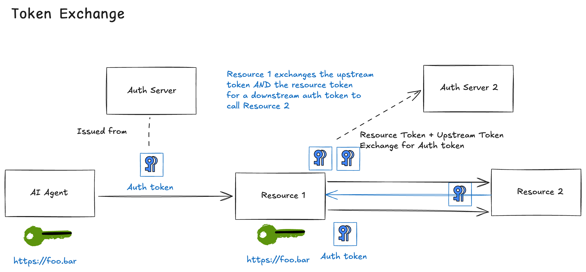

In the previous posts, we covered how agents obtain authorization through [direct issuance](./flow-03-authz.md) or [user consent](./flow-04-user-consent.md). But what happens when a resource needs to call *another* resource to fulfill a request? The resource could be in its same trust domain, or in a different one. This post covers how [AAuth](https://github.com/dickhardt/agent-auth) enables multi-hop authorization through **token exchange** while maintaining cryptographic proof of the delegation chain.

[← Back to index](index.md)

## When Resources Become Agents

In traditional OAuth, resources are endpoints. They receive tokens and serve data. But real-world systems are rarely that simple. A resource often needs to call other services. For example a company's supply chain portal may need to query other systems such as inventory, shipping, or pricing systems.

When a resource needs to access a downstream resource on behalf of an agent, it must prove:

1. **Its own identity** (the resource is a legitimate caller)
2. **The authorization chain** (this request ultimately traces back to an authorized agent)
3. **The delegated authority** (the resource is acting within the bounds of the original authorization)

AAuth handles this through **token exchange** which is a mechanism for resources to obtain new auth tokens bound to their own keys while preserving the delegation chain.

## The Token Exchange Flow

Here's the complete flow when Agent `agent.supply-chain.com` accesses Resource `important.resource.com`, which in turn needs data from Resource `second.resource.com`:



### Phase 1: Agent `agent.supply-chain.com` Gets Authorized for Resource `important.resource.com`

This follows the standard [authorization flow](./flow-03-authz.md). Agent `agent.supply-chain.com` requests access to Resource `important.resource.com`, receives a challenge, obtains an auth token from Auth Server `auth-server.com`, and accesses the resource:

```bash
================================================================================
>>> AGENT REQUEST to https://important.resource.com/data-auth
================================================================================
GET https://important.resource.com/data-auth HTTP/1.1
Signature: sig1=:bfJBXxQfM_-qjKpgUnjsHF_vjkGkMfSvZvcjCR7n0QXGuOWosMpgdQmDraokNjr41wkdy75dfIS-7FXkrjeaDw:
Signature-Input: sig1=("@method" "@authority" "@path" "signature-key");created=1768786273
Signature-Key: sig1=(scheme=jwks id="https://agent.supply-chain.com" kid="key-1" well-known="aauth-agent")
================================================================================
```

After the challenge-response flow, Agent `agent.supply-chain.com` holds an auth token:

```json
{
  "iss": "https://auth-server.com",
  "aud": "https://important.resource.com",
  "agent": "https://agent.supply-chain.com",
  "cnf": {
    "jwk": {
      "kty": "OKP",
      "crv": "Ed25519",
      "x": "RC-Evfrxrf6yOojCMGjYxwsDpFb4LKa9E4ZLNsG3rwA",
      "kid": "key-1"
    }
  },
  "scope": "data.read data.write",
  "exp": 1768789873
}
```

### Phase 2: Resource `important.resource.com` Needs Data from Resource `second.resource.com`

Resource `important.resource.com` receives the authenticated request from Agent `agent.supply-chain.com`. To fulfill this request, it needs to call `second.resource.com`. Resource `important.resource.com` now acts as an agent itself, making a signed request to `second.resource.com`:

```bash
================================================================================
>>> RESOURCE second.resource.com REQUEST received
================================================================================
GET /data-auth HTTP/1.1
Host: 127.0.0.1:8004
signature: sig1=:QyF8FyJHa_L2yYg7_wJL-VUv3oVIQcbQK8UDH3K8zaTTvFYoS3wVoy090jMt330QBvRKZ8Vl46_2iqs8Fn3eAA:
signature-input: sig1=("@method" "@authority" "@path" "signature-key");created=1768786273
signature-key: sig1=(scheme=jwks id="https://important.resource.com" kid="resource-key-1" well-known="aauth-agent")
================================================================================
```

Notice the `Signature-Key`: Resource `important.resource.com` is using `scheme=jwks` with its own identity (`https://important.resource.com`) but with `well-known="aauth-agent"`. When a resource acts as an agent, it follows the agent discovery pattern. This means resources that need to make outbound calls should publish both `/.well-known/aauth-resource` (for inbound requests) and `/.well-known/aauth-agent` (for outbound requests). The JWKS can be the same, but the metadata endpoints serve different roles.

### Phase 3: Resource `second.resource.com` Issues a Challenge

Resource `second.resource.com` doesn't know or care that the caller is also a resource. It sees an agent requesting access and issues a standard authorization challenge:

```bash
================================================================================
<<< RESOURCE RESPONSE
================================================================================
HTTP/1.1 401
agent-auth: httpsig; auth-token; resource_token="eyJhbGciOiJFZERTQSIsImtpZCI6InJlc291cmNlLWtleS0xIiwidHlwIjoi...
content-length: 22

[Body (22 bytes)]
Authorization required
================================================================================
```

The resource token identifies Resource `important.resource.com` as the agent:

```json
{
  "iss": "https://second.resource.com",
  "aud": "https://second-auth-server.com",
  "agent": "https://important.resource.com",
  "agent_jkt": "nN2XumQtDleF0DcuaNcF_Enz_9EezET4GK2j4QWPqRw",
  "scope": "data.read data.write",
  "exp": 1768786873
}
```

### Phase 4: Resource `important.resource.com` Exchanges the Token

Here's where token exchange happens. Resource `important.resource.com` needs authorization from Auth Server `second-auth-server.com`, but it's not starting from scratch. It already has proof of legitimate authorization from the upstream flow. Resource `important.resource.com` makes an exchange request:

```bash
================================================================================
>>> TOKEN EXCHANGE REQUEST to https://second-auth-server.com/agent/token
================================================================================
POST https://second-auth-server.com/agent/token HTTP/1.1
Content-Digest: sha-256=:iPlDBazalrHGLswJx6HRsEUReW593fk1Fm9w8aoshDI=:
Content-Type: application/x-www-form-urlencoded
Signature: sig1=:ell-876hRnnrbm4EL1ZFDApnyrym2jT12mRJ4v76BSkBErc_Q_Ayz2dvTJATN4tgVby0nkhCy1g82rscdYcbBw:
Signature-Input: sig1=("@method" "@authority" "@path" "content-type" "content-digest" "signature-key");created=176...
Signature-Key: sig1=(scheme=jwt jwt="eyJhbGciOiJFZERTQSIsImtpZCI6ImF1dGgta2V5LTEiLCJ0eXAiOiJhdXRoK2p3dCJ9.eyJpc3...

[Body (470 bytes)]
request_type=exchange&resource_token=eyJhbGciOiJFZERTQSIsImtpZCI6InJlc291cmNlLWtleS0xIiwidHlwIjoicmVzb3VyY2Urand0In0...
```

Two critical elements in this request:

1. **`request_type=exchange`**: Tells Auth Server `second-auth-server.com` this is a token exchange, not a fresh authorization request

2. **`Signature-Key: sig1=(scheme=jwt jwt="...")`**: Resource `important.resource.com` presents the *upstream* auth token (the one it received from Agent `agent.supply-chain.com`) as proof of its authority to make this exchange

The upstream token is carried in the `Signature-Key` header itself. Resource `important.resource.com` signs the exchange request with the key bound in that upstream token, proving it's the legitimate holder of the upstream authorization.

### Phase 5: Auth Server `second-auth-server.com` Validates and Issues

Auth Server `second-auth-server.com` performs multiple validations:

1. **Validate the request signature**: Verify the HTTPSig using the key from the upstream auth token's `aud` claim. The claim will contain the intended resource/agent and we can use the normal JWKS key discovery based on that. Once we see the agent's JWKS we can validate the signature. 
2. **Validate the upstream auth token**: Verify it was issued by Auth Server `auth-server.com` (which Auth Server `second-auth-server.com` must trust)
3. **Validate the resource token**: Verify the signature using Resource `second.resource.com`'s published JWKS
4. **Verify the chain**: Confirm the upstream token's `aud` matches the requester (Resource `important.resource.com`)
5. **Authorize the exchange**: Evaluate whether this exchange is permitted given the upstream authorization

If everything checks out, Auth Server `second-auth-server.com` issues a new auth token:

```bash
================================================================================
<<< AUTH SERVER RESPONSE (Token Exchange)
================================================================================
HTTP/1.1 200 OK
Content-Type: application/json

[Body]
{
  "auth_token": "eyJhbGciOiJFZERTQSIsImtpZCI6ImF1dGgta2V5LTEiLCJ0eXAiOiJhdXRoK2p3dCJ9...",
  "expires_in": 3600
}
================================================================================
```

## The `act` Claim: Tracking Delegation

The exchanged token includes a crucial new claim: `act` (actor) - which records the delegation chain:

```json
{
  "iss": "https://second-auth-server.com",
  "aud": "https://second.resource.com",
  "agent": "https://important.resource.com",
  "cnf": {
    "jwk": {
      "kty": "OKP",
      "crv": "Ed25519",
      "x": "cEu1GpfjCgXbz7oi1emwOlYngK4TDHBOQ1rEE7jT7DM",
      "kid": "resource-key-1"
    }
  },
  "scope": "data.read data.write",
  "exp": 1768789873,
  "act": {
    "agent": "https://agent.supply-chain.com"
  }
}
```

The token tells Resource `second.resource.com`:

- **`agent`**: The immediate caller is `https://important.resource.com` (Resource `important.resource.com`)
- **`act.agent`**: Resource `important.resource.com` is acting on behalf of `https://agent.supply-chain.com` (Agent `agent.supply-chain.com`)
- **`cnf.jwk`**: The token is bound to Resource `important.resource.com`'s signing key

Resource `second.resource.com` can now make authorization decisions with full context. It knows who's directly calling it *and* who originated the request.

### Nested `act` Claims

For longer chains, `act` claims nest recursively. If Resource `second.resource.com` needed to call Resource 3:

```json
{
  "agent": "https://second.resource.com",
  "aud": "https://third.resource.com",
  "act": {
    "agent": "https://important.resource.com",
    "act": {
      "agent": "https://agent.supply-chain.com"
    }
  }
}
```

Each hop adds a layer. The full chain is preserved and verifiable.

## Phase 6: Resource `important.resource.com` Accesses Resource `second.resource.com`

With the exchanged token, Resource `important.resource.com` can now access Resource `second.resource.com`:

```bash
================================================================================
>>> RESOURCE (as agent) REQUEST to https://second.resource.com/data-auth
================================================================================
GET https://second.resource.com/data-auth HTTP/1.1
Signature: sig1=:ZZneZeSzbj7NQvv_RDs4kjtwKVeXadHCVDWVPrR3kyIRujc_ghFeBJbpfbqH1bbaZbbVuIFvi_PMLuewAibvCw:
Signature-Input: sig1=("@method" "@authority" "@path" "signature-key");created=1768786273
Signature-Key: sig1=(scheme=jwt jwt="eyJhbGciOiJFZERTQSIsImtpZCI6ImF1dGgta2V5LTEiLCJ0eXAiOiJhdXRoK2p3dCJ9.eyJpc3...
================================================================================
```

Resource `second.resource.com` validates:
1. The auth token signature (from Auth Server `second-auth-server.com`'s JWKS)
2. The `aud` claim matches this resource
3. The request signature matches the key in `cnf.jwk`

```bash
================================================================================
<<< RESOURCE RESPONSE
================================================================================
HTTP/1.1 200
content-length: 212
content-type: application/json

[Body (212 bytes)]
{"message":"Access granted","data":"This is protected data (authorized)","scheme":"jwt","token_type":"auth+jwt","method":"GET","agent":"https://important.resource.com","agent_delegate":null,"scope":"data.read data.write"}
================================================================================
```

Access granted. Resource `important.resource.com` can now aggregate data from Resource `second.resource.com` and return it to Agent `agent.supply-chain.com`.

## Cross-Auth-Server vs Same-Auth-Server Exchange

The example above shows **cross-auth-server exchange**. Auth Server `auth-server.com` and Auth Server `second-auth-server.com` are separate systems. This is the more complex case, requiring federation trust between auth servers.

**Same-auth-server exchange** is simpler and common for ["on-behalf-of"](https://blog.christianposta.com/explaining-on-behalf-of-for-ai-agents/) scenarios within a single provider:

| Scenario | Auth Servers | Use Case |
|----------|--------------|----------|
| Cross-auth-server | Different | Service meshes, cross-organization access, federated systems |
| Same-auth-server | Same | On-behalf-of within single provider, microservices in same org |

### Same-Auth-Server Exchange

When all resources use the same auth server, the exchange is simpler:

1. Agent A gets token from Auth Server for Resource R1
2. Resource R1 needs to call Resource R2 (also governed by same Auth Server)
3. Resource R1 exchanges token at the *same* Auth Server
4. Auth Server validates the upstream token it issued, creates new token with `act` claim

The flow is identical, but no federation trust is required—the auth server trusts itself.

This pattern is essentially OAuth 2.0 Token Exchange (RFC 8693) with AAuth's cryptographic binding. The difference is that every step is signed, and tokens are proof-of-possession bound.


### Scope Narrowing

Downstream tokens should typically have equal or narrower scope than upstream tokens:

```
Upstream: scope="data.read data.write files.read"
Downstream: scope="data.read"  ✓ (narrowed)
Downstream: scope="data.read data.write files.read admin.write"  ✗ (privilege escalation)
```

Auth servers should enforce scope constraints during exchange to prevent privilege escalation through delegation.


## Summary

Token exchange enables sophisticated authorization chains while maintaining AAuth's security properties:

- **Cryptographic binding**: Every token is bound to a key, every exchange is signed
- **Chain tracking**: The `act` claim preserves full delegation history
- **Scope control**: Downstream authorization can be constrained
- **Federation**: Cross-auth-server exchange enables multi-organization workflows

The pattern recognizes that in real systems, resources aren't just endpoints—they're participants in larger workflows that require maintaining authorization context across multiple hops.

## Where to Next

We've now covered the core AAuth authorization flows:

- [Pseudonymous (HWK)](./flow-01-hwk.md): Cryptographic proof without identity
- [Identified (JWKS)](./flow-02-jwks.md): Domain-bound agent identity
- [Authorized (Direct)](./flow-03-authz.md): Runtime authorization without user interaction
- [User Consent](./flow-04-user-consent.md): Interactive authorization with user approval
- **Token Exchange (this post)**: Multi-hop delegation chains

[In the next post](./flow-06-delegated.md), we'll take a look at agent identity delegation to support distributed agents scaled across devices (workstations, mobile, etc) or agents that need to inherit policy based on parent-delegation relationship. 

[← Back to index](index.md)