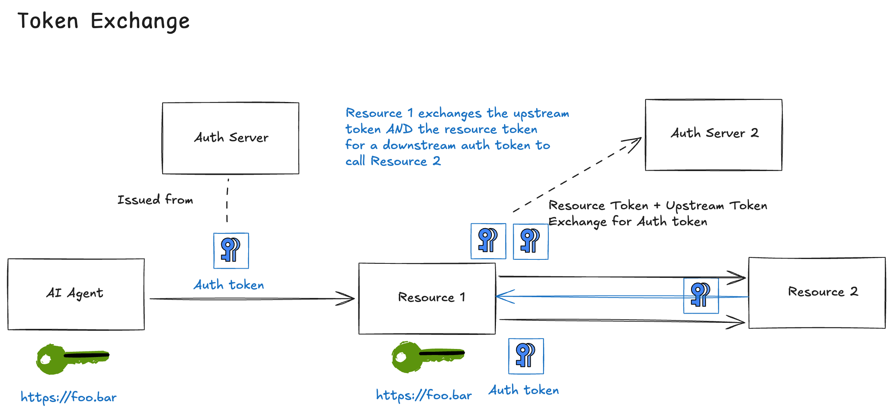

In the previous posts, we covered direct authorization, and user consent. This flow covers a different problem: what happens when one resource needs to call another resource to fulfill the original request. This is where [Agent Auth](https://github.com/dickhardt/AAuth) uses **token exchange**.

[← Back to index](index.md)

## When a Resource Becomes an Agent

In multi-hop systems, a resource often needs to call a downstream resource:

- an application API calls a billing API
- a workflow engine calls a document service
- a gateway calls a specialized backend

At that point, the upstream resource is acting as an agent for the downstream call. It needs:

- its own verifiable identity
- proof that it already holds legitimate upstream authorization
- a new auth token bound to its own signing key for the downstream resource

Token exchange is how it gets that downstream token.

## The Flow

For this flow, we use this chain:

```text
Agent 1 → Resource 1 / Auth Server 1 → Resource 2 / Auth Server 2
```



### Step 1: Agent 1 Gets an Auth Token for Resource 1

This starts exactly like the direct authorization flow:

```bash
================================================================================
>>> AGENT REQUEST to https://important.resource.com/data-auth
================================================================================
GET https://important.resource.com/data-auth HTTP/1.1
Signature: sig=:PpSpJ904Hp2ntljt58UzAeh64hbww2R8bKH-en2N8zXAcf4deRTXc9qlLrkz2dsrIyOGUZLJNSUN265ju4Q3DA:
Signature-Input: sig=("@method" "@authority" "@path" "signature-key");created=1774975920
Signature-Key: sig=(scheme=jwks_uri id="https://agent.supply-chain.com" kid="key-1")
================================================================================
```

Resource 1 responds with the standard challenge:

```bash
================================================================================
<<< RESOURCE RESPONSE
================================================================================
HTTP/1.1 401
aauth: require=auth-token; resource-token="eyJhbGciOiJFZERTQSIsImtpZCI6InJlc291cmNlLWtleS0xIiwidHlwIjoic...
content-length: 22

[Body (22 bytes)]
Authorization required
================================================================================
```

The agent then obtains an auth token from Auth Server 1. For this flow the auth token looks like:

```json
{
  "iss": "https://auth-server.com",
  "aud": "https://important.resource.com",
  "jti": "7379f720-aff4-404a-a595-9cfa7f6251c8",
  "cnf": {
    "jwk": {
      "kty": "OKP",
      "crv": "Ed25519",
      "x": "7cGdr_c-aHQzYICJD6vSlHX2amHMBjMEBamFzXbm-Q0",
      "kid": "key-1"
    }
  },
  "iat": 1774975920,
  "exp": 1774979520,
  "agent": "https://agent.supply-chain.com",
  "scope": "data.read data.write"
}
```

### Step 2: Resource 1 Calls Resource 2

To fulfill the original request, Resource 1 now needs data from Resource 2. Resource 1 acts as an agent and makes its own signed request:

```bash
================================================================================
>>> RESOURCE REQUEST received
================================================================================
GET /data-auth HTTP/1.1
Host: second.resource.com
signature: sig=:eH-XrpOcjyDewRBrbfBKHhgkLb0d3n4hVcelrzM3zvZzzFRPscHOCbz3xei_WGveSM2LCeuLfCg5pg-c2oJLDA:
signature-input: sig=("@method" "@authority" "@path" "signature-key");created=1774975920
signature-key: sig=(scheme=jwks_uri id="https://important.resource.com" kid="resource-key-1")
================================================================================
```

Resource 2 treats Resource 1 just like any other caller and challenges it for authorization:

```bash
================================================================================
<<< RESOURCE RESPONSE
================================================================================
HTTP/1.1 401
aauth: require=auth-token; resource-token="eyJhbGciOiJFZERTQSIsImtpZCI6InJlc291cmNlLWtleS0xIiwidHlwIjoic...
content-length: 22

[Body (22 bytes)]
Authorization required
================================================================================
```

That downstream resource token identifies Resource 1 as the calling agent:

```json
{
  "iss": "https://second.resource.com",
  "aud": "https://second-auth-server.com",
  "jti": "7b6973a3-a373-4cc7-aacb-b3e8fcf59fd6",
  "agent": "https://important.resource.com",
  "agent_jkt": "Vgq45kQ7NSbqGFu7kCWhal680dRj-43f8au-KuLEVJA",
  "scope": "data.read data.write",
  "iat": 1774975920,
  "exp": 1774976520
}
```

### Step 3: Resource 1 Exchanges the Token

Now Resource 1 asks Auth Server 2 for a downstream token:

```bash
================================================================================
>>> TOKEN EXCHANGE REQUEST to https://second-auth-server.com/token
================================================================================
POST https://second-auth-server.com/token HTTP/1.1
Content-Type: application/json
Signature: sig=:Usk0pc0izUtmgZ4JTpRx8MH-neBtfzBBmOtU-7BIJCyEJMCsuIrIH3GSw3UfgCLbFcBBgP4tY8gM7iqiIUQjDg:
Signature-Input: sig=("@method" "@authority" "@path" "signature-key");created=1774975920
Signature-Key: sig=(scheme=jwt jwt="eyJhbGciOiJFZERTQSIsImtpZCI6ImF1dGgta2V5LTEiLCJ0eXAiOiJhdXRoK2p3dCJ9.eyJpc3M...

[Body (1130 bytes)]
{"resource_token": "eyJhbGciOiJFZERTQSIsImtpZCI6InJlc291cmNlLWtleS0xIiwidHlwIjoicmVzb3VyY2Urand0In0...", "upstream_token": "eyJhbGciOiJFZERTQSIsImtpZCI6ImF1dGgta2V5LTEiLCJ0eXAiOiJhdXRoK2p3dCJ9..."}
================================================================================
```

Two things matter in this exchange request:

1. `resource_token` proves that Resource 2 really challenged Resource 1 for access.
2. `upstream_token` proves that Resource 1 already has legitimate upstream authorization tied to the original request chain.

The request is also signed with `scheme=jwt`, using the upstream auth token in the `Signature-Key` header. That binds the exchange request to the authorization Resource 1 already holds.

### Step 4: Auth Server 2 Validates the Exchange

In this flow, Auth Server 2 trusts Auth Server 1. That lets it validate the upstream token and decide whether the exchange is allowed.

At a high level, Auth Server 2 verifies:

- the HTTP message signature on the exchange request
- the upstream auth token from Auth Server 1
- the downstream `resource_token` from Resource 2
- that the trust chain is valid
- that Resource 1 is allowed to get a token for Resource 2

If everything checks out, Auth Server 2 issues a new auth token:

```bash
================================================================================
<<< AUTH SERVER RESPONSE (Token Exchange)
================================================================================
HTTP/1.1 200 OK
Content-Type: application/json

[Body]
{
  "auth_token": "eyJhbGciOiJFZERTQSIsImtpZCI6ImF1dGgta2V5LTEiLCJ0eXAiOiJhdXRoK2p3dCJ9...",
  "expires_in": 3600
}
================================================================================
```

### Step 5: Resource 1 Uses the Downstream Token

With that exchanged token, Resource 1 can now call Resource 2 successfully:

```bash
================================================================================
>>> RESOURCE (as agent) REQUEST to https://second.resource.com/data-auth
================================================================================
GET https://second.resource.com/data-auth HTTP/1.1
Signature: sig=:r3Y5_33ydgB5zmhf1jh_N1bkGMSy_NhmwCk-pQ1RAAy16KussPt7LRQkwjLchlVAgYkblyfs6j2r-T2Avu3iDg:
Signature-Input: sig=("@method" "@authority" "@path" "signature-key");created=1774975920
Signature-Key: sig=(scheme=jwt jwt="eyJhbGciOiJFZERTQSIsImtpZCI6ImF1dGgta2V5LTEiLCJ0eXAiOiJhdXRoK2p3dCJ9.eyJpc3M...
================================================================================
```

Resource 2 grants access:

```bash
================================================================================
<<< RESOURCE RESPONSE
================================================================================
HTTP/1.1 200
content-length: 212
content-type: application/json

[Body (212 bytes)]
{"message":"Access granted","data":"This is protected data (authorized)","scheme":"jwt","token_type":"auth+jwt","method":"GET","agent":"https://important.resource.com","agent_delegate":null,"scope":"data.read data.write"}
================================================================================
```

That response shows the immediate caller is Resource 1.

## The Exchanged Token Shape

For this flow, the downstream token looks like this:

```json
{
  "iss": "https://second-auth-server.com",
  "aud": "https://second.resource.com",
  "jti": "abdceb92-5458-4fbc-9403-7c0d8255526d",
  "cnf": {
    "jwk": {
      "kty": "OKP",
      "crv": "Ed25519",
      "x": "jmSgswMNo0aagxxh_6a3JXMFW9nPgHWZ8k7ejHNI-9k",
      "kid": "resource-key-1"
    }
  },
  "iat": 1774975920,
  "exp": 1774979520,
  "agent": "https://important.resource.com",
  "scope": "data.read data.write"
}
```

The key properties are:

- `iss` is the downstream auth server
- `aud` is the downstream resource
- `agent` is the immediate caller, Resource 1
- `cnf.jwk` binds the token to Resource 1's signing key

Notably, this implementation does **not** include a legacy `act` claim in the exchanged token.

## Why This Matters

Token exchange lets AAuth support multi-hop systems without falling back to bearer tokens or vague delegation state.

It preserves:

- proof-of-possession on every hop
- explicit resource challenges through `resource_token`
- explicit trust decisions at the downstream auth server
- a downstream token bound to the downstream caller's own key

That means Resource 2 can trust what it sees directly: a token from its own auth server, for its own audience, bound to the key that signed the request.

## Summary

In token exchange, an upstream resource becomes an agent for a downstream call. It receives a challenge from the downstream resource, presents both that `resource_token` and its `upstream_token` to the downstream auth server, and gets back a new auth token whose audience is the downstream resource and whose `agent` is the immediate upstream resource. The result is a clean, cryptographically bound delegation hop without bearer-token handoff.

## Where to Next

We've now covered:

- [Pseudonymous (HWK)](./flow-01-hwk.md): Cryptographic proof without identity
- [Identified (JWKS)](./flow-02-jwks.md): Domain-bound agent identity
- [Authorized (Direct)](./flow-03-authz.md): Runtime authorization without user interaction
- [User Consent](./flow-04-user.md): Interactive authorization with user approval
- **Token Exchange (this post)**: Multi-hop downstream authorization

[In the next post](./flow-06-delegated.md), we'll look at delegated agent identity, where an agent acts through a delegate and proves that delegated relationship cryptographically.

[← Back to index](index.md)
