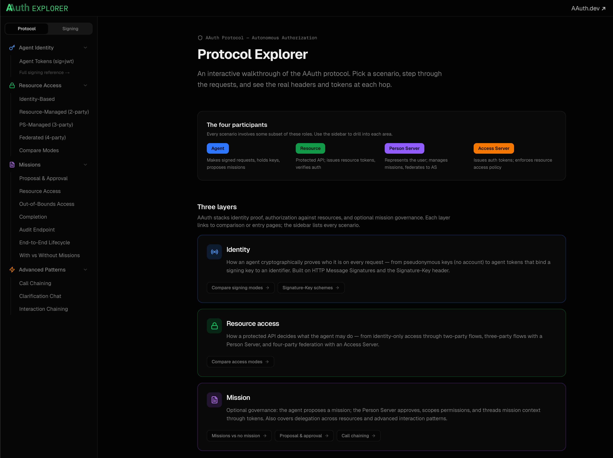
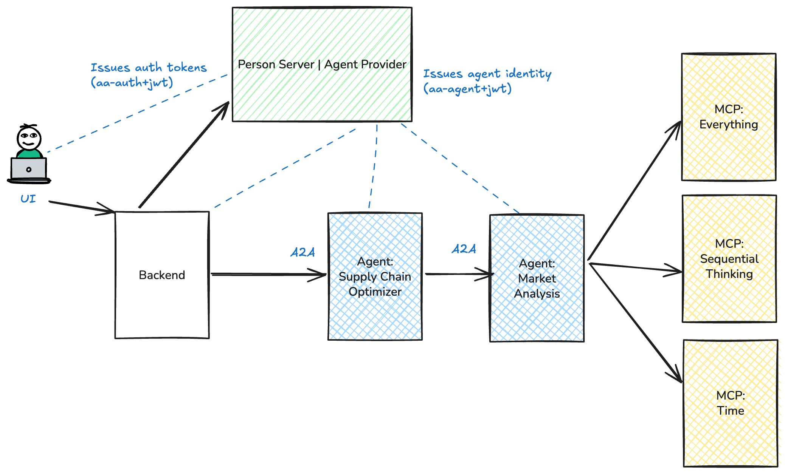

# Exploring AAuth for Agent Identity and Access Management

[Agent Auth](https://github.com/dickhardt/AAuth) (AAuth -- pronounced "AY-awth") is an [IETF draft paper, part of the OAuth working group, that specifies a protocol for agent identity and access management](https://datatracker.ietf.org/doc/draft-hardt-oauth-aauth-protocol/) from [Dick Hardt](https://github.com/dickhardt) who [authored OAuth 2.0](https://datatracker.ietf.org/doc/html/rfc6749) and co-author of [OAuth 2.1](https://github.com/oauth-wg/oauth-v2-1/blob/main/draft-ietf-oauth-v2-1.md). 

## Watch the demo

  <iframe style="position: absolute; top: 0; left: 0; width: 100%; height: 100%;" src="https://www.youtube.com/embed/-OUFPzWqxYk" title="Exploring AAuth for Agent Identity and Access Management" frameborder="0" allow="accelerometer; autoplay; clipboard-write; encrypted-media; gyroscope; picture-in-picture; web-share" allowfullscreen></iframe>

## Intro: Digging in to AAuth Flows

If you want a step by step guide through the AAuth protocol, I recommend you take a look at the [AAuth Protocol Explorer](https://explorer.aauth.dev). The explorer walks you through, in detail with all requests/responses/tokens, etc, all of the resource access flows. 

## 🎉 Full Working Demo with Agent Bootstrap, Person Server, and Agentgateway

AAuth is best understood with working code. 

This set of resources walks you through set up and evaluation of a realistic AAuth implementation with Agent Identity, Authorization, and Person Server attested flows. We leverage the [Python AAuth Library](https://github.com/christian-posta/aauth-python-library), [Agentgateway](https://github.com/agentgateway/agentgateway), and an AAuth resource proxy to turn [ANY resource into an AAuth resource](https://github.com/christian-posta/extauth-aauth-resource). 

The source code for this demo can be found in GitHub: [https://github.com/christian-posta/aauth-full-demo](https://github.com/christian-posta/aauth-full-demo). 

This demo covers two resource access modes. A resource in AAuth is the target service (API, MCP server, another AI agent, etc) that is being accessed. The first resource access mode we cover is "Identity Based". Basically an AI agent calls a resource and asserts its identity with a non-bearer JWT `aa-agent+jwt` issued by an Agent Provider. The resource verifies the agent's `aa-agent+jwt` and applies local policy; no 401 challenge and no auth token required. In the spec this is [Identity Based resource access](https://explorer.aauth.dev/access/identity-based). The second mode we'll dig into (PS-managed / three-party) is where the resource issues a 401 challenge with an `aa-resource+jwt` token; the agent exchanges this token at its Person Server for an `aa-auth+jwt` auth token and retries. In the spec this is [3-Party resource access](https://explorer.aauth.dev/access/ps-managed).

Agent identity in both modes comes from an `aa-agent+jwt` bootstrapped from the Person Server at startup. See [aa-agent+jwt token issuance](https://explorer.aauth.dev/bootstrap/self-hosted). Our implementation deviates slightly (allowed within the spec: bootstrap is non-normative). 

Following these steps is the best way to see AAuth working end to end:

1. [Install Agentgateway / Person Server / Agent Provider](install-aauth.md)
2. [Agent Identity with aa-agent+jwt (Bootstrap)](agent-identity-jwks.md)
3. [Agent authorization (autonomous flow)](agent-authorization-autonomous.md)
4. [Agent authorization (user consent)](agent-authorization-on-behalf-of.md)
5. [Apply policy with AgentGateway](apply-policy-agentgateway.md)

## AAuth Implementation Resources

The following open-source components are used in this demo:

1. [Agentgateway](https://github.com/agentgateway/agentgateway) — LLM / MCP / A2A gateway used as the AAuth identity verification and policy enforcement point (PEP) (any version should work, [tested on v1.1.0](https://github.com/agentgateway/agentgateway/releases/tag/v1.1.0)).
2. [ExtAuthz AAuth Resource (`aauth-service`)](https://github.com/christian-posta/extauth-aauth-resource) — Envoy ExtAuthz service that turns any HTTP / MCP / A2A resource into an AAuth resource (demo-tested release: [v0.0.1](https://github.com/christian-posta/extauth-aauth-resource/releases/tag/v0.0.1)).
3. [Python AAuth Library (`aauth`)](https://github.com/christian-posta/aauth-python-library) — request signing, key generation, and token helpers used by the Python agents and the backend (pinned as `aauth>=0.3.4`).
4. [Go AAuth Library](https://github.com/christian-posta/aauth-go-library) — Go implementation of AAuth signing and verification; consumed by `aauth-service` (the `extauth-aauth-resource` below) to validate agent tokens and proof-of-possession.
5. [AAuth Person Server](https://github.com/christian-posta/aauth-person-server) — demo Person Server that also acts as the Agent Provider: issues `aa-agent+jwt`, manages user consent, and issues `aa-auth+jwt`.
6. [Demo source code](https://github.com/christian-posta/aauth-full-demo) — this repository, including the supply-chain and market-analysis agents, backend, scripts, and Agentgateway configs.
