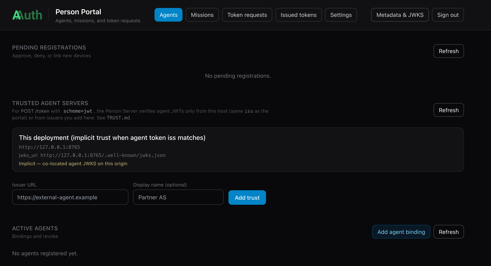

# AAuth with Agentgateway and Person Server

[← Back to index](index.md)

<!-- Add content here -->

To prove out some of the AAuth patterns, I have implemented [AAuth's Person Server](https://github.com/christian-posta/aauth-person-server) which is used to bind a Person's authority to an agent and manage delegation. The Person Server also plays the role of an Agent Provider which can issue agent tokens (agent identity). [Agentgateway](https://agentgateway.dev) is an LLM/MCP/A2A gateway that can be used to implement AAuth signature verification and resource-token/401 flows. Since it performs the role of agent gateway, it can log all requests them, send them to distributed tracing engines, and ultimately apply agent-based identity traffic and security policy. 

This guide will walk you through setup of Person Server and Agentgateway so we can dig in for the rest of the demo. 

# AAuth Person Server / Agent Provider

[I have built a demo "Person Server"](https://github.com/christian-posta/aauth-person-server) for this demo which also acts as the Agent Provider. Please review the [IETF AAuth draft](https://datatracker.ietf.org/doc/draft-hardt-oauth-aauth-protocol/) for more about these concepts. In short, the Person Server represents the "Person" (ie, legal person, organization, etc) that has comissioned the AI agent. It owns thing like the agent's mission, authorization grants, and can confer with the "person" on any new grants/authorization decisions. The PS can also federate with an AAuth Access Server (AS), but that is out of scope for this demo.

In this demo, the Person Server app also plays the role of the Agent Provider. The Agent Provider is what owns the long-term signing keys and is responsible for attesting/issuing agent identity. In this demo, although they are spearate AAuth components, I've combined them (although technically the code under the covers is actually separate). 

The right configuration for running this PS/AP is in the `run-server.sh` script:

```bash
~ git clone https://github.com/christian-posta/aauth-person-server.git
~ cd aauth-person-server
~ uv sync
~ ./run-server.sh


INFO:     Started server process [52317]
INFO:     Waiting for application startup.
INFO:     Application startup complete.
INFO:     Uvicorn running on http://127.0.0.1:8765 (Press CTRL+C to quit)
```

At this point you can navigate to [http://127.0.0.1:8765/ui](http://127.0.0.1:8765/ui)

When prompted, enter the following value for the token: `mytoken`



### AAuth Agent Bootstrap

When one of the agents starts up (in next section), it will connect with the PS/AP and try to register its keys. The bootstrap requires person approval. Once approved, agents will receive their `aa-agent+jwt` agent identity token bound to their ephemeral private key. Future renewal/re-registrations won't require a person approval (once approved). 


# AAuth with Agentgateway

[Agentgateway](https://agentgateway.dev) is an opensource LLM, MCP, and A2A gateway hosted as part of the Linux Foundation. It focuses on implementing the missing pieces not found in traditional API gateways to support MCP and Agent workloads. The project emphasizes enterprise-grade security, observability, resiliency, reliability, and multi-tenancy features. Agentgateway is built to be the most performant, reliable, and mature LLM/MCP gateway on the market.

I have [built an extension to Agentgateway](https://github.com/christian-posta/extauth-aauth-resource) that implements AAuth for a resource (API, MCP, etc). The extension plugs into any Agentgateway version and uses the [ExtAuthz protocol](https://www.envoyproxy.io/docs/envoy/latest/api-v3/extensions/filters/http/ext_authz/v3/ext_authz.proto). This extension could be used for any proxy that supports ExtAuthz including Envoy and Istio. 

To get started with Agentgateway for this AAuth demo, you can [follow the getting started guide](https://github.com/christian-posta/agentgateway/releases/tag/v0.11.3) and run it with the agentgateway configuration from this demo repo.

```bash
# Download Agentgateway binary (for macOS amd64) and rename to 'agentgateway'
curl -sL https://agentgateway.dev/install | bash
agentgateway --version
```

Now you can run agentgateway with configurations for this demo.

```bash
cd aauth-full-demo
agentgateway -f ./agentgateway/config.yaml

...

2026-05-13T19:24:33.553438Z     info    management::hyper_helpers       listener established    address=[::]:15021 component="readiness"
2026-05-13T19:24:33.559522Z     info    state_manager   Watching config file: config.yaml
2026-05-13T19:24:33.560965Z     info    state_manager   loaded config from File("config.yaml")
2026-05-13T19:24:33.561318Z     info    agent_core::readiness   Task 'agentgateway' complete (11.209712ms), still awaiting 1 tasks
2026-05-13T19:24:33.561329Z     info    management::hyper_helpers       listener established    address=127.0.0.1:15000 component="admin"
2026-05-13T19:24:33.561386Z     info    management::hyper_helpers       listener established    address=[::]:15020 component="stats"
2026-05-13T19:24:33.561430Z     info    agent_core::readiness   Task 'state manager' complete (11.322604ms), marking server ready
2026-05-13T19:24:33.561428Z     info    proxy::gateway  started bind    bind="bind/3000"
```

This configuration will rely on local routing by hostname. You can add this to your /etc/hosts:

```bash
127.0.0.1   backend.localhost
127.0.0.1   supply-chain-agent.localhost
127.0.0.1   market-analysis-agent.localhost
```

## Install Agentgateway AAuth extension

The gateway configs in this repo send **ExtAuthz** checks to the AAuth resource service over **gRPC** (`localhost:7070`) and proxy AAuth HTTP metadata (JWKS, resource discovery) to **HTTP** (`localhost:8081`). That process is the `aauth-service` binary from [extauth-aauth-resource](https://github.com/christian-posta/extauth-aauth-resource) ([Envoy ExtAuthz](https://www.envoyproxy.io/docs/envoy/latest/api-v3/extensions/filters/http/ext_authz/v3/ext_authz.proto)).

**1. Download a release build** (pick the archive that matches your OS and CPU; current demo-tested tag is [v0.0.1](https://github.com/christian-posta/extauth-aauth-resource/releases/tag/v0.0.1)):

| Platform | Asset |
|----------|--------|
| macOS Apple Silicon | `extauth-aauth-resource_0.0.1_darwin_arm64.tar.gz` |
| macOS Intel | `extauth-aauth-resource_0.0.1_darwin_amd64.tar.gz` |
| Linux x86_64 | `extauth-aauth-resource_0.0.1_linux_amd64.tar.gz` |
| Linux arm64 | `extauth-aauth-resource_0.0.1_linux_arm64.tar.gz` |

Example (macOS arm64):

```bash
mkdir -p ~/bin/extauth-aauth-resource && cd ~/bin/extauth-aauth-resource
curl -sLO https://github.com/christian-posta/extauth-aauth-resource/releases/download/v0.0.1/extauth-aauth-resource_0.0.1_darwin_arm64.tar.gz
tar xzf extauth-aauth-resource_0.0.1_darwin_arm64.tar.gz
chmod +x aauth-service
```

The archive also includes `sign-request` and `agent-client` helpers; only `aauth-service` is required for Agentgateway.

**2. Run `aauth-service`** from the demo’s `agentgateway/` directory so it picks up `resource_key.pem` and the policy YAML on disk. Use the binary you extracted (adjust the path if yours differs) and `aauth-config.yaml`, which pairs with `config.yaml`:

```bash
cd aauth-full-demo/agentgateway
AAUTH_CONFIG=aauth-config.yaml "$HOME/bin/extauth-aauth-resource/aauth-service"
```

You should see listeners on **7070** (gRPC ExtAuthz) and **8081** (HTTP). Quick check: `curl -sf http://localhost:8081/health` (or use `nc -z 127.0.0.1 8081` and `7070` as the test harness does).

**3. Run Agentgateway** with the matching gateway config (previous section), in a **separate** terminal from `aauth-service`, so `extAuthz` can reach `localhost:7070`. If you already started Agentgateway from the snippet above, leave it running as long as `aauth-service` is also up; for a clean order next time, start `aauth-service` first, then the gateway.

For a full local stack (agents, backend, correct configs per mode) without wiring this by hand, use the harness described in `TEST.md` (repo root): `./scripts/start-infra.sh mode1` (or `mode3`, `user-consent`) starts agentgateway, `aauth-service`, and the Python services; `./scripts/stop-infra.sh` tears them down.


# AAuth with Jaeger Distributed Tracing

The Agentgateway (and the agents in this demo) is configured to send tracing spans to http://localhost:4317. We can see the full token AAuth token flow in Jaeger. We can start Jaeger with the following:

```bash
./agentgateway/run-jaeger.sh
```


At this point we can [proceed with the demo](./agent-identity-jwks.md). 

> **Important — Person Server as AAuth Agent Provider:** The Person Server (`http://127.0.0.1:8765`) plays a dual role in this demo. It is the **AAuth Agent Provider** that issues `aa-agent+jwt` tokens to each agent at startup, AND it is the **Person Server** that manages user consent and issues `aa-auth+jwt` auth tokens. Keycloak is used for OIDC authentication of the human user (`mcp-user`) in the UI, but the AAuth token chain runs entirely through the Person Server. Make sure it is running before starting any other service.
{: .callout}


[← Back to index](index.md)
